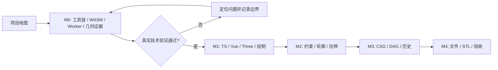

# 技术学习路线

更新：2026-10-01。来源实验与最小工程实验已执行，真实求解与 CSG 待验证。实现依赖以 [TASKS](../TASKS.md) 为准。

## 模块与项目任务

| 单元 | 技术主题 | 实施任务 | 核心学习问题 |
| --- | --- | --- | --- |
| L-000 | 参数化 CAD 项目地图 | 项目阅读 | 改宽度如何传到实体和文件？ |
| L-001 | 工具链与来源管理 | T-001,T-002 | 如何让别人重现同一个工程？ |
| L-002 | TypeScript 与领域数据 | T-102 | 类型、ID 和校验各解决什么问题？ |
| L-003 | Vue 与 Pinia | T-101,T-103 | 响应式状态如何连接视口？ |
| L-004 | Three.js 视口 | T-103 | 从世界坐标到屏幕与拾取怎么走？ |
| L-005 | 坐标与数值精度 | T-003,T-004,T-103,T-104 | 几何正确与视觉接近如何判断？ |
| L-006 | WASM 与约束求解 | T-001,T-003,T-201 | 参数如何映射为真实求解问题？ |
| L-007 | Worker 与异步一致性 | T-003,T-005,T-201 | 如何丢弃过时结果并恢复超时？ |
| L-008 | 轮廓、曲线与拉伸 | T-004,T-202,T-203 | 线和圆怎样变成带孔闭合实体？ |
| L-009 | 网格 CSG | T-004,T-301 | 布尔结果正确的证据是什么？ |
| L-010 | 命令、特征图与事务 | T-102,T-302,T-303 | 如何重算后代并整体回滚？ |
| L-011 | 文件、恢复与 STL | T-004,T-401,T-402 | 怎么保存可编辑数据并验证导出？ |
| L-012 | 测试、性能与交付 | T-005,T-403,T-404 | 怎样证明可用、正确且可复现？ |

每篇笔记进一步拆为一个问题。上表表示关联，不要求先学完整个模块才开始对应任务。

## 可单独实验的技术点

### L-001：工具链与来源管理

- **A｜版本与来源**：源码与 WASM 来自哪里？记录固定 commit、文件路径、声明和构建来源，形成 T-001 清单。
- **B｜工程运行链**：TS、Vue SFC、ESM、Vite 分别做什么？观察同一个最小工程的开发加载和生产构建。
- **C｜依赖与 Git**：锁文件如何约束依赖？从干净安装复现构建，并用一个提交解释本次变化。

### L-002：TypeScript 与领域数据

- **A｜数据建模**：用判别联合描述 sketch/extrude/boolean，用稳定 ID 表达引用；JSON 往返后引用仍成立。
- **B｜运行时校验**：构造未知版本、缺失引用、非有限数值；说明 TS 类型为什么不能替代文件校验。

### L-003：Vue 与 Pinia

- **A｜响应式边界**：理解 ref/reactive/computed 与 shallowRef/markRaw 的用途；状态变化触发一次明确的视口更新。
- **B｜组件与运行时**：组件负责界面，运行时负责 renderer 和事件；反复挂载/销毁验证没有重复监听。

### L-004：Three.js 视口

- **A｜渲染链**：Scene、Camera、Geometry、Material、Renderer 的职责；解释正交相机的缩放与 Z-up。
- **B｜变换与拾取**：验证世界坐标、屏幕坐标和射线的映射；resize 后同一点拾取正确。
- **C｜资源生命周期**：建立资源所有权与 dispose 路径；反复打开项目检查废弃缓存。

### L-005：坐标与数值精度

- **A｜草图平面**：实现 `origin + u*x + v*y` 及反投影；XY/XZ/YZ 往返误差满足 `1e-6 mm`。
- **B｜误差与捕捉**：比较 8 CSS px 捕捉和 `1e-6 mm` 闭合容差；缩放后解释它们为何不能共用一个阈值。
- **C｜网格证据**：独立计算包围盒、体积、闭合性和方向，先验证已知矩形/方块 fixture。

### L-006：WASM 与约束求解

- **A｜真实加载与内存**：梳理 JS/WASM 边界、参数映射和释放；在 Worker 中调用真实 API，记录来源与返回值。
- **B｜实体与约束**：把点、线、圆弧映射为求解对象；矩形宽 40→60，独立检查结果残差。
- **C｜失败与能力边界**：加入冲突尺寸，重复求解，核对 DOF 是否真实可读；失败不能改写旧数据。

### L-007：Worker 与异步一致性

- **A｜协议与乱序**：人为制造旧请求晚到和切换项目，用 session/requestId/revision 丢弃过时回复。
- **B｜超时与传输**：观察 transferable 的 buffer 所有权；模拟 10 秒超时，终止并重建 Worker，旧文档仍可用。

### L-008：轮廓、曲线与拉伸

- **A｜轮廓拓扑**：验证闭合、自交、外轮廓和孔洞；开放线与相交孔洞必须给出具体错误。
- **B｜曲线与网格**：按弦误差细分圆弧，解释三角化与侧面连接；对三平面和正负深度检查体积、方向和闭合性。

### L-009：网格 CSG

- **A｜三类布尔**：使用两个 20³ 方块，重叠体积 4000 mm³；独立验证 union/subtract/intersect。
- **B｜退化与顺序**：比较 A-B 与 B-A 的包围盒，测试不相交、相切与共面；记录实际支持范围与明确失败。

### L-010：命令、特征图与事务

- **A｜DAG 与重算**：找出改动的所有后代，按拓扑顺序计算；名称/可见性不触发几何重算。
- **B｜原子提交与历史**：候选文档全链成功才提交；验证失败回滚、一拖一命令、撤销分支和保存快照。

### L-011：文件、恢复与 STL

- **A｜权威数据与恢复**：保存领域文档并从它重建网格；验证损坏文件不覆盖当前项目、IndexedDB 失败有提示。
- **B｜STL 结构**：理解 binary STL 的三角面记录与单位边界；重新解析导出文件，按位置合并后验证闭合与体积。

### L-012：测试、性能与交付

- **A｜证据层级**：区分领域单测、真实 adapter 集成测试和浏览器闭环；关联 REQ/AC，避免用截图代替数值证据。
- **B｜测量与构建**：记录环境、预热、采样、p95 和资源生命周期；验证生产 `/cad/` 路径与三浏览器。

## 按里程碑推进学习

M0 只学习和实现完成技术验证所需的部分。例如先验证孔洞夹具，不等于完成完整轮廓编辑器。M0 gate 通过以前，T-101—T-104 保持未开始。

每次开始前选一个主要学习单元，写出本次要回答的问题；每次结束更新进度和任务交接。L-001A 来源与 L-001B 工程运行链已有实验，用户复述均未记录。下一任务为 T-003，先从 L-006A 的真实加载与内存边界开始；L-001C 的完整 Git/锁文件讲解仍待安排。
