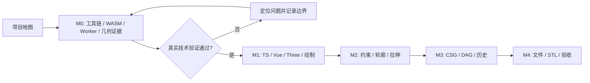

# 技术学习路线

更新：2026-10-03。本期M0—M4技术交付完成，最新[L-012D](notes/L-012D-reproducible-delivery.md)连接逐项验收与运行；复述未记录，后文接续保留历史，不推断掌握。功能依赖以[TASKS](../TASKS.md)为准。

## 模块与项目任务

| 单元 | 技术主题 | 实施任务 | 核心学习问题 |
| --- | --- | --- | --- |
| L-000 | 参数化 CAD 项目地图 | 项目阅读 | 改宽度如何传到实体和文件？ |
| L-001 | 工具链与来源管理 | T-001,T-002 | 如何让别人重现同一个工程？ |
| L-002 | TypeScript 与领域数据 | T-102 | 类型、ID 和校验各解决什么问题？ |
| L-003 | Vue 与 Pinia | T-101,T-103 | 响应式状态如何连接视口？ |
| L-004 | Three.js 视口 | T-103 | 从世界坐标到屏幕与拾取怎么走？ |
| L-005 | 坐标与数值精度 | T-003,T-004,T-103,T-104 | 几何正确与视觉接近如何判断？ |
| L-006 | WASM 与约束求解 | T-001,T-003,T-201 | 参数如何映射为真实求解问题？ |
| L-007 | Worker 与异步一致性 | T-003,T-005,T-104C,T-201,T-R01 | 如何丢弃过时结果并恢复超时？ |
| L-008 | 轮廓、曲线与拉伸 | T-004,T-202,T-203 | 线和圆怎样变成带孔闭合实体？ |
| L-009 | 网格 CSG | T-004,T-301 | 布尔结果正确的证据是什么？ |
| L-010 | 命令、特征图与事务 | T-102,T-203,T-302,T-303 | 如何重算后代并整体回滚？ |
| L-011 | 文件、恢复与 STL | T-004,T-401,T-402 | 怎么保存可编辑数据并验证导出？ |
| L-012 | 测试、性能与交付 | T-005,T-403,T-404 | 怎样证明可用、正确且可复现？ |

每篇笔记进一步拆为一个问题。上表表示关联，不要求先学完整个模块才开始对应任务。

## 可单独实验的技术点

### L-001：工具链与来源管理

- **A｜版本与来源**：源码与 WASM 来自哪里？记录固定 commit、文件路径、声明和构建来源，形成 T-001 清单。
- **B｜工程运行链**：TS、Vue SFC、ESM、Vite 分别做什么？观察同一个最小工程的开发加载和生产构建。
- **C｜依赖与 Git**：锁文件如何约束依赖？从干净安装复现构建，并用一个提交解释本次变化。

### L-002：TypeScript 与领域数据

- **A｜数据建模**：用判别联合描述 sketch/extrude/boolean，用稳定 ID 表达引用；JSON 往返后引用仍成立。
- **B｜运行时校验**：构造未知版本、缺失引用、非有限数值；说明 TS 类型为什么不能替代文件校验。

### L-003：Vue 与 Pinia

- **A｜响应式边界**：理解 ref/reactive/computed 与 shallowRef/markRaw 的用途；状态变化触发一次明确的视口更新。
- **B｜组件与运行时**：组件负责界面，运行时负责 renderer 和事件；反复挂载/销毁验证没有重复监听。

### L-004：Three.js 视口

- **A｜渲染链**：Scene、Camera、Geometry、Material、Renderer 的职责；解释正交相机的缩放与 Z-up。
- **B｜变换与拾取**：验证世界坐标、屏幕坐标和射线的映射；resize 后同一点拾取正确。
- **C｜资源生命周期**：建立资源所有权与 dispose 路径；反复打开项目检查废弃缓存。

### L-005：坐标与数值精度

- **A｜草图平面**：实现 `origin + u*x + v*y` 及反投影；XY/XZ/YZ 往返误差满足 `1e-6 mm`。
- **B｜误差与捕捉**：比较 8 CSS px 捕捉和 `1e-6 mm` 闭合容差；缩放后解释它们为何不能共用一个阈值。
- **C｜网格证据**：独立计算包围盒、体积、闭合性和方向，先验证已知矩形/方块 fixture。

### L-006：WASM 与约束求解

- **A｜真实加载与内存**：梳理 JS/WASM 边界、参数映射和释放；在 Worker 中调用真实 API，记录来源与返回值。
- **B｜实体与约束**：把点、线、圆弧映射为求解对象；矩形宽 40→60，独立检查结果残差。
- **C｜失败与能力边界**：加入冲突尺寸，重复求解，核对 DOF 是否真实可读；失败不能改写旧数据。

- **D｜方向与相等**：[角度单位与对象白名单](notes/L-006D-angle-and-equal.md)，领域radians/native degrees、方向残差与等半径，T-201A已实验。
- **E/F｜相切接触**：T-201B1/B2已完成，原生接触与领域范围分别见L-006E/F。
- **G｜约束面板**：T-201C2已完成，选择/单位/真实事务和标注见L-006G。

### L-007：Worker 与异步一致性

审查修复[L-007F](notes/L-007F-interaction-lifetime.md)/T-R01已实验：折叠显示、编辑权限、相机导航与事务生命周期分开；用户2026-10-03明确恢复，当前继续T-303。

- **A｜协议与乱序**：人为制造旧请求晚到和切换项目，用 session/requestId/revision 丢弃过时回复。
- **B｜超时与传输**：观察 transferable 的 buffer 所有权；模拟 10 秒超时，终止并重建 Worker，旧文档仍可用。

- **C｜手势最新输入**：[最新拖动队列](notes/L-007C-latest-drag.md)，一个在途/一个最新槽，一次手势一个命令；取消与删除用稳定ID保护旧文档。

### L-008：轮廓、曲线与拉伸

- **A｜轮廓拓扑**：验证闭合、自交、外轮廓和孔洞；开放线与相交孔洞必须给出具体错误。
- **B｜曲线与网格**：按弦误差细分圆弧，解释三角化与侧面连接；对三平面和正负深度检查体积、方向和闭合性。

### L-009：网格 CSG

- **A｜三类布尔**：使用两个 20³ 方块，重叠体积 4000 mm³；独立验证 union/subtract/intersect。
- **B｜退化与顺序**：比较 A-B 与 B-A 的包围盒，测试不相交、相切与共面；记录实际支持范围与明确失败。

### L-010：命令、特征图与事务

- **A｜DAG 与重算**：找出改动的所有后代，按拓扑顺序计算；名称/可见性不触发几何重算。
- **B｜原子提交与历史**：候选文档全链成功才提交；验证失败回滚、一拖一命令、撤销分支和保存快照。

### L-011：文件、恢复与 STL

- **A｜权威数据与恢复**：保存领域文档并从它重建网格；验证损坏文件不覆盖当前项目、IndexedDB 失败有提示。
- **B｜STL 结构**：理解 binary STL 的三角面记录与单位边界；重新解析导出文件，按位置合并后验证闭合与体积。

### L-012：测试、性能与交付

- **A｜证据层级**：区分领域单测、真实 adapter 集成测试和浏览器闭环；关联 REQ/AC，避免用截图代替数值证据。
- **B｜测量与构建**：记录环境、预热、采样、p95 和资源生命周期；验证生产 `/cad/` 路径与三浏览器。

## 按里程碑推进学习

M0 只学习和实现完成技术验证所需的部分。例如孔洞夹具不等于完整轮廓编辑器。T-005 gate与M1（T-101—104）已通过；[L-007C](notes/L-007C-latest-drag.md)手势/删除有实际证据，T-201A方向/相等已实验，下一子任务T-201B完整相切，随后C面板。

每次开始前选一个主要学习单元；每次结束更新进度和任务交接。来源/内核/gate/状态/领域/事务/视口与 [L-006C](notes/L-006C-domain-solver.md) 已有证据，用户复述均未记录。[L-005B](notes/L-005B-screen-snapping.md)屏幕捕捉→领域输入→真实求解→命令提交已有证据；最新拖动队列与一手势一命令已有实验；[L-006D](notes/L-006D-angle-and-equal.md)已有对象/角度/残差证据；下一问题是相切接触与完整组合；完整约束、通用重算、文件与性能后续按任务安排。

相切先行实验见 [L-006E](notes/L-006E-tangent-contact.md)：T-201B1已执行，B2领域/Worker/事务仍待实现。

相切领域集成见 [L-006F](notes/L-006F-domain-tangency.md)：B完成；下一T-201C/L-006G面板/DOF/标注与完整回归。

L-007D [诊断与原子快照](notes/L-007D-atomic-diagnostics.md)已实验；T-201C拆成C1一致性、C2面板/完整验收，整体条件不变。

L-006G [约束面板](notes/L-006G-constraint-panel.md)已讲解/实验，T-201完成；下一T-202/L-008A一般轮廓分类、自交与孔洞。用户复述仍未记录。

L-008C [曲线细分](notes/L-008C-curve-sampling.md)已讲解/实验：T-202A done。下一T-202B/L-008A端点图与轮廓分类，随后C三平面正负拉伸；复述未记录。

L-008A [一般轮廓](notes/L-008A-sketch-regions.md)已讲解/实验：T-202B done，显式选择API已验证，界面仍待C。下一T-202C一般拉伸/网格方向/Worker和实际预览，用户复述未记录。

L-008D [一般拉伸](notes/L-008D-general-extrusion.md)已讲解/实验：T-202C1 done；C/T-202仍doing，下一C2用户区域选择、预览取消与提交历史。

L-007E [拉伸预览与原子历史](notes/L-007E-extrusion-preview.md)已讲解/实验：C2a done，下一C2b临时网格所有权、区域选择与实际预览/取消/提交；用户复述未记录。

L-008E [拉伸UI与临时所有权](notes/L-008E-extrusion-ui.md)已讲解/实验：C2b、C2/C/T-202 done；REQ-006五AC通过。下一T-203实际参数/曲线/孔洞来源与撤销回归；MVP仍未完成，用户复述未记录。

L-010C [来源参数与完整历史](notes/L-010C-parameter-history.md)已讲解/实验；T-203/M2完成。下一T-301/L-009网格布尔；用户复述未记录。

L-009C [世界网格与原子布尔](notes/L-009C-world-mesh-boolean.md)已讲解/实验；T-301A完成，下一B工作区A/B与完整REQ-007。用户复述未记录。

L-009D [A/B与布尔界面](notes/L-009D-boolean-ui.md)已讲解/实验；T-301/REQ-007完成，下一T-302受影响分支与级联。复述未记录。

L-010D [受影响分支与不可变基线](notes/L-010D-affected-recompute.md)已讲解/实验；T-302A done，下一B级联影响/确认与现有特征参数。复述未记录。

L-010E [稳定编辑与显式级联](notes/L-010E-feature-edit-and-cascade.md)已讲解/实验；T-302/REQ-008完成，实际宽40→60、区域/正负深度、默认取消/级联、晚失败和精确历史有证据。用户复述未记录。按用户要求本子任务后暂停，下一T-303；完整E2E-02文件往返待T-401，最终场景待T-403。

2026-10-03已恢复；L-010F[完整历史](notes/L-010F-complete-history.md)讲解/实验通过，T-303/REQ-009四AC与M3完成。下一T-401/L-011A：如何只保存权威文档，并在打开失败时保住当前项目？最终文件/E2E与性能边界不变，复述未记录。

L-011A拆为A1[契约与原子打开](notes/L-011A1-atomic-file-load.md)/T-401A、A2标准文件UI与相机/T-401B、A3自动恢复/T-401C。A1已讲解/实验，下一A2；三入口服务探针不等于文件UI或完整REQ-010，复述未记录。

L-011A2[浏览器文件与相机](notes/L-011A2-browser-files-and-camera.md)已讲解/实验，T-401B done。三入口三平面真实下载/打开/相机拾取/继续编辑及取消/错误/dirty提示通过；下一A3防抖存储与恢复入口，整体REQ-010未完成，复述未记录。

L-011A3[IndexedDB恢复](notes/L-011A3-indexeddb-recovery.md)已讲解/实验，T-401/REQ-010六AC完成。真实防抖/恢复/放弃/旧read与write/失败下载和文件后级联通过；下一T-402/L-011B2实际选中实体的STL导出，最终T-403仍待完整UI端到端/三浏览器/性能，复述未记录。

L-011B2[单实体STL](notes/L-011B2-selected-solid-stl.md)已讲解/实验，T-402/REQ-011三AC完成。36真实导出、54实际下载与非法/Float32边界通过；下一T-403/L-012B完整工作流、三浏览器与性能，复述未记录。

L-012B1[当前稳定浏览器流程](notes/L-012B1-current-browser-workflow.md)已讲解/实验，T-403A/E2E-01/05六生产工作流通过；原生浏览器版本/下载字节/真实IDB与1280×720/1024/500有证据。下一B其余完整UI场景，随后C指定性能/资源；复述未记录，M4/MVP未完成。

L-012B2[完整UI几何](notes/L-012B2-full-geometry-workflow.md)已讲解/实验，T-403B1/E2E-02/03六生产流程完成，四布尔/传播/真实文件/继续编辑/级联精确历史及孔洞曲线有证据。下一B2失败恢复，C性能资源仍未完成，复述未记录。

L-012B3[真实故障](notes/L-012B3-real-failure-recovery.md)已讲解/实验，T-403B2/B/E2E-04六生产流程完成；A/B覆盖三稳定浏览器root/cad指定E2E-01—05。下一C指定性能/主线程/长期资源和全NFR汇总，复述未记录，M4/MVP未完成。

L-012C1[焊接语义优化](notes/L-012C1-preserve-weld-semantics.md)已讲解/实验，实际10576面验证旧约1.07s→30样本p95 29.26ms且指标/坐标精确保持。C1 done，下一C2全十实体/浏览器性能主线程与资源；Node定位不当完整NFR通过，复述未记录。

L-012C2[不可变网格与响应](notes/L-012C2-immutable-mesh-history.md)已讲解/实验，T-403C2a全十实体105760面/30求解/实际FPS/主线程与41Node/六几何/六故障通过。下一C2b简单CSG/长期资源/全NFR，复述未记录，MVP未验收。

L-012C3[特征GPU资源](notes/L-012C3-feature-resources.md)已讲解/实验，T-403C2b1完整三稳定浏览器每类30CSG和20轮实际文件/GPU/Worker生命周期完成；保留失败和复跑波动。下一C2b2/L-012C4落实PRD6.4可转移网格/完整NFR，复述未记录。

L-012C4[转移网格](notes/L-012C4-transferable-mesh.md)已讲解/实验：三真实原生双向Float64/原操作数保留、50Node/16领域、最终三稳定浏览器root/cad E2E/NFR与完整性能资源通过；T-403完成。下一T-404/L-012D运行/来源/逐项可复现交付；复述未记录。

L-012D[可复现交付](notes/L-012D-reproducible-delivery.md)已讲解/实验，T-404/M0—M4本期MVP按限定范围完成。逐项验收/真实运行/来源分发有证据；用户复述未记录，P1/P2待新范围。
