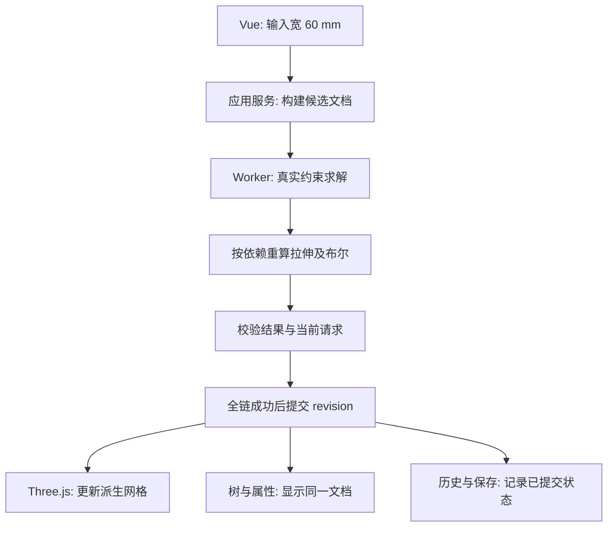

# L-000：改一个尺寸，为什么整个模型会变化？

| 项目 | 内容 |
| --- | --- |
| 日期 | 2026-10-01 |
| 关联 | 项目阅读；REQ-005、REQ-008、REQ-010、REQ-012 |
| 状态 | 讲解已整理；文档事实已核对；应用实验未执行；复述待反馈 |
| 前置知识 | 能理解对象、数组和函数的输入/输出即可 |

## 1. 本次问题

画出一个 40×30 mm 的矩形，拉伸 10 mm。后来把宽改为 60 mm，为什么实体、特征树、保存文件都应该一起变化？

本篇先建立项目地图：理解哪些数据被保存、哪些结果被计算，以及一次修改何时算成功。

## 2. 先认识四个对象

| 概念 | 本例中的内容 | 主要职责 |
| --- | --- | --- |
| 草图 | 点、四条线、宽高约束 | 表达二维形状与设计条件 |
| 求解器 | 接收几何和约束，返回点坐标及状态 | 找到满足条件的几何 |
| 特征 | 草图 → 拉伸，记录深度和引用 | 表达生成实体的步骤与依赖 |
| 网格 | 三角面组成的实体表面 | 显示、布尔运算与 STL 输出 |

约束记录“宽为 40 mm”，求解结果给出满足这个条件的具体点坐标。拉伸特征记录“使用这个草图，深度 10 mm”；由此可以再次生成网格。

领域文档是设计数据，网格是计算结果。稳定 ID 用于连接草图和拉伸，不依赖 Three.js 临时对象的 uuid。

## 3. 一次改宽度的数据流

Vue 负责接收输入和展示状态。应用服务负责组织修改。纯 TypeScript core 负责数据和规则。WASM/CSG adapter 负责调用具体计算技术。Three.js 视口负责持有和显示运行时对象。

如果求解或任意后代重算失败，候选修改不提交，旧有效文档和网格仍可用。如果回复来自旧项目或旧 revision，也不提交。这就是原子事务和异步一致性在本项目中的用途。

## 4. 可预测的结果

| 操作 | 理论体积 | 应观察到的行为 |
| --- | --- | --- |
| 宽 40、高 30、深度 10 mm | 12000 mm³ | 草图和拉伸建立稳定引用 |
| 宽改为 60 mm | 18000 mm³ | 重算后代，特征 ID 保持 |
| 撤销修改 | 12000 mm³ | 文档与网格一起恢复 |
| 求解出现矛盾约束 | 保持原有效结果 | 修改失败，不写入历史 |

这些是 [PRD 中 E2E-01](../../PRD.md) 等验收所要求的行为。当前尚无应用源码，表中结果是数学预期与需求目标，没有运行证据。

## 5. 当前已知与未验证

2026-10-01 已按顺序读取 README、PRD、DECISIONS、TASKS，并核对目录只有文档，没有应用源码、package.json 或依赖。

Vue/TS/Three.js、SolveSpace WASM、网格 CSG 是当前技术路线。求解器 API、DOF 能力、CSG 兼容版本和生产加载仍需 M0 实测。读完这篇地图不会自动通过任何功能验收。

## 6. 自己解释一遍

1. 如果只改 Three.js 网格，为什么下一次保存或重算可能丢失修改？
2. 求解成功但布尔后代失败时，这次宽度修改该不该进入撤销栈？为什么？
3. 用“输入 → 计算 → 校验 → 提交 → 显示”的顺序，描述宽 40→60 的变化。

我的复述：未记录，等待实际反馈。

下一篇从 L-001A 开始：先查明准备使用的源码与 WASM 的来源，再建立能重复运行的最小工程。

## 7. 来源

- [PRD](../../PRD.md)，v0.2.0，核对日期 2026-10-01：领域数据、事务与端到端验收。
- [技术决策](../../DECISIONS.md)，核对日期 2026-10-01：Vue/Three/WASM 边界与 Worker 路线。
- [实施任务](../../TASKS.md)，核对日期 2026-10-01：M0 gate 与后续依赖。
