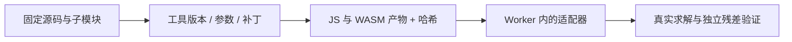

# L-001A：为什么有一个 WASM 文件，还要追查它怎么构建？

| 项目 | 内容 |
| --- | --- |
| 日期 / 环境 | 2026-10-01；Windows、Node v20.11.1、Git 2.40.1.windows.1 |
| 关联 | T-001；NFR-007、LEARN-001；REQ-005 / REQ-012 的前置调查 |
| 状态 | 讲解已整理；来源与精度实验已执行；真实求解未执行；用户复述未记录 |
| 前置知识 | 对象、数组、函数输入/输出；[项目地图](L-000-project-map.md) |

## 1. 本次问题

WASM 是编译后的程序。如果把它直接放进项目，即使能加载，也需要回答：它来自什么源码、是否有本地改动、接口能返回什么、能否用相同工具重新构建？

本次聚焦三个概念：源码版本、产物指纹、接口精度。它们回答不同问题。

## 2. 三份记录各有什么用

| 记录 | 回答的问题 | 不足以证明的事情 |
| --- | --- | --- |
| Git commit SHA | 参考的是哪个源码快照？ | 二进制一定由这个快照构建 |
| 文件 SHA-256 | 两份文件的字节是否相同？ | 文件功能正确、来源链完整 |
| 构建记录 | 用哪些源码、依赖、工具和参数得到产物？ | 所有几何输入都正确 |



一个源码 commit 是可定位的快照；`master` 可以移动。产物哈希是文件指纹；没有构建记录，就无法把源码和二进制可靠地连接起来。功能正确性还需要用实际输入调用 API。

## 3. 本项目查到了什么

我们固定了 three.cad、SolveSpace、THREE-CSGMesh 和 mimalloc 的来源，并记录 33 个文件的字节指纹。旧 WASM 可以解析，确实导出 solver/main/malloc/free；本次没有实例化或调用它。

旧包装器接收 `float*`，JS 用 Float32Array/HEAPF32。SolveSpace 内部参数使用 double，但数值在到达求解器前和返回 JS 时已经经过 Float32 边界。

旧 C 函数最终总是返回 0，`result/dof/failed` 没有通过这层接口回传。不能把“调用返回了 0”解释成求解成功，也不能据此显示 DOF。

另一个缺口是旧 `libslvs.a`：虽然有文件和一条链接命令，但未找到对应的 SolveSpace commit、编译器版本和静态库构建参数。后续选用固定官方源码重建，并记录已识别的绑定补丁。

## 4. 最小实验：数字跨过 Float32 会怎样？

先预测：40 可以精确保存；带小数的数是否都能维持 `1e-5 mm` 的误差？

```javascript
const input = 9999.0001;
const output = new Float32Array([input])[0];
const error = Math.abs(output - input);
console.log({ input, output, error });
```

实际执行命令为 `node scripts/probe-float32.mjs`。输入全部位于 PRD 的 ±10000 mm 范围内，比较的是一次类型转换的绝对误差。

| 输入 / mm | Float32 输出 / mm | 绝对误差 / mm | ≤1e-5？ |
| --- | --- | --- | --- |
| 40 | 40 | 0 | 是 |
| 40.123456789 | 40.12345504760742 | 1.7414e-6 | 是 |
| 9999.0001 | 9999 | 1.0000e-4 | 否 |
| 9999.123456789 | 9999.123046875 | 4.0991e-4 | 否 |

证据：[Float32 实验 JSON](../evidence/L-001A-float32.json)，实现：[实验脚本](../../../scripts/probe-float32.mjs)。脚本检查整数对照样本及两个超出误差阈值的样本。

Float32 会把输入舍入到附近可以表示的值。数的大小增加时，相邻可表示值的间隔也可能增大；所以“保留几位小数”不能替代绝对误差检查。上表中小坐标与大坐标的区别正好展示了这一点。

结论：这个 Float32 边界会丢失当前工作范围内的一些精细变化，所以它不能普遍保证所需精度。这是数据传输实验，不能推断真实求解器的残差或全部数值表现。

## 5. 接回项目

领域数据与求解输入/输出使用 double；网格传输和显示才按适用范围转 Float32。adapter 必须返回明确的状态和错误，而不是只打印日志。

T-001 交付的是 [来源与重建入口](../../UPSTREAM.md)、[第三方清单](../../third-party/README.md) 和 [源码审计证据](../evidence/T-001-source-audit.json)。T-003 才会实际编译、调用、读取 DOF 并独立验证约束残差；T-005 才判断 M0 是否通过。

复查源码证据运行 `node scripts/audit-upstream.mjs --check`；需要准备四个固定仓库，方法见 UPSTREAM。该命令核对 commit、字节哈希和子模块指针，不执行求解。

## 6. 我的复述与检查题

我的复述：未记录。

1. Git commit 与文件 SHA-256 分别解决什么问题？为什么只有两者仍不够？
2. 自己把输入改成 0.0001、400 或 400.0001，先预测 Float32 误差，再运行比较。
3. 如果函数总是返回 0，怎样知道它是否求解成功？需要扩展哪些返回数据？

## 7. 未解决问题与下一篇

新构建是否成功、Worker 是否能加载、所有 P0 约束是否映射正确、DOF 是否可信，以及 CSG 的版本兼容性都未验证。

下一任务 T-002 的主问题：Vue SFC、TypeScript 与 Vite 分别在工程运行链中负责什么？建立能启动、类型检查和生产构建的最小工程，再进入真实内核实验。

## 8. 来源

- [three.cad 固定源码](https://github.com/twpride/three.cad/tree/03fbc46749f148d5226378924bfec0d496a1cc06)，核对 2026-10-01：wasm/solver.c、src/Sketch.js、wasm/readme.md。
- [SolveSpace 固定源码](https://github.com/solvespace/solvespace/tree/2879a02d2866e103d7a4817721ead9ac43558aea)，核对 2026-10-01：include/slvs.h、src/slvs/CMakeLists.txt、js/slvs.d.ts。
- [本项目 PRD](../../PRD.md)，v0.2.0：工作范围、double 边界与残差阈值。
