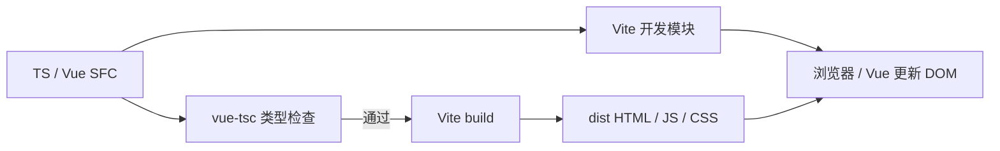

# L-001B：Vue、TypeScript 与 Vite 各负责什么？

| 项目 | 内容 |
| --- | --- |
| 日期 / 版本 | 2026-10-01 / Vue 3.5.43、TS 6.0.3、Vite 8.3.2 |
| 关联 | L-001B；T-002；LEARN-001、NFR-007 的依赖部分；REQ-001 的启动前置 |
| 状态 | 讲解：已整理；实验：已执行；复述：未记录 |
| 前置知识 | 基础 JS 的变量、函数、模块导入；[L-001A 来源链](L-001A-source-provenance.md) |

## 1. 本次问题

同一个 `.vue` 文件从源码变成可交互页面，Vue、TypeScript 和 Vite 分别处理哪一步？如果页面能打包，是否就意味着类型正确？

本次只学三件事：找到页面入口；区分类型检查与运行；观察开发模块和生产资源。求解器与三维显示留到后续单元。

## 2. 原理与数据流

浏览器执行 JavaScript，不能直接执行 Vue SFC 或 TypeScript 类型标注。SFC 是把组件脚本、模板与可选样式组织在一起的源码格式；`@vitejs/plugin-vue` 把模板等内容编译成浏览器可执行的模块。

Vue 在浏览器里创建组件并更新 DOM。本实验的输入是一次按钮点击，状态从数字 `0` 变为 `1`，输出是页面计数文字变为 `1`。`ref` 把这个数字变成可被 Vue 跟踪的状态。

TypeScript 的类型检查发生在运行之前。`vue-tsc` 同时理解 TS 和 Vue SFC，能检查“要求数字，却给了字符串”这类问题；`--noEmit` 表示只检查，不生成 JS。

| 工具 | 输入 | 输出 / 职责 |
| --- | --- | --- |
| Vue 与 SFC 插件 | 模板、组件状态、事件 | 编译组件；运行时把状态更新反映到 DOM |
| vue-tsc / TypeScript | `.ts`、`.vue` 与类型约定 | 类型诊断；本项目检查时不生成文件 |
| Vite | 源码、插件、配置 | 开发时转换并提供 ESM；生产时打包资源 |



图里的类型检查是本项目加在 `build` 命令前的步骤。直接调用 Vite 时，它转换 TS 为 JS，但不负责完整类型检查，图中的检查可以被绕过。

开发服务按模块提供代码：浏览器请求 `/src/main.ts`、`/src/App.vue`，响应内容已转换为 JS。生产构建提前打包，浏览器请求 `/assets/index-….js`。它们都运行同一组件，但资源组织不同。

## 3. 最小实验

### A：正确组件从哪里进入？

依次读 [index.html](../../../index.html)、[main.ts](../../../src/main.ts)、[App.vue](../../../src/App.vue)。HTML 提供 `#app`，main.ts 用 `createApp(App).mount('#app')` 挂载组件，App.vue 提供按钮和计数状态。

```vue
<script setup lang="ts">
import { ref } from 'vue';
const count = ref<number>(0);
</script>

<template>
  <output>{{ count }}</output>
  <button @click="count += 1">计数 +1</button>
</template>
```

`lang="ts"` 声明脚本语言。`ref<number>(0)` 限定状态值为数字。模板会自动解包 ref，所以这里能写 `count`；普通脚本中读写通常使用 `count.value`。具体响应式机制在 L-003 再展开。

```text
输入 / 初始条件：主工程 count = 0，已安装 package-lock.json 中的依赖。
操作：开发服务加载页面；点击一次；对生产 dist 重做；记录 JS 请求路径。
执行命令：npm run dev；npm run build；npm run preview；npm run check:bootstrap。
环境：Windows x64、PowerShell 7.6、Node 24.21.0、npm 11.19.0、Edge 154.0.4258.48。
期望：两个模式均 0→1；无脚本/资源错误；未实现求解/CSG 按钮禁用。
判定：真实 DOM 精确相等、HTTP 状态与错误监听，不使用几何容差。
```

浏览器脚本见 [check-bootstrap.mjs](../../../scripts/check-bootstrap.mjs)。它分别启动 Vite 的开发与预览服务，用真实 Edge 加载并点击；实际 `npm run dev/preview` CLI 也另外启动并请求过。

### B：故意写错类型

先预测这一行会怎样：

```typescript
const count = ref<number>('not-a-number');
```

本实验通过 [probe-typecheck.mjs](../../../scripts/probe-typecheck.mjs) 在忽略目录创建独立 SFC。主工程仍使用正确的数字，不通过修改主页面来制造假故障。

```powershell
npm.cmd run learn:typecheck
```

```text
输入：同一错误 SFC，ref<number> 收到字符串。
操作：先运行 vue-tsc --noEmit，再单独运行 vite build。
期望：vue-tsc 非零退出且报 TS2345；Vite 退出 0。
判定：退出码和诊断内容；只有同时观察到这两个结果，实验脚本才成功。
```

`package.json` 的主构建命令是 `npm run typecheck && vite build`。`&&` 表示前一步失败后不继续打包。这条防线来自实验观察，而非“构建通常会检查类型”的假设。

## 4. 实际结果与证据

| 检查 | 期望 | 实际 | 证据 |
| --- | --- | --- | --- |
| 锁文件干净安装与主构建 | 重新安装后成功 | `npm ci` 安装 49 包；类型检查/构建退出 0 | [来源与实际版本](../../third-party/npm-dependencies.json) |
| CLI 开发/预览 | 两入口 HTTP 200 | 开发源码模块、生产打包模块均正确 | [CLI JSON](../evidence/T-002-cli.json) |
| Edge 真实交互 | 两模式 0→1、无错误 | 通过；禁用按钮；390 px 无横向溢出 | [浏览器 JSON](../evidence/T-002-bootstrap.json) |
| 错误 SFC 类型检查 | 拒绝字符串 | TS2345，退出 2 | [类型 JSON](../evidence/L-001B-typecheck.json) |
| 相同错误 SFC 单独打包 | 转换完成 | 退出 0 | 同上 |

开发请求包含 `/src/App.vue`，生产请求为 `/assets/index-SstTJdzJ.js`。这些是本次实际抓到的请求，未来修改源码后哈希名称会改变。

还有一次有价值的失败：最初安装 TypeScript `7.0.2`，vue-tsc `3.3.11` 在启动时报告 `ERR_PACKAGE_PATH_NOT_EXPORTED`，涉及 `typescript/lib/tsc`，并没有开始检查组件。改锁 TS `6.0.3` 后检查通过。

因此要区分两种失败：工具组合无法运行，和工具正常运行后发现源码类型错误。前者要修复环境/版本，后者要修复数据或代码；不能把前者当作对错误样例的成功检查。

首次全局 Node 为 `20.11.1`，低于 Vite 8 要求。使用 [setup-node.ps1](../../../scripts/setup-node.ps1) 下载并校验 Node `24.21.0`，再用 [use-node.ps1](../../../scripts/use-node.ps1) 只切换当前终端。具体 Node/npm 与归档哈希已经记录，全局环境没有更改。

## 5. 接回项目

T-002 已建立工程入口、主构建的类型检查步骤、可复现锁文件与浏览器检查。Vue 和样式属于界面；本次还没有 core、Three.js 或 WASM 对象，不把计数器当成 CAD 领域模型。

LEARN-001 本篇记录和 NFR-007 的 npm 依赖部分已有证据。AC-001-1 要求加载真实求解器，本次未覆盖；真实求解、CSG、Worker 与生产 `/cad/` 路径继续在 M0 验证。完整边界见 [验证记录](../../VERIFICATION.md)。

锁文件把本次直接和间接依赖具体化，`npm ci` 依照它重新安装。`.research/`、`node_modules/`、`dist/` 不进入 Git；实现、锁文件、学习笔记与证据随 T-002 一起形成一个 commit。更完整的 Git/锁文件原理属于 L-001C，本次不记录用户已掌握。

## 6. 我的复述与检查题

- 我的解释：未记录。
- 小练习：把初始值改为数字 `10`，先预测点击一次后的值，再运行页面验证。随后运行类型检查，比较把它改成字符串 `'10'` 的结果。
- 为什么问题：生产页面能够打开，为什么还需要 `vue-tsc`？开发请求 `/src/App.vue` 时，浏览器是否直接执行了 Vue 模板源码？

用户实际复述或完成独立练习后，才更新“已复述”。

## 7. 疑问与下一步

当前实验确认工具链可运行，但尚未讲透 ref 的依赖追踪、模板编译细节或 HMR 状态保留。这些不是本次通过条件，留待对应单元。

下一任务 T-003 / L-006A 先解释 JS/WASM 的输入、返回值和内存边界，然后从固定 SolveSpace 源码实际构建并调用真实求解。上一单元的旧包装器精度与状态问题仍需在真实新构建中验证。

## 8. 来源

以下官方文档均于 2026-10-01 核对；文档网址可能滚动更新，实测版本以本项目证据与锁文件为准。

- [Vue TypeScript Overview](https://vuejs.org/guide/typescript/overview.html)：Vue 3，实测 3.5.43；用于 SFC 类型检查与 Vite 不执行完整类型检查的区别。
- [Vue script setup](https://vuejs.org/api/sfc-script-setup.html)：Vue 3，实测 3.5.43；用于模板可访问的顶层绑定与 ref 解包。
- [Vite Guide](https://vite.dev/guide/) 与 [TypeScript](https://vite.dev/guide/features.html#typescript)：实测 Vite 8.3.2；用于 Node 要求、开发 ESM 与 TS 转换职责。
- [Vite 本地生产预览](https://vite.dev/guide/static-deploy.html#testing-the-app-locally)：实测 8.3.2；用于 build / preview 的输入输出。
- [Node 官方版本表](https://nodejs.org/en/about/previous-releases) 与 [24.21.0 校验值](https://nodejs.org/dist/v24.21.0/SHASUMS256.txt)：用于 LTS 选择与归档来源核对。
- [npm ci](https://docs.npmjs.com/cli/v11/commands/npm-ci/)：实测 npm 11.19.0；用于按锁文件重新安装。
- [Playwright 浏览器渠道](https://playwright.dev/docs/browsers#google-chrome--microsoft-edge)：实测 1.63.0；用于调用本机 Edge，未下载测试浏览器。
- [本项目来源记录](../../third-party/npm-dependencies.json)：逐项 npm 固定版本、registry tarball、integrity、gitHead（如安装包提供）及许可证；本次未改动 npm 包源码。
