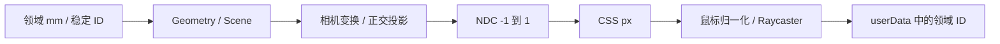

# L-004A：世界坐标怎样变成像素，点击怎样返回领域 ID？

| 项目 | 内容 |
| --- | --- |
| 日期 / 版本 | 2026-10-02 / Three.js 0.186.1；固定源码 9b4a2ac2；Edge 154.0.4258.48 |
| 关联 | L-004A/B、T-103、REQ-002；LEARN-001 |
| 状态 | 讲解：已整理；实验：已执行；复述：未记录 |
| 前置知识 | [领域 ID](L-002A-domain-validation.md)、[平面坐标](L-005A-plane-coordinates.md) |

## 1. 本次问题

一个点的世界坐标是 mm，鼠标位置是 CSS px。怎样把两者连接，并让点击得到项目里的 `point.id` 或 `feature.id`？

## 2. 原理与数据流

Scene 组织可显示对象；Geometry 保存渲染顶点；Material 决定显示方式；Camera 定义观察位置与投影；Renderer 把它们送到 WebGL。正交相机的显示比例由可视范围和 zoom 控制，不用远近透视改变零件尺寸。



点击坐标用 canvas 的实际 `getBoundingClientRect()`，不使用整个窗口宽度：`ndcX = 2*(clientX-left)/width-1`，`ndcY = 1-2*(clientY-top)/height`。Three 的 UUID 只标识本次渲染对象，重建后会变化；项目 ID 必须来自输入领域数据。

默认世界 Z 向上。进入草图时相机沿该平面法线看向原点，以平面 v 作为屏幕上方，锁定旋转；退出恢复先前模型相机。标准 XY 视图不能把与观察方向平行的 Z 同时作为屏幕上向量。

## 3. 最小实验

实际适配层见 [viewport-runtime.ts](../../../src/adapters/viewport/viewport-runtime.ts)，独立页面见 [viewport-harness.ts](../../../tests/browser/viewport-harness.ts)。页面是测试构建入口，不进入普通产品构建。

```text
输入：XY 草图端点 (-20,-10)、水平线、半径 5 的圆、半径 10 的四分之一圆弧。
步骤：world→project→CSS 点击/射线；分别 resize；隐藏草图；进入草图后测试背景过滤。
命令：. ./scripts/use-node.ps1；npm run check:viewport
环境：Windows x64 / Node 24.21.0 / Edge 154.0.4258.48 / Three 0.186.1 / DPR=2。
期望：返回 start/line/circle/arc 的稳定 ID；resize 后仍正确；隐藏对象不被拾取。
判定：ID 精确相等；相机恢复误差 ≤1e-8；几何域精度另见 L-005A。
```

## 4. 实际结果与证据

| 检查 | 输入 / 期望 | 实际 | 证据 |
| --- | --- | --- | --- |
| 四类拾取 | 确定世界坐标对应领域 ID | 开发/root/cad 全通过 | [浏览器 JSON](../evidence/T-103-viewport-browser.json) |
| resize | 900×420、600×600、1100×470 CSS px | 相机比例/拾取保持正确 | 同上 |
| 鼠标控制 | 中键平移、右键旋转、滚轮缩放 | 真实输入改变 target/position/zoom；左键回调恰好一次 | 同上 |
| 草图模式 | 不旋转、不选背景、退出恢复 | 全通过，返回相机误差 ≤1e-8 | 同上 |

第一次独立页面在 DPR=2 下出现 CSS 画布宽高翻倍，导致拖动坐标超出可见区域。修复为缓冲区按 DPR 分配、CSS 始终铺满 host；新增宽高精确断言。另过滤近乎平行的平面填充射线，保留轮廓拾取，避免数值微小倾斜造成边视平面误选。

三基准面交点有合法选择歧义，联动实验使用 XY 独立区域。真实 CSG 方块体积 8000 mm³、实体拾取通过；这里的固定夹具不代表产品已经支持拉伸。

## 5. 接回项目

ModelViewport 使用 shallowRef/markRaw 持有运行时，Pinia 只持有文档快照与选中 ID。树→ID→高亮，视口→ID→树选中，三入口已实测。线/点拾取阈值按 CSS px 换算为世界距离，绘制捕捉仍由 T-104 独立实现。

本次覆盖视口前置与空草图生命周期。完整端点拖动、绘制、一般实体命令、三浏览器与相机文件保存未完成；当前相机导航保留在视口运行时。

## 6. 我的复述与检查题

- 我的解释：未记录。
- 小练习：将 DPR 改成 1，预测世界点对应的 CSS px 是否变化。
- 为什么问题：为何不能用 `window.innerWidth` 代替 canvas 的 width？

## 7. 疑问与下一步

用户理解待反馈；Float32 渲染近似不能反过来覆盖领域 double 数据。资源与恢复见 [L-004C](L-004C-viewport-lifecycle.md)，下一任务 T-104 做实际绘制与捕捉。

## 8. 来源

- Three [OrthographicCamera](https://threejs.org/docs/pages/OrthographicCamera.html)、[Raycaster](https://threejs.org/docs/pages/Raycaster.html)、[OrbitControls](https://threejs.org/docs/pages/OrbitControls.html)，2026-10-02 核对；API 以已安装 0.186.1 和固定 [源码](https://github.com/mrdoob/three.js/tree/9b4a2ac29c63ccb43fd51c5661f2f873ac2c39b8) 核对。
- 本项目 [PRD](../../PRD.md) 0.3.2，第 3/6 节与 REQ-002/003，2026-10-02 核对。
- 本项目 [检查脚本](../../../scripts/check-viewport-browser.mjs)，T-103 本次提交，2026-10-02，实际输入与输出。
