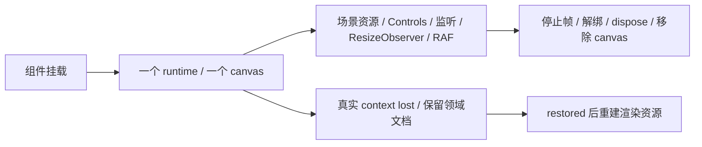

# L-004C：删除 Mesh 为什么还不够释放视口？

| 项目 | 内容 |
| --- | --- |
| 日期 / 版本 | 2026-10-02 / Three.js 0.186.1；Edge 154.0.4258.48 |
| 关联 | L-004C、L-003B、T-103、REQ-002 / AC-002-3/4；REQ-001 WebGL 分支；LEARN-001 |
| 状态 | 讲解：已整理；实验：已执行；复述：未记录 |
| 前置知识 | [渲染与拾取](L-004A-world-screen-picking.md)、[运行时所有权](L-003A-workspace-state.md) |

## 1. 本次问题

离开页面或新建项目后，为什么旧 canvas、监听器、材质或 GPU 缓存仍可能存活？怎样独立检查销毁和恢复？

## 2. 原理与数据流

Scene.remove 只改变场景关系。Geometry、Material、Renderer 和 Controls 分别有自己的资源；组件卸载需要明确结束它们的生命周期。共享材质/几何要用 Set 去重释放，避免重复调用混淆所有权。



项目文档不放在 Three 对象里，所以 context 丢失不应删除文档。Renderer 恢复图形状态后，自写适配层重建场景资源和拾取表；恢复失败显示重试。销毁后的 runtime 不再响应绘制或拾取。

## 3. 最小实验

```text
输入：包含线、圆、圆弧的固定草图；真实 CSG 方块；真实 Edge WebGL2。
操作：WEBGL_lose_context 丢失/恢复；20 次夹具→空项目；实际 UI 新建 20 次；dispose 两次。
命令：npm run check:viewport
环境：Windows x64 / Node 24.21.0 / Edge 154.0.4258.48 / Three 0.186.1。
实际驱动：ANGLE，NVIDIA GeForce RTX 4070 Ti，D3D11（完整字符串见证据）。
期望：文档不变；恢复可拾取；空项目资源数恒定；每次点击只有一回调；销毁后 canvas/资源为 0。
判定：状态、JSON、资源计数、回调次数精确比较；不使用截图证明释放。
```

## 4. 实际结果与证据

开发/root/cad 三入口全部通过，见 [浏览器证据](../evidence/T-103-viewport-browser.json)。20 次夹具切换到空项目，每次自有 geometry=8、Renderer.info GPU geometry=8、canvas=1；基准面/网格/轴常驻。最终 dispose 后 owned geometry/material=0、GPU geometry/texture=0、canvas=0，重复 dispose 无错误。

真实 WebGL 扩展丢失/恢复后文档 JSON 保持不变、线拾取恢复。扩展句柄必须在丢失前保留；丢失时再次 getExtension 返回 null，首次实验失败因此纠正。

无 WebGL 分支通过强制 getContext('webgl2') 返回 null 验证；解除该故障后实际重试恢复一个真实 canvas，项目 ID 不变。此故障注入不同于真实 context 扩展实验，两者在证据中分别记录。

## 5. 接回项目

组件卸载调用 runtime.dispose；模型变更释放旧对象；事件与 RAF 由 runtime 拥有；文档由 app/ProjectSession 持有。视图切换后领域草图保留，实际 UI 20 次新建也清空选择、特征与历史。

本实验覆盖小夹具和新建。文件打开 20 次、长时间浏览器/驱动堆增长、完整 10 万面场景、其他浏览器尚未测量，不能从当前计数恒定推断所有泄漏已排除。

## 6. 我的复述与检查题

- 我的解释：未记录。
- 小练习：仅移除 model，不调用 geometry.dispose，预测自有数量和 GPU 数量会如何分离。
- 为什么问题：为什么 renderer.info 数量稳定不等于整个浏览器内存没有泄漏？

## 7. 疑问与下一步

用户理解待反馈。当前普通生产包约 688 kB，Vite 给出 500 kB chunk 提示；已记录，性能/拆包与完整基准在 T-403，不隐藏提示。下一任务 T-104 接入绘制事件与预览所有权。

## 8. 来源

- 固定 Three [WebGLRenderer 源码](https://github.com/mrdoob/three.js/blob/9b4a2ac29c63ccb43fd51c5661f2f873ac2c39b8/src/renderers/WebGLRenderer.js)、[OrbitControls 源码](https://github.com/mrdoob/three.js/blob/9b4a2ac29c63ccb43fd51c5661f2f873ac2c39b8/examples/jsm/controls/OrbitControls.js)，0.186.1，2026-10-02 核对 dispose/context/listener 路径。
- [官方 Renderer API](https://threejs.org/docs/pages/WebGLRenderer.html)，2026-10-02 核对 WebGL2 与释放接口。
- 本项目 [运行时](../../../src/adapters/viewport/viewport-runtime.ts)、[浏览器检查](../../../scripts/check-viewport-browser.mjs)，T-103 本次提交，2026-10-02，实际证据。
