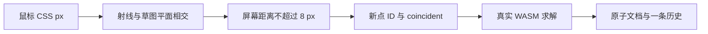

# L-005B：8 px 捕捉如何变成真实连接？

| 项目 | 内容 |
| --- | --- |
| 日期 / 版本 | 2026-10-02 / Three 0.186.1、SolveSpace 2879a02d；T-104B |
| 关联 | L-005B、L-010；T-104B；REQ-003/004/012、LEARN-001 |
| 状态 | 已讲解、已实验；复述未记录 |
| 前置 | [平面坐标](L-005A-plane-coordinates.md)、[领域求解](L-006C-domain-solver.md)、[原子历史](L-010A-atomic-history.md) |

## 1. 本次问题

鼠标落在端点旁边 7 px 时，怎样建立以后仍能求解的连接？本篇区分“屏幕上接近”和“领域中有关系”，再把捕捉接到绘制命令。

## 2. 原理与数据流

输入是鼠标的 CSS 像素和当前草图，输出是二维 double 坐标及可选捕捉目标 ID。先用相机射线与草图平面相交得到坐标，再把已有点投影到屏幕，比较屏幕距离。8 CSS px 负责操作手感，不作为几何闭合容差。



捕捉已有点时仍创建一个新点，再添加两点 coincident。求解器和后续删除操作因此能读到连接；仅把两个渲染顶点画在同处无法表达这种关系。捕捉原点则添加 fixed(0,0)。

矩形用四条线、八个拥有点、四个角重合关系、两条水平和两条垂直约束闭合。连续线以上一段**求解后的**终点继续；每段一个命令。圆只捕捉中心，半径点是构造输入；三点圆弧的过点也是构造输入，不能为不存在的永久点伪造 coincident。

橙色预览由视口拥有，不写文档。完整输入构造候选，经真实 Worker 求解成功才提交。Esc 清理预览并终止待处理 Worker；旧回复不能进入历史。撤销会清理尚未提交的起点。

## 3. 最小实验

```powershell
. ./scripts/use-node.ps1
npm run check:drawing
npm run build
npm run check:drawing:browser
```

输入：XY/XZ/YZ 各画 (0,0)—(40,30) 矩形、半径 10 的圆和三点圆弧。鼠标距已有角点 7 px 开始连续线；另试三点共线、未完成预览和求解加载中 Esc。

环境：Windows x64、PowerShell 7.6、Node 24.21.0、npm 11.19.0、Edge 154.0.4258.48。几何独立残差 ≤1e-5 mm；投影往返 ≤1e-6 mm；历史和稳定 ID 使用精确比较。

纯函数实验比较 8 与 8.01 px；真实视口夹具在模型旋转/平移/缩放后进入草图，以三种相机 zoom 再比较 7.99/8/8.01 px。重放视口检查时用 `VIEWPORT_EVIDENCE_PATH` 和 `VIEWPORT_EVIDENCE_TASK` 保存新证据，保留 T-103 原始结果。

## 4. 实际结果与证据

| 检查 | 期望 | 实际 | 证据 |
| --- | --- | --- | --- |
| 3 个纯函数实验 | 像素边界、闭合关系、非法圆弧 | 通过；原输入不变 | [日志](../evidence/T-104B-drawing.log) |
| 12 个三平面真实求解 | 4 工具 × 3 平面，残差 ≤1e-5 | 通过；矩形 40×30、圆 r=10 | [Node](../evidence/T-104B-drawing-node.json) |
| 三入口实际绘制 | 捕捉关系、连续线、撤销重做、再次编辑 | 开发/root/cad 通过 | [浏览器](../evidence/T-104B-drawing-browser.json) |
| 取消与回滚 | 预览/共线失败/旧回复不改权威文档 | 通过；新 Worker 可重试 | [领域](../evidence/T-104B-domain-replay.json)、同上 |

视口缩放、GPU 资源、WebGL 恢复见 [视口重放](../evidence/T-104B-viewport-replay.json)。截图仅检查界面布局，不作几何证据。16 项领域检查中的受控迟到测试验证协议权威；几何结果另由实际 WASM 和浏览器提供。

## 5. 接回项目

[drawing.ts](../../../src/core/geometry/drawing.ts) 构造可序列化候选；[ModelViewport](../../../src/components/ModelViewport.vue) 管局部输入；[运行时](../../../src/adapters/viewport/viewport-runtime.ts) 管投影和 GPU 预览；[ProjectSession](../../../src/app/project-session.ts) 管真实求解、取消与提交。

本子任务覆盖绘制和取消部分。AC-004-1 的拖点、AC-004-3 的实体删除、完整实际手势队列待 T-104C；完整约束面板待 T-201。T-104 整体仍 doing，不把捕捉实验当完整 REQ-004 通过。

## 6. 我的复述与检查题

- 我的解释：未记录。
- 练习：把纯函数实验半径改成 4 px，先预测 7 px 的结果，再运行。
- 为什么缩放后 8 px 对应的 mm 会变化，而 coincident 的含义不变化？
- 如果先撤销上一段再继续画线，为什么必须清除原来的预览起点？

## 7. 疑问与下一步

下一篇讨论拖动：连续鼠标事件怎样只保留最新求解输入，鼠标抬起后只生成一个命令？用户理解仍待反馈，独立开发继续到 T-104C。

## 8. 来源

- Three.js [OrthographicCamera](https://threejs.org/docs/pages/OrthographicCamera.html)、[Raycaster](https://threejs.org/docs/pages/Raycaster.html)：0.186.1，源码固定 9b4a2ac29c63ccb43fd51c5661f2f873ac2c39b8，2026-10-02 核对投影和射线接口；实际实验使用锁定安装包。
- 本项目 [PRD](../../PRD.md) REQ-004 定义 8 CSS px 和显式重合；[领域求解来源](L-006C-domain-solver.md) 记录真实内核 commit 与构建，2026-10-02 核对。捕捉半径和命令设计是本项目规则。
