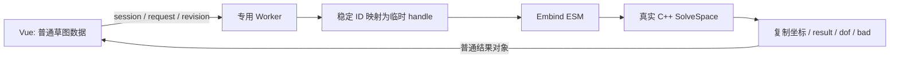

# L-006A：JS 如何调用真实 WASM 求解器？

| 项目 | 内容 |
| --- | --- |
| 日期 / 版本 | 2026-10-01—02；SolveSpace `2879a02d`、Emscripten `4.0.8` |
| 关联 | L-006A、L-007 的协议前置；T-003；REQ-001、REQ-005、REQ-012、NFR-007 |
| 状态 | 讲解：已整理；实验：已执行；复述：未记录 |
| 前置知识 | [来源与精度](L-001A-source-provenance.md)、[ESM 与 Vite](L-001B-vue-ts-vite.md) |

## 1. 本次问题

如何把普通 JS 几何数据交给 C++ 求解器，并拿回能够保存的结果？本篇关注运行边界；约束是否满足由下一篇独立计算。

## 2. 原理与数据流

Emscripten 把固定 C++ 源码编译为 WASM。Embind 生成的 ESM 胶水负责加载二进制、映射参数和调用函数。Worker 提供独立执行环境；它与页面通过消息交换可序列化对象。



领域 ID 如 `p0` 可跨求解保留；原生 handle 只在当前模型有效。适配器在求解前清空模型，在 `finally` 再清空。先复制坐标再释放，不把 handle 或内存视图发送给 Vue。

JS Number 与本次 C++ double 边界保持双精度，避免旧包装器的 Float32 中转。Worker 不是一个假求解服务：实验调用的正是源码编译出的 `solveSketch`。

## 3. 最小实验

前端运行不需要 SDK；仓库已包含可核对哈希的自建二进制。重建时需要 Git 和初次安装 SDK 所用的 Python；当前环境先用 Python 3.12.14 引导，随后使用 SDK 自带 Python 3.9.2。

```powershell
. ./scripts/use-node.ps1
./scripts/setup-solver.ps1 -BootstrapPython python
./scripts/build-solver.ps1
npm.cmd run record:solver
npm.cmd run build
npm.cmd run check:solver
npm.cmd run check:solver:browser
```

输入是 [固定草图夹具](../../../src/experiments/solver-fixtures.ts)。输出是状态、原生 DOF、冲突 ID、普通坐标或明确失败。浏览器测试分别启动真实开发服务、生产预览和 `/cad/` 构建；拦截 WASM 返回 HTTP 503，再解除拦截并重试。

环境为 Windows x64 / PowerShell 7.6 / Node 24.21.0 / npm 11.19.0 / Edge 154.0.4258.48。构建工具为 CMake 3.31.8、Ninja wheel 1.13.2（可执行文件版本带 `git.kitware.jobserver-pipe-1` 后缀）、Emscripten 4.0.8 / Clang 21.0.0。完整来源和 SHA 见 [构建清单](../../third-party/solver-build.json)。

## 4. 实际结果与证据

| 检查 | 期望 | 实际 | 证据 |
| --- | --- | --- | --- |
| 官方源码构建 | 可加载独立 ESM/WASM | mjs 59795 bytes；wasm 289622 bytes | [构建](../evidence/T-003-build.log)、[Ninja 编译记录](../evidence/T-003-ninja.log) |
| 浏览器 Worker | 三种入口真实调用成功 | 开发、生产、`/cad/` 各 8 项数值检查通过；资源 200，WASM MIME 正确 | [浏览器 JSON](../evidence/T-003-solver-browser.json) |
| WASM 503 | 显示失败，重试恢复 | 错误可见；解除拦截后 8 项通过 | 同上 |
| 热身后重复批次 | 相同负载不继续扩展缓冲区 | 初始 33554432；热身与下一批均 40304640 bytes | [Node JSON](../evidence/T-003-solver-node.json) |

首次 CMake 配置因 Windows worktree 的绝对 gitdir 被错误拼接而失败，见 [失败日志](../evidence/T-003-configure-first-failure.log)。补丁改为识别绝对路径。另两个补丁修复数组四元组索引，并调整 ESM、独立 WASM、32 MiB 初始内存与 HEAPU8 导出。全部补丁和原始许可证随仓库保留。

首次观测内存时没有导出 HEAPU8；补充显式运行时导出后才能读取。首次求解允许按需扩展内存，因此不能把 32 MiB → 38.44 MiB 直接当作泄漏；相同热身负载稳定也不足以证明所有原生分配都没有泄漏。

SDK 目录含大量 HTML 测试页，Vite 默认入口扫描影响开发加载。显式限定 `index.html` 并忽略 `.research` 监听后，实际浏览器检查通过。首次页面还有 favicon 404，添加本项目 SVG 后重新验证无浏览器错误。

## 5. 接回项目

代码边界见 [solver adapter](../../../src/adapters/solver/solve-sketch.ts)、[Worker](../../../src/workers/solver.worker.ts)、[客户端](../../../src/adapters/solver/solver-client.ts)。客户端匹配消息元数据，异常/超时会终止并重建 Worker，组件卸载负责销毁。

T-003 已验证 AC-001-1 的真实求解器资源加载部分，以及 REQ-005 的指定夹具。完整工作区、文档事务、拖动节流、人为乱序和 10 秒超时用例尚未验收，不能因此宣称 REQ-001/005/012 全部通过。

## 6. 我的复述与检查题

- 我的解释：未记录。
- 小练习：先预测首次求解会不会扩展内存，再运行两批相同夹具，解释为何比较热身后的值。
- 为什么问题：为什么保存 `p0`，而不保存原生 handle 或 HEAPU8 视图？

## 7. 疑问与下一步

用户对 Worker 生命周期、Embind 和内存边界的理解尚未反馈。下一篇 [L-006B](L-006B-constraint-evidence.md) 检查几何残差；后续 L-007 专门验证过期回复和超时。

## 8. 来源

- [SolveSpace jslib.cpp](https://github.com/solvespace/solvespace/blob/2879a02d2866e103d7a4817721ead9ac43558aea/src/slvs/jslib.cpp)：固定 commit，核对 2026-10-01，Embind 与真实 result/dof。
- [Emscripten 4.0.8](https://github.com/emscripten-core/emscripten/tree/70404efec4458b60b953bc8f1529f2fa112cdfd1)：本次实际编译版本，核对 2026-10-02。
- [模块化输出](https://emscripten.org/docs/compiling/Modularized-Output.html)、[构建项目](https://emscripten.org/docs/compiling/Building-Projects.html)：滚动官方文档，核对 2026-10-01；具体支持与产物以固定 SDK 实验为准。
- [Vite optimizeDeps.entries](https://vite.dev/config/dep-optimization-options.html#optimizedeps-entries)：核对 2026-10-02；本工程使用 Vite 8.3.2，实测限定 HTML 入口。
