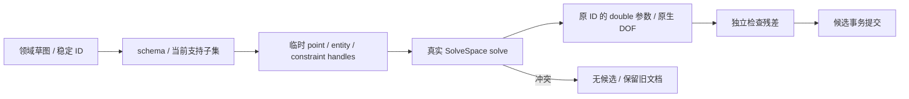

# L-006C：领域 ID 怎样通过临时 native handle 求解后仍保持不变？

| 项目 | 内容 |
| --- | --- |
| 日期 / 版本 | 2026-10-02 / 固定 SolveSpace 2879a02d；既有 Emscripten 4.0.8 自建 WASM |
| 关联 | L-006C、L-010B、T-104A；REQ-004/005/012 技术前置；LEARN-001 |
| 状态 | 讲解：已整理；实验：已执行；复述：未记录 |
| 前置知识 | [WASM 边界](L-006A-wasm-worker.md)、[领域校验](L-002A-domain-validation.md)、[原子历史](L-010A-atomic-history.md) |

## 1. 本次问题

M0 用固定小协议证明了内核可用。现在文档包含点、线、圆、带方向的圆弧与约束；如何使用真实内核计算这些数据，又避免把临时 handle 保存进项目？

## 2. 原理与数据流

每次调用重新构建 native 草图，在 Map 中记录 `domain ID → native entity`，约束记录反向的 `handle → domain constraint ID`。读取 native 参数后写回原 ID 对应的独立副本，finally 清空 native 草图。



fixed 点使用不参与本次求解的 group 1，其坐标来自 fixedPosition；可变实体在 group 2。圆需要一个独立半径参数，圆弧固有等半径关系由内核建立。SolveSpace 的圆弧按逆时针定义，clockwise 草图交换 native 首尾点，回写时仍按原点 ID。

coincident 是实际约束，不是把两个渲染顶点画在一起。求解后独立计算两点距离；约束满足、显示重合和 ID 关系是三个应分别验证的事实。

## 3. 最小实验

入口见 [solve-domain-sketch.ts](../../../src/adapters/solver/solve-domain-sketch.ts)，具体输入见 [领域夹具](../../../src/experiments/domain-solver-fixtures.ts)。浏览器“技术实验”可点击“运行领域草图求解”重做。

```text
输入：矩形宽40/60高30；圆初始半径8→约束10；正/逆时针圆弧；两线捕捉端点。
操作：映射实体/约束，真实solve，读取double坐标与半径，检查固有和显式残差。
命令：. ./scripts/use-node.ps1；npm run check:domain-solver；npm run check:domain-solver:browser
环境：Windows x64 / Node 24.21.0 / Edge 154.0.4258.48 / 既有自建WASM（未替换产物）。
期望：保持全部领域ID，圆弧两半径相等，coincident距离≤1e-5 mm；DOF来自原生返回。
容差：长度/固定/重合/圆弧等半径≤1e-5 mm；相切单位向量点积≤1e-5。
```

## 4. 实际结果与证据

| 检查 | 期望 | 实际 | 证据 |
| --- | --- | --- | --- |
| 矩形/受约束圆/重合/相切 | 原生DOF0，独立残差通过 | 全部通过，原ID保留 | [Node](../evidence/T-104A-domain-solver.json) |
| 正/逆圆弧、删除宽、两点距离 | 原生DOF1 | 全部1；固有等半径成立 | 同上 |
| 自由圆 | DOF3，半径8保留 | 原生3，半径8 mm | 同上 |
| 宽40/50冲突 | 拒绝，真实冲突ID，无候选 | inconsistent、sketch=null，两宽ID返回 | 同上 |

共 12 个真实用例、4 个非法输入通过。Node 和 [开发/root/cad](../evidence/T-104A-domain-browser.json) 都执行了真实内核，资源200/MIME正确；503后显式重试恢复。

实际 Worker 的事务夹具验证 40→60→undo→redo，并验证冲突时文档与历史不变。circle/arc 参数读取与顺时针映射通过实际输出核对；输入未被修改。markDragged 仅作 native 提示实验，还不是完整鼠标手势或节流队列验收。

## 5. 接回项目

app/sketchRecompute 为 sketch-only 文档提供真实回调；非空草图通过 DocumentSolverClient/专用Worker，空草图无方程不需要假求解。app/ProjectSession 拥有客户端，新建更换它，根App卸载销毁；核心只接收普通结果。

当前支持 fixed/coincident/horizontal/vertical/length/distance/radius，以及共享端点的圆弧-线相切。parallel/perpendicular/angle/equal、其他相切组合等待 T-201，明确拒绝。暂对候选中所有非空草图求解，受影响分支优化/实体后代在 T-302。

本次完成 T-104A 前置，T-104 整体仍 doing。绘制按钮依旧禁用；T-104B/C 负责屏幕输入、捕捉、取消、删除与一手势一命令。

## 6. 我的复述与检查题

- 我的解释：未记录。
- 小练习：移除圆半径约束，预测 DOF 从0变到多少，再执行真实实验。
- 为什么问题：为什么不能用数组下标或 native handle 替代保存文件里的点 ID？

## 7. 疑问与下一步

用户理解待反馈。原M0 8个用例与重复负载、15个领域测试、Worker/工程/项目回归通过，历史证据独立保留。完整P0、绘制和拖动尚未验证。下一步 T-104B / L-005B：8 CSS px 捕捉如何生成显式 coincident。

## 8. 来源

- 固定 [SolveSpace js/slvs.d.ts](https://github.com/solvespace/solvespace/blob/2879a02d2866e103d7a4817721ead9ac43558aea/js/slvs.d.ts)、[src/slvs/lib.cpp](https://github.com/solvespace/solvespace/blob/2879a02d2866e103d7a4817721ead9ac43558aea/src/slvs/lib.cpp)、jslib.cpp，2026-10-02 在已审计本地固定源码核对 addCircle/addDistance/coincident/markDragged 签名与绑定。网页抓取未成功，依据本地固定源码及实际执行。
- [自建来源](../../third-party/solver-build.json)，固定2879a02d和已有三补丁，2026-10-02；本次只扩充自写adapter，没有修改/重建WASM。
- [PRD](../../PRD.md) 0.3.3、[检查脚本](../../../scripts/check-domain-solver.mjs)、[Worker事务夹具](../../../src/experiments/domain-transaction-fixture.ts)，T-104A本次提交，2026-10-02，契约与数值证据。
