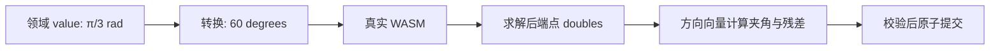

# L-006D：角度为什么需要单位和方向约定？

| 项目 | 内容 |
| --- | --- |
| 日期 / 版本 | 2026-10-02 / T-201A；固定 SolveSpace 2879a02d、原WASM未改 |
| 关联 | L-006D；T-201A；REQ-005/AC-005-5部分、REQ-012、LEARN-001 |
| 状态 | 已讲解、已实验；复述未记录 |
| 前置 | [领域求解](L-006C-domain-solver.md)、[手势权威](L-007C-latest-drag.md) |

## 1. 本次问题

领域里的 60° 如何交给使用另一种单位的求解器？两条反向平行的线该不该算平行？本篇同时核对 P0 的相等语义，避免把原生能力直接当项目需求。

## 2. 原理与数据流

领域 value 保存 radians，范围 (0,π)。输入 60° 时存 π/3；适配层乘 180/π 后调用 native angle。返回后从两条线的 start→end 方向计算夹角，不从约束 value 反抄结果。



设方向为 a、b，夹角用 `atan2(abs(cross(a,b)), dot(a,b))` 得到 [0,π]。angle 比较该角和 value；perpendicular 比较它和 π/2；parallel 使用 `min(θ,π−θ)`，正向和反向都平行。归一化后的角度误差以 rad 判断，不能把未归一化点积当角度容差。

equal 在本项目只表示两线等长，或两圆/圆弧等半径。原生接口还接受线与弧的弧长相等，但 PRD 不包含该组合，因此领域白名单明确拒绝。两个引用必须是不同对象，防止把无意义的自引用送入原生代码。

## 3. 最小实验

```powershell
. ./scripts/use-node.ps1
npm run check:linear-constraints
npm run build
npm run check:linear-constraints:browser
```

固定线A端点 (0,0)、(10,0)，线B起点 (0,20)，线B初始终点偏离预期。给 B 长10及平行/垂直/30°/60°/120°/170°约束；反转 A 的首尾验证方向。equal 另测线、圆/圆、圆/弧、弧/弧。

环境：Windows x64、PowerShell7.6、Node24.21.0、npm11.19.0、Edge154.0.4258.48；现有自建WASM。角度残差≤1e-5 rad，长度/半径≤1e-5 mm；输入/稳定ID和历史精确比较。

8项非法输入：四类约束的线/圆错误组合、把60误填radians、0、π和同一对象两次。Node实际执行；浏览器实际执行专用Worker、生产root/`/cad/`和503失败重试。

## 4. 实际结果与证据

| 检查 | 期望 | 实际 | 证据 |
| --- | --- | --- | --- |
| 12个方向/相等夹具 | 真实求解，独立残差合格 | 全通过；真实DOF与稳定ID记录 | [Node](../evidence/T-201A-linear-native.json) |
| 8项非法输入 | 原生前拒绝 | 通过；无native错误输出 | 同上 |
| 60°→120°→undo→redo与冲突 | 真实角度变化，失败不改文档/历史 | 从快照端点测量的角度符合预期；精确回滚 | 同上transaction |
| 三入口Worker与503重试 | 同源WASM/MIME，真实角度事务 | 三入口各12项和事务通过，重试12项通过 | [浏览器](../evidence/T-201A-linear-browser.json) |

早期夹具把圆半径当不变定义字段，比较失败；改为只排除可求解 radius、仍严格比较 ID/实体引用/方向。没有放宽残差或改写原生结果。普通包约726kB，chunk提示保留。

## 5. 接回项目

[adapter](../../../src/adapters/solver/solve-domain-sketch.ts) 增加四类原生映射和独立残差；[schema](../../../src/core/model/validate-document.ts) 拒绝重复对象；[fixture](../../../src/experiments/linear-constraint-fixtures.ts) 同时用于 Node 和真实 Worker 技术实验。进入“技术实验”点击“运行方向与相等约束”可重做。

T-201A 只覆盖新增方向/相等约束。相切目前仍限弧线共享端点；完整相切组合待 T-201B，约束面板、完整 REQ-005 待 T-201C。极接近 0/π 的角度与大坐标病态条件本任务未完整验收，失败应明确拒绝。

## 6. 我的复述与检查题

- 我的解释：未记录。
- 练习：把线A首尾反转，先预测 angle=60° 时线B的方向；与 parallel 有何区别？
- 为什么不能直接把 value 作为“实际角度”记录？
- native equal 支持线与弧，为什么本项目仍拒绝？

## 7. 疑问与下一步

下一任务 T-201B：相切不仅需要无限支撑曲线相切，还要验证接触点属于线段和圆弧范围。原生 tangent 便利函数的组合有限，需要先核对固定源码，不能放开白名单后让无效调用导致 native fatal。

## 8. 来源

- SolveSpace [slvs/lib.cpp](https://github.com/solvespace/solvespace/blob/2879a02d2866e103d7a4817721ead9ac43558aea/src/slvs/lib.cpp)：Slvs_Equal/Angle/Parallel/Perpendicular；[constrainteq.cpp](https://github.com/solvespace/solvespace/blob/2879a02d2866e103d7a4817721ead9ac43558aea/src/constrainteq.cpp)：角度转换。固定 commit，2026-10-02 读取实际本地源码与真实既有WASM。
- 本项目 [PRD](../../PRD.md) REQ-005、第7节；[构建来源](../../../public/wasm/SOURCE.md)：2026-10-02核对。单位、白名单与独立残差规则属于项目约定，未复制上游实现。
