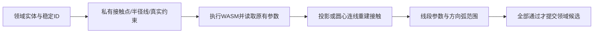

# L-006F：私有接触点怎样成为可提交的相切结果？

| 项目 | 内容 |
| --- | --- |
| 日期 / 版本 | 2026-10-02 / T-201B2，SolveSpace 2879a02d，WASM不变 |
| 关联 | L-006F；T-201B2；REQ-005/AC-005-5相切适配、REQ-012、LEARN-001 |
| 状态 | 已讲解、已实验；用户复述未记录；完整约束面板待C |
| 前置 | [原生接触与反例](L-006E-tangent-contact.md)、[稳定ID](L-006C-domain-solver.md) |

## 1. 本次问题

如何把原生辅助点用于所有相切组合，同时保证文档中只有用户的点、实体和约束？本次学习接触初值、独立范围检查和失败事务三者的关系。

## 2. 原理与数据流

线圆/弧用“接触点在支撑圆上、在直线上、半径与直线垂直”；圆/弧之间用“点在两个支撑圆上、两条半径平行”。已有共享端点弧线保留原生端点相切API。顺时针弧在native中交换首尾，领域ID和方向不变。



初值用于启动迭代，不能当结果。线圆用圆心投影；若线穿圆心，使用确定的法线方向。圆圆按现有圆心距接近半径和或半径差选择初值；共心初值明确拒绝并提示先移动圆心，不随机猜方向。

校验重新从返回的原始领域坐标求接触，不读取辅助点。线段参数须落在 `[0,1]`，边界容差为 `1e-5 mm / 线长`；弧按clockwise计算扫角，角边界容差为 `1e-5 mm / 半径`。相切距离残差≤1e-5mm，弧固有等半径也独立检查。

每个辅助约束handle都映射到同一个领域相切ID；先核对原生失败列表长度，再对领域ID去重。用户不会收到私有handle。Worker传回领域错误码，几何拒绝保留已加载模块；加载失败才重置加载promise，允许显式重试。

## 3. 最小实验

```powershell
. ./scripts/use-node.ps1
npm run check:tangency
npm run build
npm run check:tangency:browser
```

环境：Windows x64、PowerShell7.6、Node24.21.0/npm11.19.0、Edge154.0.4258.48、Playwright1.63.0；既有SolveSpace固定WASM。输入见[fixture](../../../src/experiments/tangent-fixtures.ts)，全部由真实适配器求解。

输入：半径10的曲线与y=8水平线；半径10/8曲线圆心距初值19或3。包含线圆、线弧、圆圆、圆弧、弧弧，顺逆时针、引用顺序、线方向及共享端点，17种×XY/XZ/YZ。

期望：线到y=10；外切圆心距18mm、内切2mm；有限接触且所有残差≤1e-5mm；领域ID/定义与输入保持不变。再用线段(-20,10)—(-15,10)及不含右端接触点的弧，期望TANGENT_RANGE拒绝。

## 4. 实际结果与证据

| 检查 | 期望 | 实际 | 证据 |
| --- | --- | --- | --- |
| 51真实组合 | 接触/范围/稳定ID通过 | 全通过，无native错误 | [Node](../evidence/T-201B2-tangency-native.json) |
| 3范围反例、5非法输入 | 弧外/延长线拒绝；对象错误先拒绝 | 全通过 | 同上 |
| 4边界单测 | mm转换及弧角wrap正确 | 全通过；5e-6接受、2e-5拒绝 | [日志](../evidence/T-201B2-tangency.log) |
| 半径8→12/undo/redo | 圆心距18→22→18→22mm | 实际坐标满足；精确快照恢复 | Node transaction |
| 原生冲突、范围事务 | 文档/历史/revision不变 | 三失败均保持；失败ID为领域ID | 同上 |
| 三入口真实Worker/503 | 每次51项；错误可恢复 | 全通过；范围失败后仅一次WASM加载 | [浏览器](../evidence/T-201B2-tangency-browser.json) |

首轮事务夹具把已存在的circle实体ID用于arc，被稳定角色检查正确拒绝。改为新几何分配新ID后才进入预期范围失败；没有绕过ID规则或伪造失败。

原领域16项/12core边界、12旧native、7编辑与三平面拖动、12方向/相等、9协议回归通过；历史证据另存新路径。typecheck/build通过，普通主包736.06kB提示保留；浏览器截图已查看，只作布局检查。

## 5. 接回项目

纯[几何校验](../../../src/core/geometry/tangency.ts)不依赖Vue/Three/WASM。[adapter](../../../src/adapters/solver/solve-domain-sketch.ts)持有所有辅助对象，finally清理原生草图，只回写既有领域点和圆半径。既有app真实Worker管线自动获得这些组合。

T-201B1/B2合并覆盖全部P0相切家族适配、非法对象、接触范围与失败事务。T-201B完成；T-201整体仍doing，约束面板/标注/完整REQ-005验收留给C。没有新增依赖、二进制或schema版本。

## 6. 我的复述与检查题

- 我的解释：未记录。
- 练习：将外切第二圆半径改为12，先预测圆心距和接触坐标，再运行。
- 为什么可以用私有辅助点求解，却要从原有领域参数重新验证接触？
- native冲突和弧外拒绝发生的阶段有什么差别？

## 7. 疑问与下一步

共心初值须先移动圆心；极限尺度和任意拖动中分支切换未穷尽，但每次候选仍强制残差/有限范围检查。这里只验证Edge，三浏览器与完整性能留给最终任务。用户学习掌握未记录。

下一T-201C/L-006G：选中的领域对象怎样创建/修改/删除约束，并展示真实DOF、标注与冲突？

## 8. 来源

- SolveSpace固定commit[2879a02d](https://github.com/solvespace/solvespace/tree/2879a02d2866e103d7a4817721ead9ac43558aea)，src/slvs/lib.cpp、src/constrainteq.cpp、src/slvs/jslib.cpp；2026-10-02本地源码核对与真实WASM执行。GPL声明及[构建来源](../../../public/wasm/SOURCE.md)保持不变。
- [PRD](../../PRD.md) REQ-005与第7节；[原生实验](L-006E-tangent-contact.md)和本次证据：2026-10-02核对。有限范围/初值策略为本项目实现。
