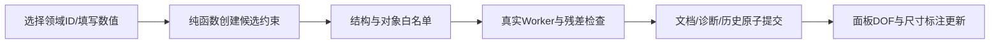

# L-006G：选择的对象怎样变成可撤销的约束？

| 项目 | 内容 |
| --- | --- |
| 日期 / 版本 | 2026-10-02 / T-201C2；Vue3.5.43、Three0.186.1、既有SolveSpace2879a02d |
| 关联 | L-006G；T-201C2；REQ-005/AC-005-1—6、REQ-012、LEARN-001 |
| 状态 | 已讲解、已实验；REQ-005指定验收通过；用户复述未记录 |
| 前置 | [原子诊断](L-007D-atomic-diagnostics.md)、[方向与角度](L-006D-angle-and-equal.md)、[相切](L-006F-domain-tangency.md) |

## 1. 本次问题

选择一条线，输入40mm，然后再改成60mm：界面如何只表达意图，让真实求解器改变几何，并保留失败前的项目？本次把选择、单位转换和事务提交连起来。

## 2. 原理与数据流

界面保存选择的领域ID。纯函数根据ID区分点和实体、建立refs，再经过schema类型/数量/值检查；非法组合不会进入求解。角度输入为度，进入领域时转成radians；native转换另在adapter中完成。



新约束分配新ID；改值保留约束和实体ID，删除只移除该约束。固定点初次保存当前坐标，之后可以编辑X/Y。失败候选显示原生inconsistent/solver-failed或具体输入错误，已提交诊断和几何保留。

尺寸标注从已提交坐标计算线长、点距、半径和角度。Three运行时每次渲染后投影世界点，Vue只接收像素和文字；标注不参与拾取。缩放、平移、resize和几何修改共享这条更新路径，不建立第二个相机或额外GPU对象。

## 3. 最小实验

```powershell
. ./scripts/use-node.ps1
npm run check:constraint-edit
npm run build
npm run check:constraints:browser
$env:SKETCH_EDIT_BROWSER_EVIDENCE_PATH='docs/learning/evidence/T-201C2-edit-browser-replay.json'
$env:SKETCH_EDIT_EVIDENCE_TASK='T-201C2'
npm run check:sketch-edit:browser
```

环境：Windows x64、PowerShell7.6、Node24.21.0/npm11.19.0、Edge154.0.4258.48、Playwright1.63.0。浏览器实际绘制和点击面板，不注入文档、不伪造Worker回复。

每个入口在XY/XZ/YZ创建40×30mm矩形，加宽高约束、拖动固定几何、把宽改60、撤销/重做，再尝试冲突50。删除宽后拖到宽65，再固定点并把X改70。其他十类通过实际线/圆输入分别创建并做非法选择；角度60→120度、圆半径12→14mm也实际编辑。

期望：所有成功残差≤1e-5（长度mm、方向rad）；失败不变；DOF从native得0→1→0；标注与实际几何同步，一拖一提交。

## 4. 实际结果与证据

| 检查 | 期望 | 实际 | 证据 |
| --- | --- | --- | --- |
| 12类core编辑与非法组合 | 真实结果；非法对象在求解前拒绝 | 全通过，native错误0 | [Node](../evidence/T-201C2-constraint-native.json) |
| 三入口×三平面矩形 | 40→60mm；固定拖动不增历史；冲突拒绝 | 全通过；标注L60；文档/诊断/revision保持 | [浏览器](../evidence/T-201C2-constraints-browser.json) |
| 删除宽、拖动、固定、改坐标 | DOF0→1→0，宽65/70mm | 实际自由宽约65.000003242mm、固定X后70mm | 同上planes |
| 全P0实际面板与非法选择 | 每类成功/拒绝；角度/半径编辑同步 | 全通过，角120°、R14mm标注正确 | 同上types/illegalKinds |
| 最新队列/取消/实体删除回归 | 每Worker至多1在途；旧结果不写当前文档 | 三入口/三平面、Esc/退出/新建冷加载取消通过 | [实际手势](../evidence/T-201C2-edit-browser-replay.json) |
| 原领域/调度/协议 | 保持缓存、历史、焦点与过滤 | 16领域/13core、7编辑及三平面native、9协议通过 | [领域](../evidence/T-201C2-domain-replay.json)、[编辑](../evidence/T-201C2-edit-replay-node.json)、[协议](../evidence/T-201C2-worker-replay.json) |

初次类型选择缺少明确可访问名称，补齐aria-label后实际操作通过。另一次测试在revision更新后立即断言标注删除，早于渲染帧；改为等待标注DOM移除，没有用任意延时掩盖。自动审批曾因用量限制未执行两项回归；用户继续后恢复执行并通过。

截图已查看，只作面板排版检查；几何依据返回领域坐标、残差和历史，不用截图证明。typecheck/build通过；普通主包约750kB的提示保留，最终性能未验收。

## 5. 接回项目

[纯编辑与标注数据](../../../src/core/geometry/constraint-edit.ts)、[ConstraintPanel](../../../src/components/ConstraintPanel.vue)、[Workspace](../../../src/components/Workspace.vue)各持有自己的职责。面板用commit回调走既有ProjectSession，不直接写Pinia文档。失败原生诊断通过SketchRejectedError传给界面，仅用于候选提示。

T-201A/B/C共同覆盖REQ-005六项AC，映射见[验收记录](../../VERIFICATION.md)。T-201与C2完成；完整MVP、文件/一般轮廓/实体后代/最终三浏览器与性能仍待后续。辅助学习掌握仍未记录。

## 6. 我的复述与检查题

- 我的解释：未记录。
- 练习：删除高度约束，预测DOF和可移动方向，再拖动验证并撤销。
- 为什么面板不能直接改点坐标来“满足”宽度输入？
- 领域角度、native角度、面板输入分别使用什么单位？
- 为什么删除约束后标注需等渲染帧更新，而历史已经提交？

## 7. 疑问与下一步

相切共心初值须先移动，任意尺度与分支切换未穷尽；每次候选仍检查残差和有限范围。当前仅实际Edge，复杂模型性能留给T-403。文件保存按钮仍禁用，失败保存内容不变由序列化权威文档实验验证，不能误写为保存UI已完成。

下一T-202/L-008A：相邻端点怎样形成闭合轮廓，怎样识别自交、外轮廓和孔洞？

## 8. 来源

- 本项目[PRD](../../PRD.md) REQ-005、第7节；[测试脚本](../../../scripts/check-constraints-browser.mjs)：2026-10-02核对及实际执行。
- Vue3.5.43/Three0.186.1来源和许可见[UI依赖](../../third-party/README.md)；SolveSpace固定[2879a02d](https://github.com/solvespace/solvespace/tree/2879a02d2866e103d7a4817721ead9ac43558aea)与[WASM来源](../../../public/wasm/SOURCE.md)：沿用已审计源码/二进制，2026-10-02核对；未更换依赖。
