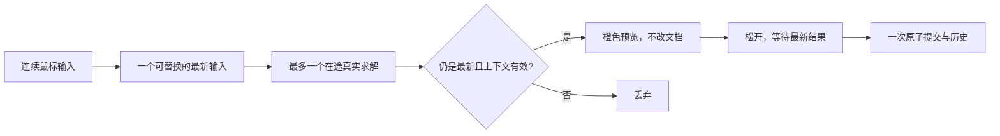

# L-007C：30 次拖动输入为什么只产生一次撤销？

| 项目 | 内容 |
| --- | --- |
| 日期 / 版本 | 2026-10-02 / T-104C；Node 24.21.0、SolveSpace 2879a02d |
| 关联 | L-007C、L-010；T-104C；REQ-004/009/012、LEARN-001 |
| 状态 | 已讲解、已实验；复述未记录 |
| 前置 | [屏幕捕捉](L-005B-screen-snapping.md)、[传输相关性](L-007A-worker-correlation.md)、[原子历史](L-010A-atomic-history.md) |

## 1. 本次问题

鼠标移动速度可以超过求解速度。如果每个事件都修改文档，会积压请求并产生几十次撤销。本篇把“输入、预览、成功提交”分开，说明取消和删除如何保住旧数据。

## 2. 原理与数据流

一次手势保存开始时的草图、项目 session 和 revision。每次输入都从这份基础快照构造候选，避免以前一次预览为基础累积偏差。



`sequence` 保护手势内的新旧输入；session/revision 保护项目和文档；WorkerRpc 的 requestId 保护传输。三者解决的范围不同。Esc、退出、撤销和新建会取消手势，必要时终止预览 Worker；新的手势显式创建新的请求。

`markDragged` 是原生求解优先提示。固定源码 `system.cpp` 对被拖参数采用 `1/20` 的最小二乘列权重，允许约束求解微调该点，不能把它当 fixed。显示与提交采用求解后坐标，约束残差依然必须 ≤1e-5，不能用鼠标偏差替代残差标准。

删除也以候选提交：找出被删实体拥有的点，保留其他实体仍使用的点，再删除引用被删实体或孤立点的约束。仅靠两个点坐标相同不能判断所有权，要使用稳定 ID。

## 3. 最小实验

```powershell
. ./scripts/use-node.ps1
npm run check:sketch-edit
npm run build
npm run check:sketch-edit:browser
```

输入：固定原点的 40×30 矩形，连续给 30 个右上角位置，最后为 (50,35)。再增加宽 40/高 30 约束；删除一条边；拖动自由圆中心和圆弧端点；构造会在求解后退化的矩形。

环境：Windows x64、PowerShell 7.6、Node 24.21.0、npm 11.19.0、Edge 154.0.4258.48、Three 0.186.1。几何/约束容差 1e-5 mm，历史快照和 ID 精确比较。小于 1e-8 mm 的原生浮点扰动视为无实际移动，不新增历史。

浏览器分别测试开发、root、`/cad/`，每入口三平面。拦住真实预览 Worker 的 WASM 下载，验证 Esc、退出和新建；解除拦截后重新执行真实求解。没有用模拟坐标补结果。

## 4. 实际结果与证据

| 检查 | 期望 | 实际 | 证据 |
| --- | --- | --- | --- |
| 7 项编辑/队列测试 | 最新槽、失败不回退、取消、共享点清理 | 通过；受控回复只证明调度 | [日志](../evidence/T-104C-edit.log) |
| 三平面 30 次矩形输入 | 终点(50,35)、一次历史 | 各2次真实求解、1次预览、1条历史 | [Node](../evidence/T-104C-edit-node.json) |
| 宽高约束、圆、圆弧 | 真实残差合格、退化拒绝 | DOF0尺寸仍40×30；圆心(65,5)、r10；退化拒绝 | 同上 |
| 三入口实际手势/删除/取消 | 预览不改文档，最多1请求，历史/焦点正确 | 每入口三平面通过；三种冷加载取消通过 | [浏览器](../evidence/T-104C-edit-browser.json) |

圆弧端点输入 (-12,3)，实际约 (-11.998837409,2.999709352)，目标偏差约 0.001198371 mm，固有等半径残差为 0。它说明优先提示与固定约束的区别；约束容差没有放宽。

浏览器矩形拾取显示实际领域值，例如 49.999996 mm；目标与求解结果在 1e-5 mm 内，并不伪造显示为精确 50。初次观察器监听顺序曾把一个已完成请求误计为在途，调整为 WorkerRpc 前注册后计数为 1。截图已查看，仅作预览/排版证据。

## 5. 接回项目

[SketchDrag](../../../src/app/sketch-drag.ts) 管一个在途请求与最新槽；[ProjectSession](../../../src/app/project-session.ts) 管独立预览 Worker 和权威事务；[ModelViewport](../../../src/components/ModelViewport.vue) 管手势和可见反馈；[sketch-edit](../../../src/core/geometry/sketch-edit.ts) 管纯领域删除、移动和退化检查。

T-104A/B/C 合起来覆盖 REQ-004 的四项 AC：矩形与自由点实际拖动、非法输入拒绝、取消与删除清理、旋转模型后进入草图及 zoom 下像素捕捉。全部 P0 约束面板、一般实体后代、保存和最终三浏览器/性能仍待后续。

## 6. 我的复述与检查题

- 我的解释：未记录。
- 练习：把队列测试输入从 30 改为 300，先预测请求数和历史数，不能只预测执行时间。
- 旧请求成功时，为什么还要检查当前 sequence？
- 删除相邻两条边时，为什么用点 ID 而不是比较坐标？
- 鼠标目标偏差与约束残差分别回答什么问题？

## 7. 疑问与下一步

当前是 sketch-only 文档，整份候选的非空草图仍逐一求解，尚未优化受影响分支。下一任务 T-201：全 P0 约束的对象组合、角度单位与真实残差，再接约束面板。学习掌握仍待用户复述。

## 8. 来源

- SolveSpace [system.cpp](https://github.com/solvespace/solvespace/blob/2879a02d2866e103d7a4817721ead9ac43558aea/src/system.cpp) 的 `SolveLeastSquares` 与 [slvs/lib.cpp](https://github.com/solvespace/solvespace/blob/2879a02d2866e103d7a4817721ead9ac43558aea/src/slvs/lib.cpp) 的 `Slvs_MarkDragged`：固定 commit，2026-10-02 读取实际本地审计源码，未复制实现；现有自建 WASM 未改。
- 本项目 [PRD](../../PRD.md) REQ-004/005/009/012、[T-104B](../../TASKS.md) 与上方证据：2026-10-02 核对。最新槽、取消和历史规则是本项目设计。
