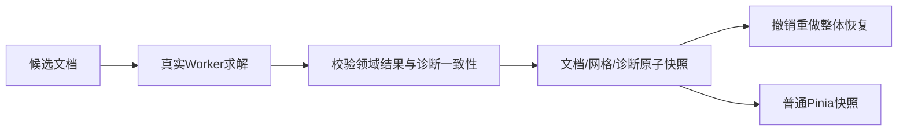

# L-007D：DOF 怎样随文档一起撤销？

| 项目 | 内容 |
| --- | --- |
| 日期 / 版本 | 2026-10-02 / T-201C1，既有SolveSpace 2879a02d WASM |
| 关联 | L-007D；T-201C1；REQ-005状态/失败/历史基础、REQ-009、REQ-012、LEARN-001 |
| 状态 | 已讲解、已实验；面板未接入；复述未记录 |
| 前置 | [原子历史](L-010A-atomic-history.md)、[领域相切](L-006F-domain-tangency.md) |

## 1. 本次问题

删除宽度约束后DOF变为1；撤销回原矩形时，怎样确保界面不会仍显示1？把诊断当作独立即时消息，会使它和权威文档不同步。

## 2. 原理与数据流

诊断包含原生状态、DOF、返回码、残差和冗余ID，是普通可序列化数据。它与文档、派生网格一起成为一次事务快照；候选成功后一起发布，失败时一起保留旧值，撤销/重做一起恢复。



元数据改名不求解，保留诊断。空草图没有原生方程，不猜DOF0；新项目和删除草图清空相关诊断。保存内容只有权威领域文档，诊断暂态不进入文件。

返回码4允许冗余成功。实测新增固定点后DOF0，但native的bad列表包含h-bottom，因为已固定的两端使水平约束冗余。成功返回中的这些ID记录为redundantConstraintIds，failedConstraintIds为空；真正失败才用失败ID拒绝候选。

## 3. 最小实验

```powershell
. ./scripts/use-node.ps1
npm run check:diagnostics
npm run build
$env:DOMAIN_SOLVER_BROWSER_EVIDENCE_PATH='docs/learning/evidence/T-201C1-worker-browser.json'
$env:DOMAIN_SOLVER_EVIDENCE_TASK='T-201C1'
npm run check:domain-solver:browser
```

环境：Windows x64、PowerShell7.6、Node24.21.0/npm11.19.0、Edge154.0.4258.48。输入是真实40×30mm矩形：删除width、固定p1、undo/redo，再添加冲突50mm。

期望：原DOF0→删除宽DOF1→固定点DOF0；撤销/重做精确恢复诊断。失败保持文档/诊断/历史/revision/序列化保存内容不变；元数据改名保留诊断。

## 4. 实际结果与证据

| 检查 | 期望 | 实际 | 证据 |
| --- | --- | --- | --- |
| 5真实管线测试 | 历史/元数据/失败/空项目/迟到一致 | 全通过，native错误0 | [Node](../evidence/T-201C1-diagnostics.json) |
| DOF与冗余 | 1→0→undo1→redo0 | 真实DOF；码4、h-bottom冗余、失败ID为空 | 同上；[Worker](../evidence/T-201C1-worker-browser.json) |
| 4种损坏诊断 | 整个候选拒绝 | 全拒绝，文档历史不变 | Node最后一项 |
| 三入口Worker/503 | 实际DOF/历史/冲突与加载恢复 | 全通过；原12native fixture也通过 | Worker证据 |
| 原领域与构建 | 不破坏旧缓存/历史 | 16领域/12core、12native/4拒绝；typecheck/build通过 | [领域](../evidence/T-201C1-domain-replay.json)、[native](../evidence/T-201C1-native-replay.json) |

首轮校验把所有bad列表都视为失败，正确拦住诊断，但不符合原生冗余成功语义。读取真实返回码4/DOF0及h-bottom后修正分类；没有把DOF自行改成猜测值。普通包738.71kB提示保留。

## 5. 接回项目

[sketchRecompute](../../../src/app/sketch-recompute.ts)从真实返回值分离诊断；[ProjectEngine](../../../src/core/commands/project-engine.ts)校验草图ID、DOF/状态、残差集合和容差，再原子存入历史。[ProjectSession](../../../src/app/project-session.ts)只发布普通快照。对外getter克隆，调用者不能直接改写诊断。

受控promise仅延迟实际WASM结果，证明取消保护，不伪造几何或DOF。C1完成只交付一致性前置；C2继续界面显示、全部约束编辑和完整REQ-005，不将C1标成REQ-005完成。

## 6. 我的复述与检查题

- 我的解释：未记录。
- 练习：删除高度约束，先预测原生DOF变化，再实验并撤销。
- 为什么诊断可以进入历史，却不进入项目JSON？
- 原生bad列表在失败和冗余成功时分别代表什么？

## 7. 疑问与下一步

缺少真实诊断时显示“未求解”，不能由约束数量推算自由度。完整界面与文件恢复尚未实现；加载文件后需重新获得真实诊断。下一T-201C2/L-006G面板/数值/删除/标注与三入口完整回归。

## 8. 来源

- SolveSpace固定[2879a02d源码](https://github.com/solvespace/solvespace/tree/2879a02d2866e103d7a4817721ead9ac43558aea) src/slvs/lib.cpp成功/冗余返回契约；2026-10-02本地源码核对与既有WASM实测，二进制未修改。
- [PRD](../../PRD.md) REQ-005/009/012与[测试](../../../tests/sketch-diagnostics.test.mjs)：2026-10-02核对。快照一致性是本项目设计。
