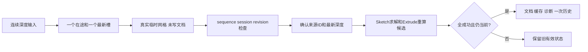

# L-007E：最新拉伸预览怎样安全进入原子历史？

| 项目 | 内容 |
| --- | --- |
| 日期 / 版本 | 2026-10-02；基于66c4d52，Node24.21.0 |
| 关联 | L-007E；T-202C2a；REQ-006/009/012前置、LEARN-001 |
| 状态 | 讲解：已整理；实验：已执行；复述：未记录 |
| 前置知识 | [最新拖动](L-007C-latest-drag.md)、[一般拉伸](L-008D-general-extrusion.md) |

## 1. 本次问题

用户连续修改深度，旧结果可能晚到；确认后还要重新求解并生成网格。如何保证预览不写文档，成功提交只增加一次历史，取消或失败保持旧有效状态？

## 2. 原理与数据流

预览捕获来源草图、区域、session和revision。队列只有一个在途请求与一个可替换的最新输入；输出还要匹配sequence。更新时清掉旧成功预览，非法新深度不能继续显示旧网格并声称成功。finish等待最新请求，验证来源仍有效，再提交定义。

权威管线按依赖顺序先真实求解Sketch，再生成Extrude；文档、网格缓存、诊断共同进入候选，全部成功才加入历史。撤销/重做共同恢复三者；存盘定义只含来源ID和深度。当前全量重算，布尔与受影响分支优化仍留后续任务。

客户端也有所有权。预览确认进入提交时，结束其几何客户端并交给后续预览一个新客户端；旧finally只能清理它捕获的实例，不能通过“当前客户端”字段终止后来创建的工作。



## 3. 最小实验

实现：[最新预览](../../../src/app/extrusion-preview.ts)、[特征重算](../../../src/app/feature-recompute.ts)、[会话所有权](../../../src/app/project-session.ts)。测试见 [真实事务](../../../tests/extrusion-transactions.test.mjs)。延迟promise包装真实WASM和真实double网格，不返回模拟求解成功。

```text
输入：真实固定40×30矩形；深度10→−20；宽40→60；连续深度1…30
操作：真实提交/撤销重做；冲突/区域缺失/0深度；取消/改名/新项目/晚到
命令：npm run check:extrusion-transactions；npm run build
环境：Windows x64、Node24.21.0/npm11.19.0、Three0.186.1、既有WASM
期望：12000→18000→36000mm³；30输入只请求1与30，确认只增加1历史
容差：体积1e-6mm³；失败前后文档/缓存/诊断/历史/revision/保存内容精确一致
附加：受控传输端口执行真实内核，延迟第二个solid回复，取消提交后立即开始新预览
```

## 4. 实际结果与证据

| 检查 | 期望 | 实际 | 证据 |
| --- | --- | --- | --- |
| 原子特征历史 | 12000/18000/36000，undo/redo精确 | 通过；−20深度bounds z∈[−20,0] | [事务JSON](../evidence/T-202C2a-transactions.json) |
| 三候选失败 | 旧权威状态全部不变 | 冲突、区域不完整、0深度拒绝；元数据保留缓存 | 同上 failed-candidates |
| 30次最新输入 | 2请求、1有效预览、1历史 | 请求深度1/30，真实体积1200/36000 | 同上 latest-depth-queue |
| 取消/来源改变/新项目/晚到 | 不发布旧网格或缓存 | 全通过，文档历史精确保留 | 同上 late-real-mesh / late-atomic-cache |
| 10→0→−10 | 失败清旧成功，再恢复 | 0拒绝且状态不变，−10提交12000mm³ | 同上 failed-preview-recovery |
| 客户端交接 | 旧finally不终止新预览 | 新深度20预览与提交，体积24000mm³ | 同上 preview-client-ownership |

7/7通过，native stderr为空。新增交接测试曾真实失败：虽然闭包捕获了旧客户端，新预览仍在旧提交结束前复用它。修复为确认进入提交时主动交接客户端；新预览在取消旧提交后立即启动，仍成功返回并提交。

首轮Node直接执行遇到TypeScript参数属性不可仅擦除；改为显式成员与构造赋值，符合项目的Node/TS执行方式。没有启用额外编译绕过。build/typecheck通过；主包774.65kB提示保留。

三入口真实约束面板与三平面40→60/冲突/自由拖动/固定/标注回归通过，见 [约束重放](../evidence/T-202C2a-constraints-browser-replay.json)。三入口实际绘制/拖动/捕捉/删除/焦点及生产冷WASM Esc/退出/新项目取消通过，见 [手势重放](../evidence/T-202C2a-edit-browser-replay.json)。Edge154.0.4258.48；16领域/16core边界通过。这些是旧草图行为的回归，没有拉伸UI验收。

## 5. 接回项目

ProjectSession已使用真实Sketch→Extrude管线，并拥有主求解/几何客户端和独立预览客户端。cancelPending终止当前权威任务；undo/redo、新项目、开始拖点或其他命令取消预览。错误后仍可重新建立预览会话。

C2a没有区域选择或临时GPU网格界面；工作区拉伸按钮仍禁用，完整REQ-006未验收。C2b需要把本服务接到Vue/视口、验证旧回调不会清掉新预览，并完成实际浏览器取消/提交/历史。

## 6. 我的复述与检查题

- 我的解释：未记录。
- 小练习：把深度更新序列改为10/−10/0/20，先预测最后被提交的深度与在途请求数。
- 为什么问题：为什么仅捕获旧客户端还不足以保证安全？为什么预览成功后确认仍须重算候选？

## 7. 疑问与下一步

临时网格需由视口拥有和销毁，Vue只持普通DTO与浅引用；实际Esc/新项目/隐藏/上下文恢复仍由C2b验证。本单元不声称布尔或受影响分支优化已完成。

## 8. 来源

- [PRD](../../PRD.md)：0.3.9，核对2026-10-02，预览/取消/有符号深度/历史与原子失败要求。
- [ProjectEngine](../../../src/core/commands/project-engine.ts)：本次基于66c4d52，核对2026-10-02，已有候选校验、缓存诊断与历史事务。
- [本次真实测试](../../../tests/extrusion-transactions.test.mjs)：T-202C2a工作树，基于66c4d52；核对2026-10-02，真实native/网格与受控时间顺序。
- [WASM来源](../../../public/wasm/SOURCE.md)：SolveSpace2879a02d2866e103d7a4817721ead9ac43558aea；核对2026-10-02，构建未变。
