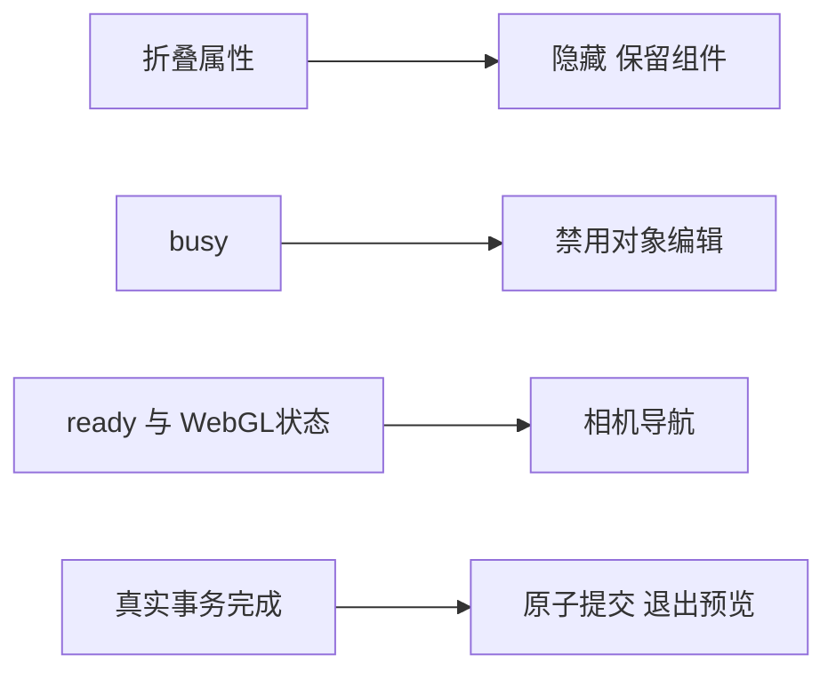

# L-007F：显示状态与事务生命周期

| 项目 | 内容 |
| --- | --- |
| 日期 / 版本 | 2026-10-02 / 基线e3e0848；Vue3.5.43、Three.js0.186.1 |
| 关联 | L-007F、T-R01、REQ-006/009/012；AC-012-2/3/4 |
| 状态 | 已讲解、已实验；复述未记录 |
| 前置知识 | [拉伸提交](L-008E-extrusion-ui.md)、[资源生命周期](L-004C-viewport-lifecycle.md) |

## 1. 本次问题

折叠面板为何丢失真实提交回调？禁用编辑为何也禁用了相机？本次学习一个边界：显示状态和输入权限不应决定事务的寿命。

基线属性内容使用v-if，折叠卸载组件。提交已进入ProjectEngine，清理预览不能撤销权威事务；alive=false又阻止完成事件。重新展开显示错误，但旧事务成功，重试得到第二个拉伸。setInputEnabled(false)同时关闭OrbitControls，违反AC-012-3。

## 2. 原理与数据流

输入是折叠、busy、内核ready和WebGL状态。输出分别是内容显示、对象编辑和相机导航权限。

属性内容改为v-show，折叠只隐藏，组件、深度草稿和完成回调仍存在；取消、结束预览或离开工作区才走原有清理。编辑与导航使用独立字段，Controls重建/WebGL恢复读取导航字段，草图旋转锁定保持原逻辑。



实现见[Workspace](../../../src/components/Workspace.vue)、[ModelViewport](../../../src/components/ModelViewport.vue)和[ViewportRuntime](../../../src/adapters/viewport/viewport-runtime.ts)。

## 3. 最小实验

```text
输入：XY20×20mm矩形；宽20→25；拉伸深度10/12mm。
导航：扣留真实25mm求解回复，中键移动30×15 CSS px，滚轮-160。
折叠：12mm预览折叠/展开；确认后扣留真实4800mm³网格，隐藏期间释放。
取消：另一10mm拉伸扣留实际4000mm³网格，隐藏期间Esc，再释放旧回复。
命令：npm run check:interaction:browser；npm run check:viewport。
Node：node --test tests/extrusion-transactions.test.mjs tests/workspace-state.test.mjs。
环境：Windows x64、PowerShell7.6、Node24.21.0/npm11.19.0、Edge154.0.4258.48。
容差：长度≤1e-5mm、直边体积≤1e-6mm³；标注屏幕移动>1 CSS px。
历史：文档精确比较，成功一次revision，取消零revision，无意外第二个拉伸。
```

[脚本](../../../scripts/check-interaction-lifecycle-browser.mjs)只延迟真实成功回复，不替换几何。相机判断来自生产页面实际标注位置，不依赖组件内部对象。

## 4. 实际结果与证据

| 检查 | 期望 | 实际 | 证据 |
| --- | --- | --- | --- |
| 忙碌导航 | 可平移/缩放，编辑禁用 | 三入口标注移动、草图旋转锁定；宽25mm，取消/重试恢复5000mm³ | [交互](../evidence/T-R01-interaction-browser.json) navigation |
| 折叠提交 | 草稿保留、零重发、一次提交 | 深度12mm、4800mm³；隐藏完成回到模型选择，精确undo/redo | 同上 panel |
| 隐藏取消 | 丢弃晚回复并可重试 | 实际4000mm³回复拒收，文档/revision不变，新提交恢复 | 同上 panel |
| WebGL恢复 | 开关独立保留 | 三入口恢复后可只开导航，拾取仍禁用；20次资源回归通过 | [视口](../evidence/T-R01-viewport-replay.json) |
| 管线/构建 | 原有行为不回归 | 7真实事务与4状态测试通过；typecheck/build/docs/diff通过 | [事务](../evidence/T-R01-extrusion-transactions.json)、[验证](../../VERIFICATION.md) |

首次新脚本误将未指定kind与未指定拦截目标相等比较，扣留启动检查。限定明确类型后，开发/root/cad完整重跑通过；这是测试工具问题，未作为产品内核失败。

## 5. 接回项目

T-R01仅修复审查问题，保留原子提交、取消和真实销毁；依赖、内核、领域算法与容量未变。root约798.55kB/cad约910.31kB的大chunk提示保留，不代表最终性能验收。

## 6. 我的复述与检查题

- 我的解释：未记录。
- 小实验：折叠12mm预览，预测再次展开的深度与Worker请求数量。
- 为什么问题：为何卸载预览组件不一定取消已进入ProjectEngine的事务？

## 7. 疑问与下一步

用户仅授权本次审查修复。下一T-303等待明确恢复；文件/STL、完整场景、最终三浏览器/性能与用户复述未验收。

## 8. 来源

- 基线e3e0848：[拉伸面板](../../../src/components/ExtrusionPanel.vue)、[会话](../../../src/app/project-session.ts)，核对2026-10-02，用于解释卸载和事务寿命。
- Vue3.5.43本机@vue/runtime-dom/dist/runtime-dom.esm-bundler.js中的vShow，核对2026-10-02并经三入口验证；来源见[第三方清单](../../third-party/README.md)。
- Three.js0.186.1本机OrbitControls与本项目adapter，核对2026-10-02；来源见[CSG清单](../../third-party/csg-source.json)。
