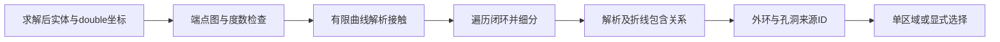

# L-008A：线和曲线怎样成为外轮廓与孔洞？

| 项目 | 内容 |
| --- | --- |
| 日期 / 版本 | 2026-10-02；基于34eda9a，Node24.21.0 |
| 关联 | L-008A；T-202B；REQ-006/AC-006-3前置、LEARN-001 |
| 状态 | 讲解：已整理；实验：已执行；复述：未记录 |
| 前置知识 | [曲线细分](L-008C-curve-sampling.md)、[平面坐标](L-005A-plane-coordinates.md) |

## 1. 本次问题

草图实体只是一个集合。如何发现连通闭环，拒绝自交和相切孔洞，并给拉伸提供一个明确的区域及其来源ID？本次研究拓扑和包含关系，不生成实体网格。

## 2. 原理与数据流

把线/弧端点看作节点，把实体看作边。相距不超过1e-6mm的端点属于同一节点；一个闭环的节点必须恰好连接两条边。度数1表示开放，超过2表示分叉。圆独立形成闭环。近点合并后还检查整组直径，拒绝A近B、B近C却A远C的传递链。

连通不等于简单闭环。分别解析求解有限线—线、线—圆/弧、圆/弧—圆/弧的交点与重叠；只允许同一图节点上的相邻端点接触。支撑圆相交而接触点在弧外时不算交叉。共圆弧按端点划分角区间，允许互补半圆，拒绝共享非零区间。

无接触的环再检查包含关系：避开端点与切点的射线穿越边界，奇数次为内部。被包含次数为深度，偶数层是材料外环、奇数层是孔。深度2的岛会形成另一个区域，必须选择。输出外环逆时针、孔环顺时针；原实体方向和ID不改写。

折线仍需检查。真实边界有效，却可能被默认细分切掉一个很小的孔，或产生碰撞；解析与折线包含结果不一致时明确拒绝，并允许core调用者提高精度。多个区域不能默认取面积最大者。



## 3. 最小实验

实现见 [轮廓发现/选择](../../../src/core/geometry/sketch-regions.ts)、[曲线接触/解析射线](../../../src/core/geometry/curve-contact.ts)。输入由 [夹具](../../../src/experiments/region-fixtures.ts) 构造并真正进入WASM；固定点只是指定实验初值，不能替代真实求解。

```text
输入：40×30外矩形+10×10孔；圆、CW/CCW半圆、互补半圆、双弧透镜
操作：三平面/反向/乱序；开放/分叉/自交/重叠/相切孔；多区域与嵌套岛
执行：npm run check:regions；npm run check:domain；npm run build
环境：Windows x64、Node24.21.0/npm11.19.0、既有SolveSpace WASM
期望：直边净面积1100mm²；真实曲线接触拒绝；多个材料区域要求选择
容差：闭合/接触1e-6mm；直边面积精确；曲线解析面积1e-10mm²
附加：324个网格点用独立圆盘/半圆盘/透镜条件核对解析射线结果
```

## 4. 实际结果与证据

全部输入、native状态、输出和反例见 [T-202B JSON](../evidence/T-202B-regions.json)，10/10测试通过，native stderr为空。

| 检查 | 期望 | 实际 | 证据条目 |
| --- | --- | --- | --- |
| 三平面×反向直边 | 外1200、孔100、净1100mm² | 6例精确通过，来源ID保留 | rectangle-hole-three-planes |
| 圆/半圆/双弧×三平面 | 解析面积正确，折线误差≤1% | 18例；最大相对误差0.2454533% | mixed-curve-regions |
| 嵌套圆R10/6/2 | 外壳64π、岛4π，须选择 | 2区域/深度0,1,2，漏孔拒绝 | selection-and-parity |
| 非法图/接触 | 给出明确错误 | 6拓扑、8孔接触反例拒绝 | invalid-topology / analytic-contact-refusals |
| 近端点 | 0.5e-6闭合，更远/传递链拒绝 | 通过，输入不被移动 | closure-tolerance |
| 独立包含网格 | 圆/半圆/透镜条件一致 | 324/324；大坐标凹环净564mm² | independent-analytic-grid / concave-translated |

两R2圆心距4mm、接触方向2.5°时，真实圆相切，独立算出的采样折线间隙却为0.00380711367mm；圆心距3.9999mm时真实相交，折线仍间隔0.00370711367mm。因此折线不交不能证明曲线不交。

R10外圆里，在距圆心9.995mm/方向2.5°放R0.001孔，默认精度导致包含关系不同，返回CONTOUR_PRECISION_COLLISION；改为1e-4mm细分后识别为一个区域/一个孔，净面积314.1592622173867mm²。

首轮测试把共线重叠误写为一般接触期望；实际返回更具体的CONTOUR_OVERLAP。更正测试后通过，未放宽实现。16领域/16core边界、build/typecheck通过，见 [领域](../evidence/T-202B-domain-replay.json) / [事务](../evidence/T-202B-transaction-replay.json) 重放。

## 5. 接回项目

core返回普通DTO。区域定义采用现有ExtrudeFeature的outerEntityIds/holeEntityIds；解析面积用于独立理论量，折线点用于后续三角化。重放保存定义时核对完整孔洞，不能静默省略新孔。

T-202B只完成core发现和显式选择API；用户区域选择界面与一般拉伸仍由C实现。没有构造线模式，草图全部实体参与，存在任何开放组件都会拒绝。闭合处只在派生点列中采用一致节点，弧细分预留1e-6mm闭合预算，领域文档不变。

未执行浏览器实验；尚未验收完整AC-006-3（还缺拉伸与零深度）、其余REQ-006 AC或性能。默认精度不能表达的狭小有效区域会明确拒绝，不伪造几何。

## 6. 我的复述与检查题

- 我的解释：未记录。
- 小练习：给已闭合矩形增加一条对角线，先预测节点度数与错误，再运行。
- 为什么问题：为什么“每个节点度数2”仍不足以证明轮廓有效？为什么相切圆孔不能只检查采样点？

## 7. 疑问与下一步

区域识别成功还不能证明网格闭合、法向外向或体积正确。下一T-202C学习三角化、孔侧壁与有符号深度，并验证Worker/取消/事务和真实界面。

## 8. 来源

- [PRD](../../PRD.md)：0.3.8，核对2026-10-02，轮廓/区域选择/误差与闭合规则。
- [core实现](../../../src/core/geometry/sketch-regions.ts)、[独立测试](../../../tests/sketch-regions.test.mjs)：本次T-202B工作树，基于34eda9a；核对2026-10-02，端点图、Green面积积分、解析射线与反例。
- [WASM来源](../../../public/wasm/SOURCE.md)：SolveSpace 2879a02d2866e103d7a4817721ead9ac43558aea，构建未变；核对2026-10-02，用于真实输入求解。
