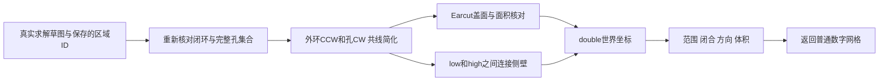

# L-008D：二维带孔区域怎样沿正负法线变成实体？

| 项目 | 内容 |
| --- | --- |
| 日期 / 版本 | 2026-10-02；基于1911b19，Three0.186.1 / Earcut3.0.2 |
| 关联 | L-008D；T-202C1；REQ-006几何前置、REQ-012、LEARN-001 |
| 状态 | 讲解：已整理；实验：已执行；复述：未记录 |
| 前置知识 | [一般轮廓](L-008A-sketch-regions.md)、[孔洞网格](L-008B-hole-extrusion.md) |

## 1. 本次问题

给定有效外环和孔环，如何生成盖面与侧壁，让三平面和负深度下仍闭合、法线朝外？本次把固定M0夹具推广到一般求解后领域草图，不接工作区交互。

## 2. 原理与数据流

Three ShapeUtils 调用 Earcut 将二维外环/孔环三角化，坐标使用JS Number。每个边界点沿法线复制到 `low=min(0,depth)` 与 `high=max(0,depth)`；盖面朝high的法线为+n，low盖面为−n。沿逆时针外环、顺时针孔环连接两组三角形，孔侧壁自然朝孔内。

世界点是 `origin + u*x + v*y + n*d`，其中 `n=u×v`。因此XZ的正深度向−Y，YZ向+X。负深度改变low/high范围，面片顺序仍按外向要求构造。

Earcut可能省略共线盖面点；若侧壁保留它们，盖面一条长边对侧壁两条短边会成为T形接缝。适配器在盖面和侧壁同时移除派生环中的共线中间点，领域实体ID不删除。三角化面积核对、世界范围和闭合网格检查全部成功才返回网格。



## 3. 最小实验

生产适配见 [extrudeSketch](../../../src/adapters/solid/extrude-sketch.ts)，共享真实夹具见 [extrusion-fixtures](../../../src/experiments/extrusion-fixtures.ts)。输入包含草图、区域实体ID和深度，不传Three对象或最终网格冒充参数定义。

```text
输入：矩形、矩形孔、圆、环、CW/CCW半圆、双弧透镜、共线边与凹轮廓
操作：9形状×3平面×±10mm；平移斜平面±10；深度±0.01与±10000
命令：npm run check:extrusion；npm run check:extrusion:browser
环境：Windows x64、Node24.21.0/npm11.19.0、Edge154.0.4258.48
期望：矩形12000mm³，孔11000mm³，曲线理论面积×绝对深度；闭合且外向
容差：直边体积相对1e-8，曲线相对1%；夹具bounds1e-6mm；焊接1e-6mm
附加：盖面法向±n、侧面垂直n、圆孔侧壁径向朝内；10非法输入后继续成功
```

## 4. 实际结果与证据

| 检查 | 期望 | 实际 | 证据 |
| --- | --- | --- | --- |
| 60真实一般拉伸 | 三平面/正负深度与理论量 | 全通过；直边12000、孔10999.999999999998mm³ | [Node](../evidence/T-202C1-extrusion-node.json) |
| 闭合/方向/孔壁 | 无边界/非流形/反向/退化 | 全部为0；cap/side/hole normal failures=0 | 同上 cases.actual |
| 曲线夹具 | 误差≤1% | 最大0.24545329664% | 同上 relativeVolumeError |
| 共线外环/孔 | 简化后仍闭合 | 32三角/16顶点，体积约11000 | 同上 collinear |
| 最大R10000 | 精度合格且闭合 | 994段、3972三角；体积314157173.2479807mm³ | 同上 boundaryChecks |
| 10拒绝+7边界 | 不输出假网格 | 零/小/越界深度、开放/自交/相切孔/漏孔/缺引用、世界范围等拒绝 | 同上 invalid / boundaryChecks |
| 三入口实际Worker | 数值和错误码一致 | 开发/root/cad各60成功+10拒绝、错误后恢复；WASM一次加载/MIME通过 | [浏览器](../evidence/T-202C1-extrusion-browser.json) |

平移斜平面和±0.01/±10000边界通过。额外斜平面圆的真实拉伸极值为10000.01mm，采样顶点最大绝对值仅9999.98mm，仍返回EXTRUSION_WORKSPACE_RANGE。范围校验检查两端解析曲线极值，不只看输出网格顶点。

503故障须持续覆盖streaming和备用加载请求；首轮只拦一次被备用方式恢复，测试未获得预期失败。第二轮错误后已经成功，但脚本默认等待“可见”，证据位于折叠details内，导致超时。改为等待attached后，持续503的3次HTTP尝试、明确错误/无证据、放行重试60+10全部通过。没有放宽几何检查。

Node首轮几何通过，类型检查发现async收集数组缺显式类型；补充ExtrusionCase后build/typecheck通过。旧19几何/16独立STL/2非流形拒绝回归、9协议、16领域/16core边界通过，见 [solid](../evidence/T-202C1-solid-replay.json)、[协议](../evidence/T-202C1-worker-replay.json)、[领域](../evidence/T-202C1-domain-replay.json)。

## 5. 接回项目

新增SolidInput的sketch-extrusion，现有SolidClient与独立Worker处理普通DTO；失败保留DomainError.code，后续请求可恢复。Worker边界复用严格文档schema及完整区域核对；临时校验ID不进入领域文档。没有改动WASM/CSG二进制或依赖。

这是一般adapter和数值入口；工作区拉伸按钮仍禁用。C2还需区域选择UI、预览/取消、原子提交和历史，之后才验收完整REQ-006。没有通用布尔后代重算、最终三浏览器或性能结论。默认精度狭小区域仍明确拒绝，沿用B边界。

## 6. 我的复述与检查题

- 我的解释：未记录。
- 小练习：将XZ矩形深度改为−20，先预测Y范围和体积，再测量。
- 为什么问题：为什么负深度仍应有正的有向体积？为什么共线点只从盖面删除会破坏闭合？

## 7. 疑问与下一步

数值网格通过不表示用户预览可安全取消。下一T-202C2研究临时网格所有权、请求代次和提交后历史；C/T-202仍doing。

## 8. 来源

- [PRD](../../PRD.md)：0.3.8，核对2026-10-02，深度/孔洞/三平面和精度要求。
- [Three来源清单](../../third-party/README.md)：Three0.186.1，gitHead9b4a2ac29c63ccb43fd51c5661f2f873ac2c39b8；核对2026-10-02。本机node_modules/three/src/extras/ShapeUtils.js调用Earcut，earcut.js声明3.0.2；没有复制新增上游文件。
- [本次实现](../../../src/adapters/solid/extrude-sketch.ts)、[独立数值夹具](../../../src/experiments/extrusion-fixtures.ts)：T-202C1工作树，基于1911b19；核对2026-10-02，实际double构造与网格检查。
- [WASM来源](../../../public/wasm/SOURCE.md)：SolveSpace2879a02d2866e103d7a4817721ead9ac43558aea，构建未变；核对2026-10-02，真实输入求解。
