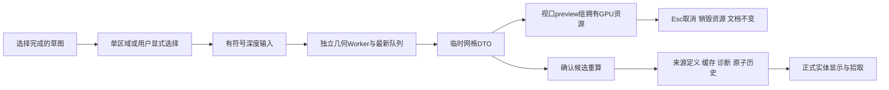

# L-008E：临时网格如何从预览变成正式特征？

| 项目 | 内容 |
| --- | --- |
| 日期 / 版本 | 2026-10-02；基于6e40abf，Vue3.5.43 / Three0.186.1 |
| 关联 | L-008E；T-202C2b；REQ-006/AC-006-1—5、REQ-009/012、LEARN-001 |
| 状态 | 讲解：已整理；实验：已执行；复述：未记录 |
| 前置知识 | [一般网格](L-008D-general-extrusion.md)、[最新预览服务](L-007E-extrusion-preview.md) |

## 1. 本次问题

用户能看到一个网格，不等于它已经进入项目。如何让区域选择、深度、临时GPU资源与确认后的来源定义保持一致，并在Esc/新项目/旧结果晚到时安全取消？

## 2. 原理与数据流

完成草图后选择它，面板读取有效区域。只有一个材料区域时可自动进入预览；多个区域保留空选项，必须由用户选。深度变化使用上一单元的最新队列，面板以浅引用持普通网格DTO；视口运行时拥有Three几何和材质。

临时网格放在独立preview组，使用透明材质，不进入拾取集合。更新、取消或组件卸载会销毁这一组的GPU资源。正式实体只来自ProjectSession成功提交后的文档与缓存；保存定义仍为sketchId、outerEntityIds、holeEntityIds和depth。

面板的epoch/alive保护回调，旧请求不能清除新预览。Esc终止预览和正在确认的权威请求；新项目先取消，再走原有未保存修改对话框。确认过程中其他revision变化检查不误取消自己的成功提交，最后选择新实体。实体与预览使用正面渲染，外向法线由数值实验保证。



## 3. 最小实验

面板见 [ExtrusionPanel](../../../src/components/ExtrusionPanel.vue)，入口见 [Workspace](../../../src/components/Workspace.vue)，所有权见 [ViewportRuntime](../../../src/adapters/viewport/viewport-runtime.ts)。UI实验通过实际数值绘图、按钮、键盘与Worker运行，不向页面塞预制网格。

```text
输入：三平面40×30矩形；±10深度；40×30外环+10×10孔；R10圆与半圆弧+线
操作：预览/改深度/0拒绝/Esc/确认/undo/redo；多个区域显式选择；非法轮廓
命令：npm run check:extrusion-ui:browser；npm run check:viewport；npm run check:domain；npm run build
环境：Windows x64、Node24.21.0/npm11.19.0、Edge154.0.4258.48/WebGL2
期望：矩形12000、孔11000mm³；单确认增1revision；取消文档/revision精确不变
容差：体积1e-6mm³（直边）、曲线相对1%；bbox1e-6mm；闭合检查焊接1e-6mm
附加：生产冷solid Worker加载时取消预览/取消确认/新建，旧结果不入历史，之后成功恢复
```

## 4. 实际结果与证据

开发/root/cad三入口全部通过，见 [实际UI JSON](../evidence/T-202C2b-ui-browser.json)。几何数据来自真实网格指标；截图只作排版检查。

| 验收 | 期望 | 实际 | 证据 |
| --- | --- | --- | --- |
| AC-006-1 | 40×30×10，12000mm³ | 三入口×三平面；体积容差/bbox通过，来源定义保留 | UI planes / C1数值 |
| AC-006-2 | −10沿反法线，闭合外向 | 三入口实际预览与提交，正有向体积/无winding错误；C1两端/孔壁法向通过 | UI finalNegative / [C1](../evidence/T-202C1-extrusion-node.json) |
| AC-006-3 | 开放/自交/相切/相交孔/0拒绝 | 三入口明确错误，文档/revision不变；0不保留旧成功网格；更多曲线接触见B | UI refusals / planes.zeroRefused |
| AC-006-4 | 贯穿10×10孔，11000mm³ | 三入口真实绘制/预览/提交，来源holeEntityIds保留 | UI regions.hole |
| AC-006-5 | XY/XZ/YZ世界bounds正确 | 正深度分别40×30×10、40×10×30、10×40×30；±深度数值均已验证 | UI planes / C1 |
| 多区域 | 不默认猜测 | 无预览/确认禁用，用户选1200mm²区域后12000mm³ | UI explicit-multiple-regions |
| 取消和历史 | 清临时资源，不写历史；确认仅一次 | 取消前后文档/revision精确一致、对象1→0、销毁数增加；undo/redo精确 | UI planes |
| 冷Worker | 取消后不收旧结果 | 预览Esc、确认Esc、新项目均通过；前两种随后成功12000mm³ | UI cold |

圆体积按1000π、半圆按500π判断，均≤1%误差，闭合通过。首次UI测试错误使用严格相等比较体积12000，实际12000.000000000002mm³；修为已约定容差。第二次测试按钮名称误写“适应模型”，实际“适应视图”；修正后通过。没有放宽几何/历史检查。

取消资源断言在负深度预览已渲染后采集基线，保证增加的销毁数来自取消本身。三入口视口拾取/控制/context恢复与20重建回归通过，见 [视口](../evidence/T-202C2b-viewport-replay.json)；16领域/16core边界与build/typecheck通过。主包781.06kB/cad890.18kB提示保留，未做最终性能验收。

孔洞预览截图已查看，250px属性栏的区域、深度和按钮正常换行；修复视图按钮hover深色文字低对比。取消/提交后不会保留临时网格参与拾取。

## 5. 接回项目

T-202 A/B/C共同完成REQ-006五项AC。工作区拉伸已启用，布尔/文件/STL继续禁用。派生网格仅给渲染转Float32，领域与数值证据仍double。

默认精度无法表达的狭小区域明确拒绝，暂无构造线模式；当前Sketch/Extrude全量重算，Boolean/受影响分支优化未交付。下一T-203验证真实参数编辑、曲线与孔洞来源在撤销/失败后持续一致；MVP与最终三浏览器/性能尚未完成。

## 6. 我的复述与检查题

- 我的解释：未记录。
- 小练习：在XZ上预览−10后按Esc，预测文档特征数、revision和临时对象数，再核对。
- 为什么问题：为什么临时网格不能进入Pinia保存Scene/Mesh？为什么多个外环必须选择而不能默认选最大者？

## 7. 疑问与下一步

需要继续验证修改真实尺寸/半径后已有拉伸的重算、失败回滚与曲线/孔洞历史。下一T-203；通用布尔、参数DAG分支优化、文件与最终验收继续后续任务。

## 8. 来源

- [PRD](../../PRD.md)：本次更新0.3.10，核对2026-10-02，五项轮廓/拉伸AC与预览规则。
- [C2a真实服务](../../../src/app/extrusion-preview.ts)、[本次UI验证脚本](../../../scripts/check-extrusion-ui-browser.mjs)：基于6e40abf，本次T-202C2b工作树；核对2026-10-02，实际UI/Worker/资源和历史。
- [Three来源](../../third-party/README.md)：0.186.1 / gitHead9b4a2ac29c63ccb43fd51c5661f2f873ac2c39b8；核对2026-10-02，现有BufferGeometry/材质/资源销毁，无新增复制上游文件。
- [WASM来源](../../../public/wasm/SOURCE.md)：SolveSpace2879a02d2866e103d7a4817721ead9ac43558aea，构建未变；核对2026-10-02，真实求解器。
