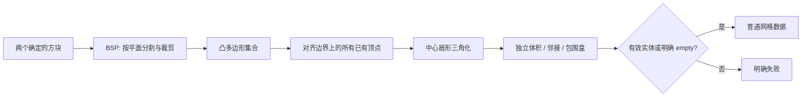

# L-009A：怎样证明布尔网格正确？

| 项目 | 内容 |
| --- | --- |
| 日期 / 版本 | 2026-10-02；THREE-CSGMesh `8bd00fe9`、Three.js `0.186.1` |
| 关联 | L-009A/B、L-005C；T-004；REQ-006、REQ-007、REQ-011、NFR-007 |
| 状态 | 讲解：已整理；实验：已执行；复述：未记录 |
| 前置知识 | [约束的独立证据](L-006B-constraint-evidence.md)、三角形与点积 |

## 1. 本次问题

CSG 返回了三角形，是否意味着实体正确？本篇同时检查体积、包围盒、闭合边、顶点邻域和方向，以免把一张看起来封闭的表面当成实体。

## 2. 原理与数据流



BSP 核心按平面把多边形分到两侧，再用裁剪、翻转实现 union/subtract/intersect。本项目保留固定 `csg-lib.js` 的原始字节；Three.js 和 BSP 都在适配层，core 只处理数字。

有向体积来自每个三角形与参考点形成的四面体：`dot(a, cross(b,c))/6` 的总和。计算前将参考点平移到首个顶点，减轻大坐标相消。外向且一致的三角面应有正体积。

闭合边要求按 `1e-6 mm` 位置容差合并后，每条无向边恰好出现两次且方向相反。只有边检查还不够：两个实体仅共享一个顶点，边都可能合法，但该点邻域分为两个环。检查顶点 link 是单个环，才能识别这种非流形接触。

## 3. 最小实验

两个方块边长 20 mm，A 中心 `(0,0,0)`，B 中心 `(10,0,0)`。各体积 8000，重叠为 4000 mm³。union 期望 12000，A-B/B-A/intersect 均 4000，但减法的包围盒不同。

```powershell
. ./scripts/use-node.ps1
npm.cmd run check:solid
npm.cmd run build
npm.cmd run check:solid:browser
```

环境：Windows x64 / PowerShell 7.6 / Node 24.21.0 / npm 11.19.0 / Edge 154.0.4258.48。固定输入见 [solid-fixtures.ts](../../../src/experiments/solid-fixtures.ts)；适配器见 [solid-spike.ts](../../../src/adapters/solid/solid-spike.ts)。

体积相对误差上限 `1e-4`；本次包围盒容差 `4e-4 mm`；边/顶点焊接 `1e-6 mm`。上游 BSP 平面分类阈值为 `1e-5`，与焊接容差职责不同，不随意当成同一个“精度”。

## 4. 实际结果与证据

| 夹具 | 期望 | 实际 | 证据 |
| --- | --- | --- | --- |
| 重叠方块三类布尔、双向减法 | 12000 / 4000 / 4000 / 4000 mm³ | 体积及包围盒在容差内；闭合/方向通过 | [Node JSON](../evidence/T-004-solid-node.json) |
| 分离、面相切、完全相同 | 正确三类结果；交集或减法可 empty | 9 项均满足预期；empty 为零三角形且 bounds=null | 同上 |
| 原始重叠 union 扇形三角化 | 测量是否存在 T 接点 | 有未配对边，closed=false | 同上 rawFanTriangulation |
| 边/顶点相切 union | 非流形应拒绝 | 2 项明确 INVALID_SOLID，不假成功 | 同上 degeneracies |
| 真实 Worker 三入口 | 19 项数值检查均通过 | 开发、生产、`/cad/` 通过，无非预期页面错误 | [浏览器 JSON](../evidence/T-004-solid-browser.json) |

T 接点不是“漏掉检测也无妨”：长边 `[a,c]` 与两条短边 `[a,b]`、`[b,c]` 无法形成相同三角网格邻接。桥接层将其他面的已有顶点插入对应多边形边界，再从内部中心点三角化；修复后的结果经相同严格检查通过。

验证器还有负向实验：移除一个三角面、整体反向均被拒绝。体积正确本身不能替代闭合性，闭合性也不能单独证明尺寸正确。

## 5. 接回项目

Worker 返回普通坐标数组；Vue 仅保留证据数据，未持有 Mesh/Scene。运行时与 core 分离。孔洞和 STL 的两个具体问题见 [L-008B](L-008B-hole-extrusion.md)、[L-011B](L-011B-stl-roundtrip.md)。

本桥接层只验证确定性小夹具，边界对齐最多 2000 个顶点，采用直接扫描；没有证明复杂曲面、极薄几何、百万面模型或工业精度。旧 `three-csg.js` 的 Float32 输出和全局 Worker 未采用；Three.js BoxGeometry 的局部尺寸仍来自 Float32，世界平移与自写桥接保留 Number。后续一般输入必须继续测量数值边界。

## 6. 我的复述与检查题

- 我的解释：未记录。
- 小练习：将 B 中心从 10 改为 5，先预测 union 为 10000、交集为 6000 mm³，再独立核对。
- 为什么问题：为什么 A-B 和 B-A 的体积相同，还必须比较包围盒？

## 7. 疑问与下一步

用户对 BSP、T 接点和顶点流形尚未复述。后续 T-005 汇总两内核的真实兼容范围，通过 M0 gate 才进入工作区；T-301 建立真实实体输入的通用布尔命令。

## 8. 来源

- [固定 CSG 核心](https://github.com/manthrax/THREE-CSGMesh/blob/8bd00fe919ad464500653ad98d8d9a4de2f59015/csg-lib.js)：MIT；核对 2026-10-02，BSP 实际算法与 EPSILON。
- [Three.js 0.186.1 来源](../../third-party/npm-dependencies.json)、[CSG 字节清单](../../third-party/csg-source.json)：核对 2026-10-02，精确版本、许可与哈希。
- [PRD 数值约定](../../PRD.md)：核对 2026-10-02；本篇只验证 M0 指定夹具。
