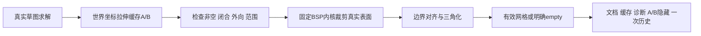

# L-009C：怎样把真实实体网格接入布尔和原子历史？

| 项目 | 内容 |
| --- | --- |
| 日期 / 版本 | 2026-10-02；基于549ec2f；Three0.186.1 / 固定CSG8bd00fe9 |
| 关联 | L-009C、L-010；T-301A；REQ-007数值/事务前置、REQ-008/009部分、LEARN-001 |
| 状态 | 讲解：已整理；实验：已执行；复述：未记录 |
| 前置知识 | [BSP与网格证据](L-009A-solid-evidence.md)、[来源参数历史](L-010C-parameter-history.md) |

## 1. 本次问题

M0只验证了已知方块。现在输入来自真实草图和拉伸，如何保留圆形孔等实际表面，同时让布尔结果、来源隐藏和历史一起提交？

本次先验证适配层、Worker和特征管线；工作区A/B选择继续T-301B。完整REQ-007还未通过。

## 2. 原理与数据流

布尔输入是两个世界坐标的TriangleMesh，内容为普通Number数组。不能用包围盒代替实体：圆柱的包围盒是方柱，裁剪它会得到错误的孔和体积。

适配层检查两输入非空、闭合、外向、有限且在世界±10000mm内，然后把三角面转成固定BSP库的多边形。裁剪后沿用M0的边界对齐桥，避免T接点；结果必须通过同样的独立流形与方向检查。零三角形是明确的empty，bounds=null、volume=0；empty不作为下一次布尔的有效输入。



新建布尔时，在候选文档中隐藏A/B；全部重算成功才提交。失败时隐藏也是候选的一部分，因此旧输入仍可见。特征保存operation、operandAId和operandBId；管线按拓扑顺序读取新生成的输入缓存，可以重算布尔后代。

本次仍是全DAG重算。每个操作数最多2000三角面，已有对齐桥最多2000个输出唯一顶点；超出返回CSG_CAPACITY，不声称大模型性能已验收。

## 3. 最小实验

真实夹具见 [mesh-boolean-fixtures](../../../src/experiments/mesh-boolean-fixtures.ts)，事务见 [五项测试](../../../tests/mesh-booleans.test.mjs)。技术实验页新增“运行真实网格布尔实验”，便于独立重做。

```text
输入：真实求解的20×20矩形A(0,0)—(20,20)、B(10,0)—(30,20)，各拉伸20
操作：union / A-B / B-A / intersect；三平面；分离/面接触/重合；矩形与R5圆柱贯穿切除
命令：npm run check:mesh-booleans；npm run check:mesh-booleans:browser
回归：check:domain、check:solid；build/typecheck、check:docs
环境：Windows/Node24.21.0/npm11.19.0/Edge154.0.4258.48；WASM、CSG源码和依赖未更新
期望：12000/4000/4000/4000mm³，减法沿来源平面u分别[0,10]与[20,30]
容差：直边体积相对1e-4，曲线相对1%，bounds4e-4mm，焊接1e-6mm；历史精确比较
```

## 4. 实际结果与证据

[Node证据](../evidence/T-301A-mesh-booleans.json)五测试通过；[Worker证据](../evidence/T-301A-mesh-booleans-browser.json)开发/root/cad各23夹具+8拒绝通过，WASM一次200/MIME正确，生产冷solid Worker 503后重试成功。

| 检查 | 期望 | 实际 | 证据 |
| --- | --- | --- | --- |
| 三平面标准布尔 | 12000/4000/4000/4000 | 12夹具，实际网格闭合外向，双向减法bbox不同 | cases XY/XZ/YZ |
| 分离/共面/重合 | 有效实体或明确empty | 9夹具通过；empty零三角形/bounds=null | cases disjoint/face/identical |
| 实际表面切孔 | 矩形11000；圆形12000−250π | 2真实贯穿切除，闭合与体积容差通过 | rectangular/circular-cut-through |
| 非法输入 | 明确错误码 | empty/NaN/open/reversed/capacity/bad operation/边接触/点接触共8拒绝 | invalid |
| 成功隐藏与历史 | A/B隐藏，同一历史 | 一次revision/history，undo恢复可见输入，redo精确恢复 | atomic-hidden-inputs-and-dag |
| 来源宽20→25 | union12000、A-B4000、intersect6000 | 全链重算，布尔ID/定义保持，精确历史 | 同上 |
| empty来源再移动 | 同一ID可变成有效实体 | B从30移到10后交集4000；empty不能复用为输入 | explicit-empty-history |
| 失败/取消 | 保留旧数据和可见性 | 非流形失败后差集重试8000；已算布尔晚返回被丢弃 | rollback / late-actual |

原有16领域/16纯core检查、19M0几何/16独立STL/2非流形拒绝回归通过，证据：[领域](../evidence/T-301A-domain-replay.json)、[事务](../evidence/T-301A-transaction-replay.json)、[几何](../evidence/T-301A-solid-replay.json)。主包785.96kB/cad895.46kB提示保留。

## 5. 接回项目

SolidInput新增mesh-boolean；[solid adapter](../../../src/adapters/solid/solid-spike.ts)使用真实网格，[featureRecompute](../../../src/app/feature-recompute.ts)接入布尔缓存，[ProjectEngine](../../../src/core/commands/project-engine.ts)在成功候选里隐藏输入。core继续没有Three、DOM、Vue或WASM指针。

T-301A done，T-301整体doing。REQ-007/AC-007-1—5有数值/事务前置，工作区A/B与empty提示、实际选择和失败恢复仍待B，不把实验按钮作为完整需求通过。通用分支优化、级联删除、文件和最终性能仍待后续。

## 6. 我的复述与检查题

- 我的解释：未记录。
- 小练习：把B改成(5,0)—(25,20)，预测三类布尔体积，修改夹具再验证。
- 为什么问题：为什么体积相同的A-B/B-A仍要比较bbox？为什么失败时不能先隐藏A/B再算结果？

## 7. 疑问与下一步

下一T-301B：工作区明确选择主体A/工具B，显示empty，实际确认/撤销/失败和取消。BSP容差附近的极薄/复杂曲线不保证都成功，必须逐次严格检查；最终三浏览器/性能未执行。

## 8. 来源

- [CSG来源清单](../../third-party/csg-source.json)：固定8bd00fe919ad464500653ad98d8d9a4de2f59015，MIT，vendor字节未修改；核对2026-10-02，复用已有BSP与自写桥。
- [WASM来源](../../../public/wasm/SOURCE.md)：SolveSpace2879a02d2866e103d7a4817721ead9ac43558aea，产物未改；核对2026-10-02，真实来源草图求解。
- [第三方](../../third-party/README.md)：Three0.186.1，原有锁文件；核对2026-10-02，无新增包。
- [本次fixture](../../../src/experiments/mesh-boolean-fixtures.ts)、[事务测试](../../../tests/mesh-booleans.test.mjs)：基于549ec2f，T-301A工作树；核对2026-10-02，实际世界网格与原子失败证据。
