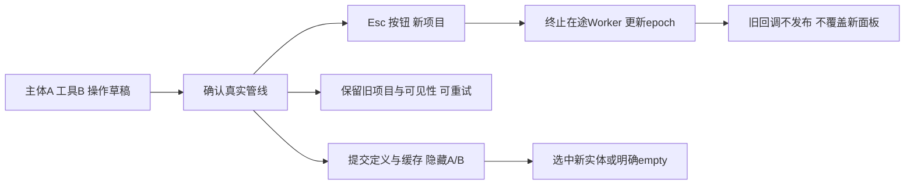

# L-009D：A/B选择如何决定差集并保护历史？

| 项目 | 内容 |
| --- | --- |
| 日期 / 版本 | 2026-10-02；基于6b02fde；Vue3.5.43 / Three0.186.1 |
| 关联 | L-009D、L-007；T-301B；REQ-007/AC-007-1—5、REQ-009/012部分、LEARN-001 |
| 状态 | 讲解：已整理；实验：已执行；复述：未记录 |
| 前置知识 | [世界网格布尔](L-009C-world-mesh-boolean.md)、[来源参数历史](L-010C-parameter-history.md) |

## 1. 本次问题

A-B与B-A可能体积相同，但留下的空间部分不同。怎样让用户明确选择主体和工具，并在失败、取消、空结果和撤销后保持项目一致？

## 2. 原理与数据流

面板只列出当前缓存中非空、有效的实体，隐藏输入也可再次选择。选择两个不同ID才启用确认；交换按钮只交换草稿A/B，不提交历史。进入时按已有选择顺序预填，缺少的操作数保持空选项。

确认将operation、operandAId和operandBId交给上单元的原子管线。成功选择新布尔特征，输入隐藏与结果同一历史；失败保留表单便于换操作重试。empty显示“无材料体积”，不进入下次布尔的操作数列表。



工作区持有面板生命周期epoch、session、基准revision；提交期间不把自身成功的revision误判为外部变化。取消先关闭面板并更新epoch，再终止会话在途任务；卸载后的组件不再发布旧错误/提交状态。

## 3. 最小实验

实现见 [BooleanPanel](../../../src/components/BooleanPanel.vue)、[Workspace](../../../src/components/Workspace.vue)，实际流程见 [UI脚本](../../../scripts/check-boolean-ui-browser.mjs)。数值绘图、尺寸/固定约束、拉伸和布尔都来自实际按钮与Worker。

```text
输入：三平面20×20草图A、沿平面u偏移10的B，各拉伸20
操作：选择A/B；空/相同ID禁用；交换A/B；并/差/交；撤销/重做；来源宽20→25
边界：分离交集empty；边接触union失败→subtract重试；计算中Esc/取消/新建
命令：npm run check:boolean-ui:browser；npm run check:viewport；npm run check:domain；npm run build；npm run check:docs
环境：Windows x64/Node24.21.0/npm11.19.0/Edge154.0.4258.48/WebGL2
期望：12000/4000/4000/4000mm³；沿u减法bounds=[0,10]/[20,30]；修改后交集6000
容差：体积1e-6mm³、bounds1e-6mm；文档/历史指标精确比较
```

取消实验在浏览器测试中包装原生Worker，只扣住真实mesh-boolean成功回包。回包里实际12000mm³已独立测量，再按Esc/取消/新建并释放旧回包；没有替换求解或网格算法。

## 4. 实际结果与证据

[三入口UI证据](../evidence/T-301B-boolean-ui-browser.json)开发/root/cad全部通过；生产入口三种真实晚结果取消与恢复通过。

| 验收 | 期望 | 实际 | 证据 |
| --- | --- | --- | --- |
| AC-007-1 | 并12000、差4000、交4000 | 三入口×三平面各四操作，闭合与体积通过 | planes.cases |
| AC-007-2 | A-B/B-A空间不同 | 交换后的来源ID正确，沿u bounds分别[0,10]/[20,30] | cases swap/bounds |
| AC-007-3 | 分离交集明确empty | 零三角形、bounds=null、文案明确；不作为有效操作数 | boundary.empty |
| AC-007-4 | 失败保留旧项目 | 边接触union被拒绝，文档/revision/可见性不变；subtract恢复8000 | boundary.failure/recovered |
| AC-007-5 | 默认隐藏，来源保留 | 定义保留A/B；一次提交隐藏两输入，精确undo恢复/redo再隐藏；序列化见A | planes history / [A证据](../evidence/T-301A-mesh-booleans.json) |
| 来源继续编辑 | 同一布尔重算 | 宽20→25后交集6000，布尔定义/ID稳定，精确历史 | sourceWidthEdit |
| 计算中取消 | 旧结果不入历史 | Esc/按钮/新建都拒收实际已算出的12000；前两种随后重试成功 | cancellations |
| 面板选择 | 缺失或同一输入不提交 | 确认禁用，选择阶段Esc不改文档/revision | planes guards |

首次UI脚本重做后直接读取指标而超时：撤销删除结果时界面清理了该选择，重做恢复文档但不自动选回。脚本明确重新选择结果后全部通过，无需改变生产历史行为。

已查看1280×900实际面板截图，250px属性栏的A/B、交换、操作与确认/取消正常排版。截图不作为几何证据。[视口回归](../evidence/T-301B-viewport-replay.json)三入口拾取/控制/context恢复/20重建通过；[领域](../evidence/T-301B-domain-replay.json)16/16与16纯core通过。普通包约791kB/cad约902kB提示保留。

## 5. 接回项目

T-301A/B共同完成REQ-007五项AC，工作区布尔启用。布尔和拉伸共享普通派生缓存、特征树和正面渲染；empty不创建视口网格。

当前全DAG重算、2000输入三角面/2000唯一输出顶点限制继续有效。下一T-302受影响分支、级联删除和更完整特征编辑；完整REQ-008/009、文件/STL、最终三浏览器/性能与MVP仍未完成。

## 6. 我的复述与检查题

- 我的解释：未记录。
- 小练习：把B向平面u偏移5，先预测A-B与B-A包围盒，再交换A/B验证。
- 为什么问题：为什么空实体不能进入有效操作数列表？为什么输入隐藏必须和结果处于同一次历史？

## 7. 疑问与下一步

下一T-302/L-010：只重算受影响后代，并明确显示级联删除影响。现有参数编辑能驱动布尔，但尚不满足“不重算无关分支”的完整REQ-008。

## 8. 来源

- [PRD](../../PRD.md)：本次0.3.13，核对2026-10-02，REQ-007五AC和失败历史。
- [面板](../../../src/components/BooleanPanel.vue)、[工作区](../../../src/components/Workspace.vue)、[UI脚本](../../../scripts/check-boolean-ui-browser.mjs)：基于6b02fde，T-301B工作树；核对2026-10-02，实际操作与原生Worker回包扣留实验。
- [CSG来源](../../third-party/csg-source.json)、[WASM来源](../../../public/wasm/SOURCE.md)：固定8bd00fe9/2879a02d原始产物未改；核对2026-10-02。
