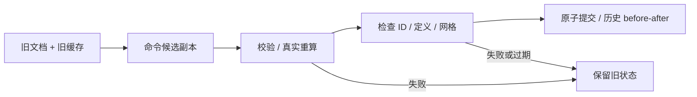

# L-010A：失败和撤销时，文档与网格怎样一起恢复？

| 项目 | 内容 |
| --- | --- |
| 日期 / 版本 | 2026-10-02 / PRD 0.3.1；Three.js 0.186.1；固定 BSP 8bd00fe9 |
| 关联 | L-010A/B、T-102、REQ-008/009/010 基础；LEARN-001 |
| 状态 | 讲解：已整理；实验：已执行；复述：未记录 |
| 前置知识 | [数据校验](L-002A-domain-validation.md)、[网格证据](L-009A-solid-evidence.md) |

## 1. 本次问题

改动参数后，如果文档先更新、网格稍后计算失败，用户会看到互相矛盾的状态。本次实验让候选全链成功后再提交，并让撤销同时恢复文档与派生缓存。

## 2. 原理与数据流

权威状态是当前文档及其对应缓存。命令在独立副本上改变输入，旧状态一直保留；真实重算成功且身份、结构、缓存通过校验，才一次替换权威状态并加入历史。



session 表示项目会话，revision 表示当前提交版本，requestId 表示本次计算。切换项目使旧计算失效；旧请求的 finally 也不能解除新请求的 busy 锁。Worker 的回复匹配与应用层的提交权威要同时成立。

撤销记录包含前后文档与缓存，避免只改深度却留下新网格。撤销后提交新命令会丢弃 redo 分支；最多保留 100 步。dirty 比较当前文档和成功保存快照的内容指纹，忽略更新时间，不能只看历史游标。

## 3. 最小实验

[project-engine.ts](../../../src/core/commands/project-engine.ts) 不导入 Three/WASM；通过重算回调接收真实结果。测试里的固定轴对齐矩形桥接调用现有真实 CSG，用来隔离事务，不是通用拉伸实现或伪求解器。

```text
输入：固定 20×20 矩形，深度 20；执行 replace-feature 改深度 30。
步骤：提交 20 → 提交 30 → undo → redo；另使重算失败或旧请求晚到。
命令：. ./scripts/use-node.ps1；npm run check:domain；npm run check:project
环境：Windows x64 / Node 24.21.0 / Three 0.186.1 / Edge 154.0.4258.48。
期望：体积 8000 → 12000 → 8000 → 12000 mm³；ID 一直相同。
容差：本夹具体积绝对误差 ≤1e-8 mm³；网格闭合、外向；元数据精确相等。
```

## 4. 实际结果与证据

| 状态 | 深度 / 期望体积 | 实际体积 mm³ | revision |
| --- | --- | --- | --- |
| 原始提交 | 20 / 8000 | 8000.000000000002 | 2 |
| 修改提交 | 30 / 12000 | 12000.000000000007 | 3 |
| 撤销 | 20 / 8000 | 8000.000000000002 | 4 |
| 重做 | 30 / 12000 | 12000.000000000007 | 5 |

[数值证据](../evidence/T-102-transaction-geometry.json) 同时记录闭合、稳定 feature ID 与容差。[15 项测试日志](../evidence/T-102-domain.log) 覆盖失败时已有文档/缓存/历史/dirty 不变、无重算入口明确拒绝、重算非法改变定义或 ID、旧会话结果拒绝、新事务锁保护、100 步上限与 tombstone ID 防复用。

[三入口浏览器](../evidence/T-102-project-browser.json) 实测重命名、撤销/重做、快捷键焦点保护、分支历史、新建取消/Esc/丢弃和视图切换后保留项目。保存按钮与“保存后新建”仍禁用，没有报告假保存。

## 5. 接回项目

app/ProjectSession 拥有 engine，Pinia 仅保存普通快照。视图卸载不销毁文档；组件拥有的几何内核独立销毁。重命名和可见性不调用几何重算。

基础历史已验证，但 REQ-009 的完整绘制、约束、特征编辑、拖动一手势一命令仍未完成。保存 token 测试只证明 dirty 算法；实际文件保存是 T-401。一般后代重算接线是 T-302。

## 6. 我的复述与检查题

- 我的解释：未记录。
- 小练习：把第二次重算改成抛错，预测深度、体积、canUndo 和 dirty，再观察。
- 为什么问题：为何 undo 后 revision 继续增加，而不能退回原数字？

## 7. 疑问与下一步

用户理解待反馈；完整拖动、一般轮廓与异步后代重算仍需后续实验。下一任务 T-103，学习文档坐标如何送到 Three 相机和拾取，再返回领域 ID。

## 8. 来源

- 本项目 [PRD](../../PRD.md) 0.3.1、REQ-008/009/010/012，2026-10-02 核对，事务与历史约定。
- 本项目 [实际事务测试](../../../tests/project-engine.test.mjs)，T-102 本次提交，2026-10-02 核对，失败/缓存/竞态/历史证据。
- 固定 [BSP 来源](../../third-party/csg-source.json)，8bd00fe919ad464500653ad98d8d9a4de2f59015，2026-10-02 核对；本实验复用 T-004 真实几何适配层。
