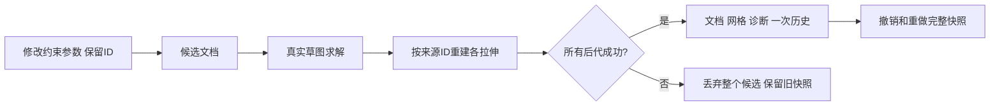

# L-010C：改来源参数，为什么必须一起提交后代网格？

| 项目 | 内容 |
| --- | --- |
| 日期 / 版本 | 2026-10-02；基于 c24684f；Node24.21.0 / Three0.186.1 |
| 关联 | L-010C、L-008；T-203；REQ-005/006/009、REQ-008后代失败部分、LEARN-001 |
| 状态 | 讲解：已整理；实验：已执行；复述：未记录 |
| 前置知识 | [原子历史](L-010A-atomic-history.md)、[真实拉伸界面](L-008E-extrusion-ui.md) |

## 1. 本次问题

已有拉伸后修改草图宽度、孔宽或半径，怎样保证尺寸、实体和撤销记录始终描述同一个版本？如果草图求解成功，但一个后代失败，哪些数据可以提交？

本次用真实参数编辑检验稳定来源 ID、整条链的失败回滚，以及几何与约束一起撤销。布尔后代继续下一阶段。

## 2. 原理与数据流

拉伸定义保存 sketchId、outerEntityIds、holeEntityIds 和 depth。它引用来源实体，不保存一份永远不变的轮廓坐标。编辑现有草图保留这些 ID，求解器生成新位置；拉伸再从新位置识别同一个区域并生成网格。

候选文档、成功诊断与派生缓存暂存在一次事务里。所有后代成功，才替换当前快照并增加一个历史步骤。即使前一个网格已经生成，后一个失败也不能发布部分缓存。撤销/重做直接恢复完整成功快照；失败不移动历史游标，也不清空原有重做分支。



圆的 radius 可由半径约束驱动；圆弧的半径由中心与起点距离得到。本次半圆固定中心，固定左端点并保持闭合直线水平，把左端点 X 从 −10 改为 −12；内在等半径关系使右端点移到 12，得到 R12 半圆。

## 3. 最小实验

数值实验见 [真实参数历史测试](../../../tests/parameter-history.test.mjs)，界面实验见 [浏览器脚本](../../../scripts/check-parameters-browser.mjs)。界面使用数值绘图、实际约束表单、编辑草图和历史按钮；未注入预制求解结果。

```text
输入：40×30矩形；内部10×10孔；R10圆与半圆；已提交±10拉伸
修改：外宽40→60；孔宽10→20；半径10→12；矛盾宽/半径；孔宽60穿过外边界
命令：npm run check:parameters；npm run check:parameters:browser；npm run build；npm run check:docs
环境：Windows x64 / PowerShell7.6 / Node24.21.0 / npm11.19.0 / Edge154.0.4258.48
期望：矩形12000→18000；孔11000→17000→16000mm³；来源定义不变
容差：直边体积1e-6mm³；曲线体积相对1%；native残差≤1e-5；历史快照精确比较
后代失败：同一草图拉伸10和10000；来源平面Z原点0→1，第一个成功，第二个世界边界越界
```

## 4. 实际结果与证据

[Node证据](../evidence/T-203-parameter-history.json)四测试通过，覆盖三平面正负深度的矩形/曲线、三平面孔洞与后代失败；[UI证据](../evidence/T-203-parameters-browser.json)开发/root/cad共24实际流程通过。

| 检查 | 期望 | 实际 | 证据 |
| --- | --- | --- | --- |
| 矩形宽度 | 12000→18000mm³ | 三入口×三平面，XZ使用−10；同一拉伸ID和来源定义 | UI rectangle / Node rectangle |
| 外宽与孔宽 | 11000→17000→16000mm³ | 最大浮点尾差低于1e-6；孔实体ID保持 | UI hole / Node hole |
| 圆半径 | 1000π→1440πmm³ | 3137.606738916→4518.153704039；相对误差约0.127% | UI circle |
| 半圆半径 | 500π→720πmm³ | 1568.803369458→2259.076852019；相对误差约0.127% | UI half |
| 求解失败 | 不发布候选 | 矛盾宽50、半径11拒绝；文档/诊断/revision/重做状态不变 | UI failure |
| 后代失败 | 成功草图也整体回滚 | 孔宽60真实求解后轮廓CONTOUR_CONTACT拒绝；旧网格精确不变 | UI hole.failure / Node |
| 较晚后代失败 | 已算出前代也不能提交 | 第一个真实12000mm³、Z=[1,11]；第二个EXTRUSION_WORKSPACE_RANGE；全部旧数据保留 | Node late-descendant |
| 来源删除 | 不能留下悬空轮廓 | 删除被引用孔实体先由schema以REFERENCE_MISSING拒绝 | Node hole.failures |
| 历史与保存快照 | 约束/网格同时恢复 | 精确undo/redo；失败保留redo分支和save bytes；撤销回保存快照dirty=false | Node / UI |

首次孔失败夹具只移动固定起点，求解器把无符号线长翻向后仍得到合法孔，未出现期望拒绝。将孔宽改为60，固定起点15，向左或向右都必然穿过外环；随后按实际 CONTOUR_CONTACT 验证。来源删除实际由schema先拒绝，不能错误声称已进入轮廓重算。两项修正改变夹具和预期，没有修改生产算法。

## 5. 接回项目

T-203完成，M2完成。现有 [featureRecompute](../../../src/app/feature-recompute.ts) 与 [ProjectEngine](../../../src/core/commands/project-engine.ts) 已满足本次实际来源编辑/后代拉伸/历史回归，无需额外生产修补。

本次覆盖REQ-009中尺寸/拉伸的AC-009-1/3，以及失败时历史不变；REQ-008/AC-008-3在Sketch→Extrude链有证据。完整REQ-008含布尔后代与分支重算，完整REQ-009含所有命令和100步骤，继续T-301—303。保存快照与JSON验证是内部实验，文件UI仍未实现。

## 6. 我的复述与检查题

- 我的解释：未记录。
- 小练习：把外宽改为50、孔宽改为15，预测深度−10的材料体积，再在界面验证。
- 为什么问题：为什么后代失败时，即使求解器已得到新草图，也不能仅保留新草图？为什么失败不能清空重做分支？

## 7. 疑问与下一步

当前所有Sketch/Extrude全量重算。下一T-301/L-009把真实网格布尔接入候选管线，再验证布尔后代；受影响分支优化、文件、最终三浏览器/性能仍待后续。

## 8. 来源

- [PRD](../../PRD.md)：本次0.3.11，核对2026-10-02，参数历史、E2E-03及后代失败验收。
- [应用管线](../../../src/app/feature-recompute.ts)、[领域历史](../../../src/core/commands/project-engine.ts)：基于c24684f，核对2026-10-02，来源ID、候选提交与快照；本次生产代码未改。
- [Node测试](../../../tests/parameter-history.test.mjs)、[UI脚本](../../../scripts/check-parameters-browser.mjs)：T-203工作树，核对2026-10-02，独立数值/操作证据。
- [内核来源](../../../public/wasm/SOURCE.md)：SolveSpace2879a02d2866e103d7a4817721ead9ac43558aea；[第三方清单](../../third-party/README.md)：Three0.186.1、Vue3.5.43；核对2026-10-02，依赖与二进制未改。
