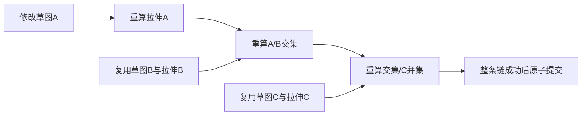

# L-010D：如何只重算受影响的后代？

| 项目 | 内容 |
| --- | --- |
| 日期 / 版本 | 2026-10-02；基于0a06992；Node24.21.0 / Three0.186.1 |
| 关联 | L-010D；T-302A；REQ-008/AC-008-1/3/4部分、REQ-009/012、LEARN-001 |
| 状态 | 讲解：已整理；实验：已执行；复述：未记录 |
| 前置知识 | [来源参数](L-010C-parameter-history.md)、[布尔界面](L-009D-boolean-ui.md) |

## 1. 本次问题

已有A/B/C三份草图和多级布尔，修改A时，为什么还要求解B和C？如何证明只计算A的后代，同时保留旧缓存的正确性与失败回滚？

## 2. 原理与数据流

事务提供当前成功文档、网格和诊断的不可变基线。规划器按稳定ID比较几何定义，忽略名称/可见性，并对对象键排序，避免JSON键插入顺序造成假变化。数组顺序仍有意义，保留原顺序。

新增、几何定义变化、缺少派生缓存或真实草图诊断的节点是种子。按拓扑顺序向前遍历：任一父节点需要重算，当前节点也需要。没有受影响的节点从基线复制已有缓存/诊断；已删除节点不再复制。基线只由当前事务提供，不从视口或Vue状态猜测。



若没有基线，全部节点都当作新增；若缺少真实诊断，即使缓存存在，也重新求解该草图及后代。失败仍丢弃整份候选，包括已计算的后代；复用不会削弱原子提交。基线被冻结，适配器不能通过修改它污染旧历史。

## 3. 最小实验

规划器见 [recompute-plan](../../../src/core/features/recompute-plan.ts)，真实实验见 [affected-recompute测试](../../../tests/affected-recompute.test.mjs)。计数器记录真正进入SolveSpace、拉伸和CSG的调用，而不是计数一个UI动画。

```text
输入：A/B/C三真实草图及拉伸；A/B交集join；join/C并集result
修改：A宽20→25；拉伸深度；新增布尔；仅改名称/可见性；级联删C；A平面Z移到20
命令：npm run check:affected-recompute
UI：BOOLEAN_UI_ASSERT_AFFECTED=1，独立设置BOOLEAN_UI_EVIDENCE_PATH/TASK，再运行check:boolean-ui:browser
环境：Windows/Node24.21.0/npm11.19.0/Edge154.0.4258.48；原WASM/CSG/依赖未改
期望：A参数编辑仅solve A、extrude A、intersect、union；B/C缓存和诊断精确不变
容差：直边体积1e-6mm³；缓存/文档/诊断/历史精确比较；调用清单精确比较
```

UI追踪只包装原生Worker.postMessage，记录普通请求类型、来源ID与操作；请求仍发给真实Worker。输出写入独立T-302A证据，保留旧任务记录。

## 4. 实际结果与证据

[五Node测试](../evidence/T-302A-affected-recompute.json)与[三入口UI回归](../evidence/T-302A-boolean-ui-replay.json)全部通过。

| 检查 | 期望 | 实际 | 证据 |
| --- | --- | --- | --- |
| A宽20→25 | 仅A与其后代 | 1真实native、1拉伸、2布尔；体积10000/6000/14000；B/C精确复用 | one-source-affected-chain |
| 深度/新增布尔 | 不再求解无变化来源 | 深度3网格调用/0native；新增布尔1CSG/0native | depth-add-metadata |
| 名称/可见性与键顺序 | 0几何调用 | replace元数据、rename、visibility均0；缓存不变 | 同上 |
| 级联删C | 移除C及其后代缓存 | 0内核调用，剩余A/B/join缓存精确保留，undo精确 | cascade-cache-eviction |
| 较晚后代失败 | 全部旧数据保留 | A拉伸成功、join真实empty，result拒绝empty操作数；revision/history/save/redo保留 | affected-late-failure |
| 冷重建/诊断缺失 | 真实重新求解 | 两种情况各3native，完整文档/缓存/诊断精确重建 | cold-and-immutable-baseline |
| 基线所有权 | 不能修改旧文档 | baseline与features被冻结，篡改抛TypeError | 同上 |
| 三入口实际参数编辑 | 不发无关请求 | 每入口×三平面恰好solve A、extrude A、intersect，共3请求，交集6000 | UI actualWorkerRequests |

受影响改动后的预览队列/客户端竞态[7测试](../evidence/T-302A-extrusion-transaction-replay.json)、参数[4测试](../evidence/T-302A-parameter-replay.json)、布尔[5测试](../evidence/T-302A-mesh-boolean-replay.json)、领域[16测试/17纯core](../evidence/T-302A-domain-replay.json)通过。UI的失败/empty/隐藏历史及真实晚回包三种取消也通过，build/typecheck通过。主包792.01kB/cad902.45kB提示保留。

## 5. 接回项目

[ProjectEngine](../../../src/core/commands/project-engine.ts)把冻结的成功基线交给Recompute；[featureRecompute](../../../src/app/feature-recompute.ts)使用规划器并只复制当前文档需要的派生数据。Three对象和WASM指针继续由适配层持有。

T-302A done，T-302整体doing。现在支持Sketch→Extrude→Boolean的受影响重算；级联core已测，但工作区影响列表/明确确认、现有拉伸参数编辑与完整REQ-008仍待B。

调用次数减少不是最终性能验收。普通DTO仍需克隆和验证，视口资源更新尚有成本；大模型耗时与内存留待最终测量。

## 6. 我的复述与检查题

- 我的解释：未记录。
- 小练习：只改C的深度，预测哪些请求应出现，再改变夹具核对。
- 为什么问题：为什么缺少真实诊断时不能凭现有点坐标断定草图已求解？为什么复用缓存也必须来自同一成功基线？

## 7. 疑问与下一步

下一T-302B：特征依赖说明、级联影响列表与确认、编辑已有拉伸参数、完整REQ-008验收。文件、100步全命令覆盖、最终三浏览器/性能与MVP尚未完成。

## 8. 来源

- [PRD](../../PRD.md)：本次0.3.14，核对2026-10-02，禁止重算无关分支、整体失败与元数据规则。
- [规划器](../../../src/core/features/recompute-plan.ts)、[真实测试](../../../tests/affected-recompute.test.mjs)、[UI追踪](../../../scripts/check-boolean-ui-browser.mjs)：基于0a06992，T-302A工作树，核对2026-10-02。
- [内核来源](../../../public/wasm/SOURCE.md)、[CSG来源](../../third-party/csg-source.json)：固定2879a02d/8bd00fe9，二进制/vendor未改；核对2026-10-02。
