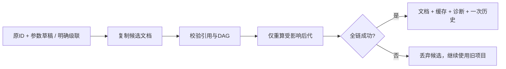

# L-010E：编辑和删除来源，怎样保住整张特征图？

| 项目 | 内容 |
| --- | --- |
| 日期 / 版本 | 2026-10-02；基于 a5308ba 的 T-302B 工作树 |
| 关联 | L-010；T-302B；REQ-008/AC-008-1—5、REQ-009/012部分、LEARN-001 |
| 状态 | 讲解：已整理；实验：已执行；复述：未记录 |
| 前置知识 | [不可变基线和受影响重算](L-010D-affected-recompute.md)、[原子历史](L-010A-atomic-history.md) |

## 1. 本次问题

已有拉伸被布尔引用时，改深度或删来源为什么不能只改特征树？布尔引用的是稳定 ID，它的网格也取决于来源几何。只改其中一部分，会留下旧网格或悬空引用。

本篇学习三个联系：表单草稿与成功文档分离；编辑保留 ID；级联影响确认后，仍由同一事务提交文档、派生数据和历史。

## 2. 原理与数据流

编辑输入是原特征 ID、新区域和有符号深度。面板先从真实草图生成区域目录，用户明确选择；应用时复制特征定义，保留 ID，交给 `replace-feature`。成功输出是新文档、全部有效缓存和诊断，以及一个历史步骤。

删除输入是来源 ID 和明确的 `cascade: true`。打开确认框时只计算后代列表，尚未执行命令。默认聚焦取消；只有确认后才删来源和后代。无关分支继续使用同一成功基线中的缓存。



图中的“丢弃”包括前代已经成功、较晚后代失败的情况。部分成功不会提前发布。取消在途任务还会终止旧 Worker；组件卸载后用 `alive` 阻止旧回调写入已退出的表单。

| 操作 | 文档变化 | 真实几何请求 |
| --- | --- | --- |
| 填表、取消草稿、打开删除框 | 无 | 无 |
| 应用深度/区域 | 同 ID 的新定义 | 拉伸及其受影响布尔 |
| 确认级联 | 删除来源与后代 | 本夹具剩余分支无需请求 |
| 改名、隐藏/显示 | 元数据 | 无 |

## 3. 最小实验

先只隔离一个宽度：A 在草图坐标 (0,0)—(40,30)，B 在 (10,0)—(30,30)，均拉伸 10 mm，结果选 A-B。A 体积 12000、B 为 6000，差集为 6000 mm³。

将 A 的宽改成 60 mm：A 为 18000、差集为 12000 mm³。再把已有 A 拉伸深度改成 20 mm：A 为 36000、差集为 30000 mm³。B 不变；负深度 -10 时，两输入只有平面接触，差集等于 A 的 18000 mm³。三平面按各自法向解释深度。

```powershell
. ./scripts/use-node.ps1
npm.cmd run build
npm.cmd run check:feature-edit:browser

$env:AFFECTED_RECOMPUTE_EVIDENCE_PATH = 'docs/learning/evidence/T-302B-affected-recompute-replay.json'
$env:AFFECTED_RECOMPUTE_EVIDENCE_TASK = 'T-302B'
npm.cmd run check:affected-recompute

$env:DOMAIN_EVIDENCE_PREFIX = 'docs/learning/evidence/T-302B-domain-replay'
$env:DOMAIN_EVIDENCE_TASK = 'T-302B'
$env:TRANSACTION_EVIDENCE_PATH = '../docs/learning/evidence/T-302B-transaction-replay.json'
npm.cmd run check:domain

$env:BOOLEAN_UI_EVIDENCE_PATH = 'docs/learning/evidence/T-302B-boolean-ui-replay.json'
$env:BOOLEAN_UI_EVIDENCE_TASK = 'T-302B'
$env:BOOLEAN_UI_ASSERT_AFFECTED = '1'
npm.cmd run check:boolean-ui:browser
npm.cmd run check:docs
```

环境：Windows x64、PowerShell 7.6、Node 24.21.0、npm 11.19.0、Edge 154.0.4258.48、Playwright 1.63.0。Vue 3.5.43、Three 0.186.1、Vite 8.3.2；依赖和真实 WASM/CSG未更新。

判定：独立网格指标检查闭合/方向和解析体积，直边体积容差 `1e-6 mm³`；比较稳定 ID、完整文档、网格指标和真实 Worker 请求。Node 回归另比较完整缓存/诊断/保存快照/redo 分支。截图仅核对排版。

## 4. 实际结果与证据

| 检查 | 期望 | 实际 | 证据 |
| --- | --- | --- | --- |
| 宽40→60 | A 18000，差12000；3请求 | 三入口×三平面通过，只求解A/拉伸A/差集 | [UI](../evidence/T-302B-feature-edit-browser.json) planes.widthRequests |
| 深度10→20→-10 | 差30000→18000；不求解草图 | 误差≤1e-6 mm³，稳定ID和精确历史通过 | 同上 deeper/negative/depthRequests |
| 现有区域更换 | 面积400→100，深10，4000→1000 | 保留拉伸/来源ID；仅1拉伸请求 | 同上 region |
| 0/空/非数值与草稿取消 | 无成功命令 | 文档、网格指标、revision和历史入口不变；取消恢复当前深度 | 同上 planes |
| 默认取消/级联 | Enter、Esc、取消不删；确认删A草图/拉伸/布尔 | 精确影响列表，确认仅一个revision；B几何/隐藏状态与历史一致 | 同上 cascade |
| 元数据 | 名称/显示不重算 | 来源名称随改名更新，实际0请求 | 同上 cascade |
| 较晚后代失败 | 新拉伸和交集先算完，后续union拒绝empty | 旧文档/网格指标/revision/history不变；下一有效编辑恢复3000 | 同上 failure |
| 在途取消 | 扣留实际8000网格，取消后拒收 | Esc/按钮均保持旧项目并能恢复 | 同上 cancellations |
| 核心和标准布尔回归 | DAG、完整缓存历史、三类布尔 | 5真实Node/16领域/17纯core；三入口标准布尔与晚取消通过 | [重算](../evidence/T-302B-affected-recompute-replay.json)、[领域](../evidence/T-302B-domain-replay.json)、[布尔](../evidence/T-302B-boolean-ui-replay.json) |
| 排版 | 控件适合属性栏 | 已查看1280/1024 px实际截图；1024所有编辑控件横向留在属性栏内 | UI region.narrowLayout；截图在忽略的.research |

第一次失败恢复断言把期望写成 2000 mm³，漏加了独立 C 的 1000 mm³。真实结果约 3000；核算 `10×20×10 + 10×10×10` 后修正期望并完整重跑通过。实验期望也需要独立检查。

## 5. 接回项目

[拉伸参数组件](../../../src/components/ExtrudeParameters.vue)持有本地草稿；[级联确认组件](../../../src/components/DeleteFeatureDialog.vue)管理模态框；[工作区](../../../src/components/Workspace.vue)冻结确认上下文的 session/revision，变化后关闭旧确认。组件不自行改权威数组，最终仍调用既有 ProjectSession/ProjectEngine。

结合 T-302A，本次 REQ-008 五项 AC 有证据：精确40→60与稳定ID、默认拒绝/显式级联、较晚失败整体回滚、DAG拒绝/元数据0调用、历史草图继续编辑。T-302完成；REQ-009全命令/100步和文件仍待后续。

任务依赖原为 T-302→T-303→T-401，但 T-302 的 E2E-02还包含保存打开，会形成验收顺序冲突。按[ADR-033](../../DECISIONS.md)明确阶段边界：T-302验收几何、传播、级联与历史；T-401验证文件往返，T-403复跑完整E2E-02。原E2E-02六条与MVP标准保留，完整场景尚未通过。

## 6. 我的复述与检查题

- 我的解释：未记录；没有根据测试通过推断用户掌握。
- 小练习：保留宽60，将A深度改成15，先预测差集体积和请求数量，再运行。
- 为什么问题：为什么“确认级联”不能只过滤特征树？较晚布尔失败时，已经生成的新拉伸网格应由谁决定是否发布？

## 7. 疑问与下一步

文件往返、100步全命令历史、最终三浏览器和性能尚未验收。曲线细分和CSG容量沿用既有限制；普通Number DTO克隆/校验仍有成本。

用户要求完成当前子任务后暂停；下一入口为 T-303/L-010历史覆盖。本轮不会进入下一任务，复述和独立练习待用户反馈。

## 8. 来源

- [PRD](../../PRD.md)：0.3.15，核对2026-10-02；REQ-008和E2E-02验收依据。
- [工作区](../../../src/components/Workspace.vue)、[真实交互脚本](../../../scripts/check-feature-edit-browser.mjs)、[核心回归](../../../tests/affected-recompute.test.mjs)：基于a5308ba，T-302B工作树，核对2026-10-02。
- [真实WASM来源](../../../public/wasm/SOURCE.md)、[CSG来源](../../third-party/csg-source.json)：固定SolveSpace 2879a02d / CSG 8bd00fe9，二进制和vendor未改，核对2026-10-02。
- [锁文件](../../../package-lock.json)：本轮未改；Vue/Three/Vite/Playwright实际版本来自已安装的锁定环境，核对2026-10-02。
