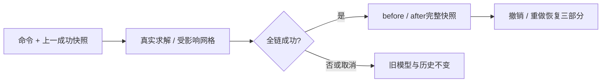

# L-010F：怎样验证一百步历史恢复的是完整模型？

| 项目 | 内容 |
| --- | --- |
| 日期 / 版本 | 2026-10-03；基于cef03a6的T-303工作树 |
| 关联 | L-010；T-303；REQ-009/AC-009-1—4，LEARN-001 |
| 状态 | 讲解：已整理；实验：Node与三入口已执行；复述：未记录 |
| 前置知识 | [原子历史](L-010A-atomic-history.md)、[受影响重算](L-010D-affected-recompute.md)、[交互生命周期](L-007F-interaction-lifetime.md) |

## 1. 本次问题

连续改一百次深度和名称，再撤销时，怎样发现“树正确、网格仍是新版本”？本篇把历史恢复对象明确为文档、派生网格和求解诊断三个部分，并区分历史游标、revision与保存标记。

## 2. 原理与数据流

输入是一个用户提交命令和上一份成功模型。几何事务全部成功后，历史记录保存before/after完整快照；失败、取消和无变化操作不新增记录。撤销和重做直接恢复快照，不重新调用内核，因此也不引入新的求解分支。



最近100条成功记录构成有限窗口。增加第101条时丢弃最早记录，但剩余最早记录仍保存自己的before快照。撤销105次新操作只能回到第5次后的状态，不能穿过已经淘汰的步骤。

revision只增不减，用于拒绝过时请求。dirty比较当前文档与已保存文档的规范内容，忽略updatedAt和对象键序。撤销到同一保存内容可以清除dirty，即使revision已经更大；保存期间再修改，完成保存也只能确认当时捕获的那份文档。

| 情况 | 历史与重做 | dirty |
| --- | --- | --- |
| 成功新命令 | 新增一条，清空旧重做分支 | 与已保存内容比较 |
| 失败/取消/无变化 | 原记录与重做分支保留 | 原值 |
| 撤销到保存内容 | 移动游标，恢复完整快照 | false |
| 旧项目保存回调 | 不确认新项目 | 新项目原值 |

## 3. 最小实验

两个20×20×20mm方块沿x重叠10mm，交集4000mm³。修改A深度，独立按`20×20×depth`检查体积；交集仍由B的20mm高度限制。105次操作混合35次真实深度编辑、35次名称修改和35次显隐切换。

每次成功后保存测试侧期望快照。按反向100次、正向100次比较文档、完整缓存和诊断；计算调用计数必须不增加。另一次手势输入30个位置，只允许一个提交命令。

```powershell
. ./scripts/use-node.ps1
npm.cmd run check:history
npm.cmd run build
npm.cmd run check:history:browser
$env:DOMAIN_EVIDENCE_PREFIX = 'docs/learning/evidence/T-303-domain-replay'
$env:DOMAIN_EVIDENCE_TASK = 'T-303'
$env:TRANSACTION_EVIDENCE_PATH = '../docs/learning/evidence/T-303-transaction-replay.json'
npm.cmd run check:domain
npm.cmd run check:docs
```

环境：Windows x64、PowerShell7.6、Node24.21.0、npm11.19.0、Edge154.0.4258.48、Playwright1.63.0；Vue3.5.43、Three0.186.1、Vite8.3.2。WASM/CSG与锁文件保持原固定版本。

Node比较完整可序列化数据；浏览器比较实际文档、网格指标和可见诊断，并观察真实Worker请求。直边解析体积容差1e-6mm³，鼠标长度容差1e-5mm。扣留回复前已经执行真实计算，不使用假网格。

## 4. 实际结果与证据

| 检查 | 期望 | 实际 | 证据 |
| --- | --- | --- | --- |
| 全操作家族 | 绘制四工具、约束加删/尺寸、删除、拉伸/布尔、名称、显隐、级联精确恢复 | Node与开发/root/cad通过 | [Node](../evidence/T-303-history-node.json)、[UI](../evidence/T-303-history-browser.json) operations |
| 手势 | 30输入只提交一次，取消不新增 | 2次native预览、1次命令，取消快照不变 | Node all-command-families |
| 有限历史 | 105操作保留100，回到步骤5，再重做100 | 200次完整快照比较通过，0恢复内核调用 | Node 100-complete-snapshots |
| 保存与分支 | 延迟保存/撤销dirty正确；失败保留redo，新命令清空 | Node全部通过；旧session/伪造保存token拒绝 | Node saved-fingerprint-and-branch |
| busy与晚取消 | 连按撤销重做不部分提交，旧结果拒收 | 实际A12000/后代4000全部算完再扣留，40次busy拒绝；redo/save bytes保留并恢复 | Node busy-undo-and-real-late-reply |
| UI有限历史 | 105混合含35真实深度，100撤销/100重做 | 三入口各200次精确文档/网格指标恢复，0Worker请求 | UI capacity |
| UI计算快捷键 | 实际网格扣留，快捷键不改文档 | 三入口实际24000mm³、20次busy快捷键；取消保留redo，新成功分支清空 | UI pending |
| 回归/构建 | 领域/纯core/类型/生产路径通过 | 16领域、17纯core、typecheck/build通过；root798.55/cad910.31kB警告保留 | [领域](../evidence/T-303-domain-replay.json)、[事务](../evidence/T-303-transaction-replay.json) |

新测试首轮使用了不存在的planeFrame导出，改为现有BASE_PLANES后Node完整通过。浏览器首轮实际鼠标投影宽约30.000002382mm，体积12000.000952760016mm³；长度误差在1e-5mm内，但不可直接用精确30mm的1e-6mm³体积容差。手势按长度验证后，增加真实30mm尺寸约束再运行解析体积与容量实验，避免混用容差。

## 5. 接回项目

沿用[ProjectEngine](../../../src/core/commands/project-engine.ts)和[ProjectSession](../../../src/app/project-session.ts)现有完整快照实现，本次补齐此前缺少的全命令与混合100步真实验收。[Node集成](../../../tests/history-acceptance.test.mjs)不使用矩形替代通用拉伸；[浏览器检查](../../../scripts/check-history-browser.mjs)操作生产UI与真实Worker。

REQ-009四项AC有Node/三入口证据，T-303与M3完成。用户2026-10-03要求继续执行，替代此前暂停指令；[ADR-035](../../DECISIONS.md)记录验收范围与接续原因。

文件尚未实现。本篇只验证保存快照确认和dirty基础，真实下载、打开重建与恢复归T-401，不将captureSave当作实际文件保存。最终三浏览器和性能归T-403。

## 6. 我的复述与检查题

- 我的解释：未记录，技术实验通过不代表用户掌握。
- 小练习：将105次改成108次，预测最早可撤销到的步骤，再运行。
- 为什么问题：撤销到保存快照后revision为什么不能回退？失败的几何命令为什么不能清空redo分支？

## 7. 疑问与下一步

完整模型的100份DTO快照仍有克隆和内存成本，本次小网格通过不等于最终性能通过。文件完成回调与当前项目的关系将在T-401/L-011A继续验证；用户复述尚未记录。

## 8. 来源

- [ProjectEngine](../../../src/core/commands/project-engine.ts)：本项目cef03a6，2026-10-03核对；历史窗口、快照和保存fingerprint。
- [ADR-032—034](../../DECISIONS.md)：cef03a6，2026-10-03核对；冻结基线、原子发布与显示生命周期。
- [固定内核来源](../../UPSTREAM.md)：SolveSpace2879a02d、CSG8bd00fe9；本次未修改二进制或vendor，2026-10-03核对。
