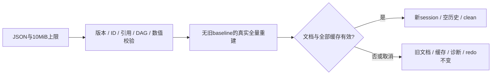

# L-011A1：为什么打开文件也必须先完成一次事务？

| 项目 | 内容 |
| --- | --- |
| 日期 / 版本 | 2026-10-03；基于7f7aa51的T-401A工作树 |
| 关联 | L-011A1；T-401A；REQ-010/AC-010-1—3基础，REQ-009/012回归 |
| 状态 | 讲解：已整理；实验：Node与三入口服务已执行；复述：未记录 |
| 前置知识 | [领域校验](L-002A-domain-validation.md)、[完整历史](L-010F-complete-history.md) |

## 1. 本次问题

JSON能够解析，为什么还不能马上替换当前项目？文件可能引用不存在的草图，也可能在前代网格已经算完后，较晚布尔才失败。替换过早会丢失当前有效模型和历史。

本篇只解决文件数据契约与原子打开基础；文件选择、下载、相机运行时和恢复入口分给后续子任务。

## 2. 原理与数据流

输入是schemaVersion=1的可序列化文档；输出是全量求解/重建通过的新项目、派生缓存和诊断。文件只保存领域数据与普通相机DTO，不保存网格缓存、求解诊断、历史或内核指针。



打开同一ID的文件也不能借用旧项目缓存，输入来自外部，应当从文件定义重建。真正成功前，旧session和权威文档保持原样；busy禁用模型历史入口。成功后换session、revision增加一次、清空历史，把重建后的文档内容当作保存基线。

文件读取与写出都限制UTF-8编码后的字节数。JS字符串的字符数不能代替字节数；输出超过10MiB也应拒绝，避免生成随后无法重新打开的文件。

## 3. 最小实验

两个20×20×20mm方块沿草图x重叠10mm，交集4000mm³。将文档序列化、解析并冷打开，检查2次native、2次拉伸和1次CSG；继续把A深度改30mm，得到12000mm³，交集仍4000mm³。XY/XZ/YZ分别执行。

另存外40×30mm、内10×10mm孔洞、深10mm，期望11000mm³；半径10mm圆深10mm，解析体积1000πmm³，沿用曲线1%容差。故意把A移到z=20，交集empty；后续union拒绝empty，不能覆盖当前项目。

```powershell
. ./scripts/use-node.ps1
npm.cmd run check:project-files
npm.cmd run check:project-files:browser
$env:HISTORY_EVIDENCE_PATH = 'docs/learning/evidence/T-401A-history-replay.json'
$env:HISTORY_EVIDENCE_TASK = 'T-401A'
npm.cmd run check:history
$env:DOMAIN_EVIDENCE_PREFIX = 'docs/learning/evidence/T-401A-domain-replay'
$env:DOMAIN_EVIDENCE_TASK = 'T-401A'
$env:TRANSACTION_EVIDENCE_PATH = '../docs/learning/evidence/T-401A-transaction-replay.json'
npm.cmd run check:domain
npm.cmd run build
npm.cmd run check:docs
```

环境：Windows x64/PowerShell7.6/Node24.21.0/npm11.19.0/Edge154.0.4258.48、Vue3.5.43、Three0.186.1、Vite8.3.2。固定WASM/CSG未更新。直边体积1e-6mm³，曲线体积相对1%；完整文档/缓存/诊断精确比较。

浏览器脚本在忽略的.research生成隔离探针，用Vite实际编译生产ProjectSession和Worker。在开发/root/cad调用同一服务，证明加载/失败/继续编辑；它不是文件UI的替代验收。

## 4. 实际结果与证据

| 检查 | 期望 | 实际 | 证据 |
| --- | --- | --- | --- |
| 三平面JSON | ID/参数/显隐/view DTO与网格/诊断恢复 | 2native/2拉伸/1CSG冷建，8000/8000/4000，继续编辑12000并可撤销到clean | [Node](../evidence/T-401A-project-files-node.json) three-plane-json-rebuild |
| 孔/圆 | 孔11000、圆1000πmm³ | 孔10999.999999999998、圆3137.606738915698；与保存前缓存精确相同 | Node hole-and-circle-json-rebuild |
| 非法文件/结果 | 拒绝并保留原项目、session、redo、save bytes | 7文件拒绝、4重建结果拒绝全部通过 | Node invalid-file-and-rebuild-results |
| 文件字节上限 | 恰好10MiB接受，超过拒绝 | 10MiB输入接受；12049734字节合法DTO输出拒绝 | 同上 oversizedOutputRefused |
| 较晚失败 | 前代已成功仍整体丢弃 | empty交集后的union拒绝，旧权威/redo保留，下一有效打开恢复 | Node late-actual-geometry-failure |
| 取消/新打开 | 旧回复不能覆盖新打开或新项目 | 实际4000交集扣留后取消、旧finally不清新busy、new拒收全部通过 | Node cancelled-and-newer-openings |
| 生产服务/Worker | busy仅发布旧文档，成功一次替换 | 开发/root/cad两次状态发布，JSON重建/尺寸历史、旧保存token、晚失败与恢复通过 | [浏览器](../evidence/T-401A-project-files-browser.json) |
| 回归/构建 | 历史、领域、core边界与类型保持 | 四历史、16领域/17core、typecheck/build通过；主包800.19kB警告保留 | [历史](../evidence/T-401A-history-replay.json)、[领域](../evidence/T-401A-domain-replay.json)、[事务](../evidence/T-401A-transaction-replay.json) |

首轮测试误期望“求解A→拉伸A→求解B”，实际拓扑队列先处理全部无前置草图，再处理拉伸；校正为solve A/B、extrude A/B、intersect。循环错误码沿用FEATURE_CYCLE，测试首次误写DEPENDENCY_CYCLE。校正期望后完整重跑通过，未改变生产拓扑算法或错误码。

## 5. 接回项目

[ProjectEngine.openDocument](../../../src/core/commands/project-engine.ts)不传旧baseline，全部结果验证完成后才替换权威数据。[ProjectSession](../../../src/app/project-session.ts)暴露openJson/captureSave/markSaved，保持Worker与发布生命周期；[JSON校验](../../../src/core/model/validate-document.ts)增加输出字节限制。

T-401A done，T-401整体doing，REQ-010尚未完整验收。AC-010-1/2/3有服务基础证据，但真实文件选择/下载、相机捕获/实际恢复和UI安全处理待B，IndexedDB/恢复/配额失败待C；完整E2E-02也未通过。

## 6. 我的复述与检查题

- 我的解释：未记录，没有根据测试推断用户掌握。
- 小练习：将圆深度从10改20，预测解析体积与重建请求，再运行。
- 为什么问题：文件里的特征ID恰好等于当前项目ID时，为什么仍必须全量重建？为什么失败打开不能清空历史？

## 7. 疑问与下一步

下一T-401B/L-011A2回答：浏览器读取和下载什么时候才算成功，以及怎样将实时相机状态放入文件？默认打开/保存按钮仍禁用。本次相机证据只覆盖DTO，不是运行时相机往返；最终三浏览器和性能待后续。

## 8. 来源

- [PRD REQ-010与Worker契约](../../PRD.md)：本项目7f7aa51，2026-10-03核对；版本、10MiB、领域数据重建和成功后换session。
- [ProjectEngine](../../../src/core/commands/project-engine.ts)、[featureRecompute](../../../src/app/feature-recompute.ts)：7f7aa51与本任务工作树，2026-10-03核对；原子快照和无baseline冷重建。
- [UPSTREAM](../../UPSTREAM.md)：SolveSpace2879a02d、CSG8bd00fe9，2026-10-03核对；固定真实内核，本次未复用新外部代码。
