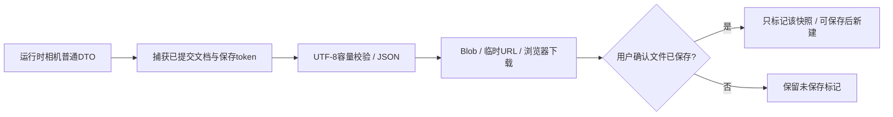

# L-011A2：发起下载与确认文件保存有什么区别？

| 项目 | 内容 |
| --- | --- |
| 日期 / 版本 | 2026-10-03；基于0f53a6b的T-401B工作树 |
| 关联 | L-011A2；T-401B；REQ-010/AC-010-1—3、6；REQ-001/009/012回归 |
| 状态 | 讲解：已整理；实验：Node与三入口UI已执行；复述：未记录 |
| 前置知识 | [原子打开](L-011A1-atomic-file-load.md)、[完整历史](L-010F-complete-history.md) |

## 1. 本次问题

浏览器接受Blob下载后，页面能否声称文件已经写入磁盘？标准下载没有给页面磁盘写入完成回调。因此保存需要捕获具体文档快照，发起下载，再由用户确认这个快照已保存；未确认继续保留dirty。

本篇解决标准文件输入、真实下载和实时相机状态。IndexedDB自动恢复属于下一篇。

## 2. 原理与数据流

打开的输入是用户选择的File，输出是原子重建成功的新项目。先检查File.size，再读取文本、校验JSON。读取期间允许取消；项目session/revision改变后旧文本不能继续打开。dirty项目默认取消，明确丢弃后才替换。



相机导航是文档元数据，dirty包含它，但不增加几何revision或历史条数。撤销/重做保留最新导航；计算成功时合并计算期间最新view，避免忙碌平移被旧候选文档覆盖。打开文件则恢复文件中的相机。自动进入草图的临时正视不作为导航提交，实际导航或保存会捕获当前运行时DTO。

相机允许在几何工作范围以外；position/target限制±1e9，zoom与OrbitControls一致为0.01—10000，几何±10000mm边界不变。Three.js对象始终由运行时持有。

## 3. 最小实验

输入：XY/XZ/YZ两个20×20×20mm方块，沿草图x重叠10mm，交集4000mm³。打开真实文件，适应视图、中键平移12/8px并滚轮缩放；立即点击保存，读取真实下载文件。重新加载后上传下载结果，精确比较领域文档与实际网格指标，并用文件DTO独立投影已知实体表面点，实际点击拾取交集。

继续把A宽20改25mm，期望A=10000、交集=6000mm³，撤销/重做恢复几何。拒绝路径包含损坏JSON、未来版本、缺失引用、1e309、超过10MiB、File.text错误和Blob URL错误。扣留真实8000mm³拉伸结果再取消打开，旧结果不得进入权威项目。

```powershell
. ./scripts/use-node.ps1
npm run check:project-view
npm run build
npm run check:project-file-ui:browser
$env:PROJECT_EVIDENCE_PATH='../docs/learning/evidence/T-401B-project-ui-replay.json'
$env:PROJECT_EVIDENCE_TASK='T-401B'
npm run check:project
$env:WORKSPACE_EVIDENCE_PATH='../docs/learning/evidence/T-401B-workspace-replay.json'
$env:WORKSPACE_EVIDENCE_TASK='T-401B'
npm run check:workspace
$env:INTERACTION_EVIDENCE_PATH='docs/learning/evidence/T-401B-interaction-replay.json'
npm run check:interaction:browser
$env:VIEWPORT_EVIDENCE_PATH='../docs/learning/evidence/T-401B-viewport-replay.json'
$env:VIEWPORT_EVIDENCE_TASK='T-401B'
npm run check:viewport
npm run check:docs
```

环境：Windows x64/PowerShell7.6/Node24.21.0/npm11.19.0/Edge154.0.4258.48、Playwright1.63.0、Vue3.5.43、Three0.186.1、Vite8.3.2。直边体积容差1e-6mm³，领域文档/网格指标精确比较；固定WASM/CSG未更新。

## 4. 实际结果与证据

| 检查 | 期望 | 实际 | 证据 |
| --- | --- | --- | --- |
| 相机与历史 | 导航无几何命令、busy提交保留最新view | 3Node测试通过，5非法view不替换当前文档 | [Node](../evidence/T-401B-project-view-node.json) |
| 真实文件往返 | 三入口×三平面一致并可编辑 | 文件/文档/网格一致；真实相机拾取join，宽25后10000/6000 | [UI](../evidence/T-401B-file-ui-browser.json) planes |
| 非法文件与IO失败 | 旧项目/revision/history保留 | 5文件拒绝、读/下载错误分别提示并精确保留 | UI errorPaths |
| 取消与安全名称 | 默认取消，晚回复拒收，名称只是文本 | 读取取消、Enter默认取消、实际8000晚回复取消；无img注入 | 同上 |
| 保存生命周期 | 未确认dirty，确认后才能新建 | Ctrl+S在文本框内真实下载；保留修改、确认后新建、dirty离页提示通过 | 同上 |
| 旧入口回归 | 名称/新建/布局/503/忙碌导航/面板/视口恢复保持 | 三入口回归通过，WebGL恢复和20次资源检查通过 | [项目](../evidence/T-401B-project-ui-replay.json)、[工作区](../evidence/T-401B-workspace-replay.json)、[交互](../evidence/T-401B-interaction-replay.json)、[视口](../evidence/T-401B-viewport-replay.json) |
| 领域/历史/构建 | 原子历史与纯core保持 | 四历史、16领域/17core、typecheck/build通过；root806.88kB警告保留 | [历史](../evidence/T-401B-history-replay.json)、[领域](../evidence/T-401B-domain-replay.json)、[事务](../evidence/T-401B-transaction-replay.json) |

首轮发现中键平移后首个保存点击只有pointerup，没有pointerdown/click。阻止canvas中键pointerdown默认行为后，真实下载出现；原因是Chromium原生中键自动滚动接管了下一次点击。生产root首次仍失败是未重新build；重新构建后全部通过。临时事件日志已移除。既有“保存禁用”断言随功能更新，忙碌导航改为比较几何与revision，并独立确认导航DTO保留。

## 5. 接回项目

[ProjectFiles](../../../src/components/ProjectFiles.vue)管理读取/确认/取消、保存快照和错误；[文件适配](../../../src/adapters/files/project-file.ts)只处理File/Blob生命周期。[ProjectEngine](../../../src/core/commands/project-engine.ts)只接受可序列化相机DTO，[视口](../../../src/adapters/viewport/viewport-runtime.ts)发出导航结束状态。

T-401B done，T-401整体doing。AC-010-1/2/3/6的文件UI路径已有真实证据；自动恢复AC-010-4/5待C，完整REQ-010/E2E-02、STL及最终三浏览器/性能仍未验收。标准下载由用户确认，未实现可选File System Access增强。

## 6. 我的复述与检查题

- 我的解释：未记录。
- 小练习：下载后选择“继续保留修改”，预测dirty与历史，再确认同一快照。
- 为什么：busy期间导航为何不能增加几何revision，打开文件又为何必须恢复文件view？

## 7. 疑问与下一步

下一T-401C/L-011A3：如何在1秒防抖与异步存储期间保证恢复记录来自最新已提交项目？怎样区分恢复副本与手动保存，避免旧恢复覆盖用户手动打开？用户学习复述仍未记录。

## 8. 来源

- [PRD](../../PRD.md)：0f53a6b，2026-10-03核对；文件回退、相机、dirty和快捷键要求。
- [File API](https://w3c.github.io/FileAPI/)：2026-09-12 Editor's Draft，2026-10-03核对；File/Blob、文本读取和临时URL生命周期。
- Three0.186.1本地OrbitControls.js，2026-10-03核对：导航end、zoom限制和中键事件；没有复制或修改上游代码。
- 本任务[浏览器脚本](../../../scripts/check-project-file-ui-browser.mjs)和上述证据，2026-10-03核对：真实下载及模型输入/输出；截图不作为数值判定。
