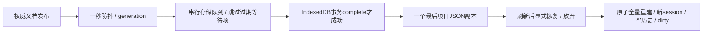

# L-011A3：异步防抖如何保存最新已提交项目？

| 项目 | 内容 |
| --- | --- |
| 日期 / 版本 | 2026-10-03；基于b2c896a的T-401C工作树 |
| 关联 | L-011A3；T-401C/T-401；REQ-010六AC，REQ-009/012回归 |
| 状态 | 讲解：已整理；实验：6Node与三入口真实IndexedDB已执行；复述：未记录 |
| 前置知识 | [原子打开](L-011A1-atomic-file-load.md)、[文件与相机](L-011A2-browser-files-and-camera.md) |

## 1. 本次问题

用户连续修改，最后一个写入尚未完成时又打开另一项目，恢复副本应该保存哪一个？需要同时控制一秒防抖、串行写入和项目切换；单纯延迟一次setTimeout不能解决已经开始的旧写入。

## 2. 原理与数据流

输入是ProjectSession发布的已提交文档快照；输出是IndexedDB最后一个项目的JSON副本或明确错误。预览和候选几何不进入副本；恢复存储不markSaved，手动下载与恢复副本分开提示。



已经开始的旧写入可以先完成，但新项目写入在队列中排在它之后，最终副本应收敛到最新文档。旧写入完成不能更新新项目的成功状态。首次读取还在进行时发生手动打开，旧读取结果不能再提供恢复入口；存储不可用期间手动打开后再重试，也应写当前项目。

IndexedDB单个put请求成功后，事务仍可能中止。适配器只在事务complete时报告写入成功，abort/配额/不可用/阻塞/超时分别返回错误。每次操作关闭连接，版本变化也关闭旧连接。恢复记录只含版本、时间和领域JSON，不依赖网格或历史。

恢复入口不静默替换当前模型。当前dirty时默认取消；明确恢复后走同一真实冷重建事务。恢复成功保留dirty，直至手动确认保存。放弃会删除副本，并保持当前文档/历史；不会立即把初始空项目写回。恢复服务和离页提示由App生命周期持有，切换技术实验页面仍有效。

## 3. 最小实验

XY中A=(0,0)—(20,20)、B=(10,0)—(30,20)，深20mm；真实求解/CSG生成union、双向差、intersect。初始体积12000/4000/4000，差集x=[0,10]与[20,30]。把A宽改25，union=12000、A-B=4000、intersect=6000mm³。

连续六次名称修改：一秒内不写，停止后只写一次最新名称。真实下载、刷新显式恢复、手动文件打开，然后级联删除A及五后代、撤销/重做，比较完整领域与实际网格指标。

故障实验在实际IndexedDB方法边界注入QuotaExceededError、put成功后abort、SecurityError；扣留实际readonly事务或实际10000mm³Worker结果，验证手动打开和取消。Node使用受控存储Promise隔离队列竞态，但几何仍为固定真实内核。

```powershell
. ./scripts/use-node.ps1
npm run check:project-recovery
npm run build
npm run check:project-recovery:browser
$env:PROJECT_FILES_EVIDENCE_PATH='docs/learning/evidence/T-401C-project-files-replay.json'
$env:PROJECT_FILES_EVIDENCE_TASK='T-401C'
npm run check:project-files
$env:FILE_UI_EVIDENCE_PATH='docs/learning/evidence/T-401C-file-ui-replay.json'
$env:FILE_UI_EVIDENCE_TASK='T-401C'
npm run check:project-file-ui:browser
$env:HISTORY_EVIDENCE_PATH='docs/learning/evidence/T-401C-history-replay.json'
$env:HISTORY_EVIDENCE_TASK='T-401C'
npm run check:history
$env:DOMAIN_EVIDENCE_PREFIX='docs/learning/evidence/T-401C-domain-replay'
$env:DOMAIN_EVIDENCE_TASK='T-401C'
$env:TRANSACTION_EVIDENCE_PATH='../docs/learning/evidence/T-401C-transaction-replay.json'
npm run check:domain
$env:WORKSPACE_EVIDENCE_PATH='../docs/learning/evidence/T-401C-workspace-replay.json'
$env:WORKSPACE_EVIDENCE_TASK='T-401C'
npm run check:workspace
$env:DRAWING_BROWSER_EVIDENCE_PATH='docs/learning/evidence/T-401C-drawing-replay.json'
$env:DRAWING_EVIDENCE_TASK='T-401C'
npm run check:drawing:browser
npm run check:docs
```

环境：Windows x64/PowerShell7.6/Node24.21.0/npm11.19.0/Edge154.0.4258.48、Vue3.5.43、Three0.186.1、Vite8.3.2。体积1e-6mm³，文档/网格指标精确比较。真实防抖1000ms，记录最后UI操作之后观测延迟≥900ms；测试允许操作返回时间与提交时间之间的调度误差。没有更新固定WASM/CSG。

## 4. 实际结果与证据

| 检查 | 期望 | 实际 | 证据 |
| --- | --- | --- | --- |
| 防抖/串行 | 六次只写最新，旧写入最终让位新项目 | 6Node全部通过；实际IDB三入口六次各一次写入 | [Node](../evidence/T-401C-project-recovery-node.json)、[浏览器](../evidence/T-401C-project-recovery-browser.json) |
| 读取/切换 | 旧读取不覆盖手动打开 | Node延迟read与浏览器实际readonly扣留均通过 | delayed-read / errorPaths |
| 显式恢复 | 重建4000/6000，空历史且dirty | Node4000；UI已编辑交集6000与保存文档/全部网格相同 | real-recovery / e2e02 |
| 文件后级联 | A五后代删除、undo/redo无悬空引用 | 文件重开后仅b/solid-b；完整文档与指标恢复 | e2e02 |
| 配额/中止/不可用 | 旧副本保留，手动下载可用 | quota旧记录不变；请求success后abort不报saved；SecurityError后真实下载与重试通过 | errorPaths |
| 取消/坏记录/放弃 | 当前项目不替换，旧finally不影响新恢复 | Node实际4000与UI实际10000晚结果拒收，Enter默认取消；坏JSON拒绝、放弃删除副本 | Node cancelled-and-newer / UI errorPaths |
| 生命周期/回归 | 实验页仍有dirty离页提示，绘制/布局保持 | 三入口dirty离页/绘制/冷取消/布局503通过；五文件、四历史、16领域/17core、build/docs通过 | [文件](../evidence/T-401C-project-files-replay.json)、[UI回归](../evidence/T-401C-file-ui-replay.json)、[绘制](../evidence/T-401C-drawing-replay.json)、[布局](../evidence/T-401C-workspace-replay.json) |

首轮Node因parameter property不支持strip-only失败，改为普通字段，六测试通过。浏览器首轮把网格指标字段误写boundingBox，实际为bounds，已校正。后发现OrbitControls恢复相机产生约1e-13漂移，保存会额外改DTO；恢复后显式保留输入position，三入口精确文件比较通过。存储最初不可用、手动打开后重试曾停在idle；修复为已有用户变更时安排当前副本写入，完整重跑通过。

收尾重跑还发现测试在异步File.text结束前查询确认按钮，偶发未点击而超时。改为依据当前dirty等待并点击确认按钮，三入口全部重跑通过；没有跳过用户确认或放宽生产校验。

## 5. 接回项目

[ProjectRecovery](../../../src/app/project-recovery.ts)负责防抖、队列、恢复代次和显式选择；[IndexedDB适配](../../../src/adapters/files/recovery-store.ts)负责事务结果与连接生命周期；[恢复面板](../../../src/components/ProjectRecovery.vue)仅显示状态与确认。[原子引擎](../../../src/core/commands/project-engine.ts)允许恢复成功后保持dirty。

REQ-010六AC已有A/B/C合并证据：AC1文件/相机/继续编辑，AC2领域JSON与真实冷建，AC3容量/版本/引用/循环/非有限拒绝，AC4恢复/放弃/手动打开优先，AC5配额/存储失败与手动下载，AC6安全文本。T-401完成；T-403仍需完整UI从绘制开始的E2E-02与最终三浏览器/性能，不能把三个入口称为三种浏览器。

## 6. 我的复述与检查题

- 我的解释：未记录，没有推断学习掌握。
- 小练习：修改后立刻刷新与等副本更新后刷新，先预测可恢复的版本。
- 为什么：put成功为什么还不能提示副本已更新？旧写入已开始时怎样保证新项目最终胜出？

## 7. 疑问与下一步

下一T-402/L-011B2：如何从选择的实际实体导出STL，并用独立解析器验证单位、法线、拓扑、包围盒与体积？完整MVP与最终验收未完成。

## 8. 来源

- [PRD REQ-010/E2E-02](../../PRD.md)：b2c896a，2026-10-03核对；一秒防抖、显式恢复、存储失败回退。
- [Indexed Database API 3.0](https://w3c.github.io/IndexedDB/)：Editor's Draft，2026-10-03核对；事务complete、abort和连接versionchange。仅据其事务规则实现适配，没有复制上游工程。
- [UPSTREAM](../../UPSTREAM.md)：固定SolveSpace2879a02d、CSG8bd00fe9，2026-10-03核对；实际几何来源未改变。
- 本任务Node/浏览器脚本与上述证据：T-401C工作树，2026-10-03核对；受控Promise只用于存储时序，浏览器验收使用真实IndexedDB。
