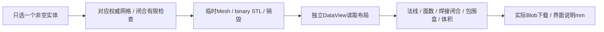

# L-011B2：怎样证明下载的STL就是选中的实体？

| 项目 | 内容 |
| --- | --- |
| 日期 / 版本 | 2026-10-03；基于b326555的T-402工作树，Three0.186.1 |
| 关联 | L-011B2；T-402；REQ-011/AC-011-1—3，REQ-010/012回归 |
| 状态 | 讲解：已整理；实验：3Node/36实际导出、三入口54实际下载已执行；复述：未记录 |
| 前置知识 | [STL布局与独立解析](L-011B-stl-roundtrip.md)、[浏览器下载](L-011A2-browser-files-and-camera.md) |

## 1. 本次问题

场景里有实体、隐藏来源、草图与高亮，为什么不能直接导出整个Scene？导出目标必须由单个选择ID确定，只使用该ID的权威派生网格。Scene只是显示结果，不能决定文件内容。

## 2. 原理与数据流

输入是已提交文档、派生缓存和一个实体ID；输出是经重新解析验证的binary STL及明确错误。导出不改文档、历史、revision或dirty。世界坐标来自领域几何重建后的网格；不读取视口Scene/选择高亮/辅助对象。



STL每面重复记录三个Float32顶点；按位置焊接验证拓扑，不能按重复顶点的索引判断。STL文件没有单位，本项目按mm输出，用户应在导入端选择mm。重新解析后法线必须单位化、与外向三角面一致，体积相对误差≤1e-4，包围盒误差≤max(1e-4mm,尺寸×1e-5)。

Float32可能损失精度。中心x=9999mm、宽0.001mm的实际闭合薄实体，STL精度已不能满足容差；明确返回STL_EXPORT_INVALID，不能只因源网格有效就下载一个不满足要求的文件。

## 3. 最小实验

三平面两个20×20×20mm方块，重叠10mm；分别导出A、B、union、双向差和交集。预期8000/8000/12000/4000/4000/4000mm³，下载每个文件后独立解析。显式选择隐藏来源可导出该来源本身；选择布尔结果时隐藏来源不混入结果。

Node再验证孔洞、圆与圆环，各在三平面深±10mm，保存前后的实际网格体积/包围盒/闭合/法线一致。拒绝空、多选、草图、无网格、非有限、不闭合、busy和Float32精度损失。浏览器扣留实际8000mm³打开结果，检查busy导出禁用、取消旧结果及重试。

```powershell
. ./scripts/use-node.ps1
npm run check:project-stl
npm run build
npm run check:project-stl:browser
$env:SOLID_EVIDENCE_PATH='../docs/learning/evidence/T-402-solid-replay.json'
$env:SOLID_EVIDENCE_TASK='T-402'
npm run check:solid
$env:WORKSPACE_EVIDENCE_PATH='../docs/learning/evidence/T-402-workspace-replay.json'
$env:WORKSPACE_EVIDENCE_TASK='T-402'
npm run check:workspace
$env:FILE_UI_EVIDENCE_PATH='docs/learning/evidence/T-402-file-ui-replay.json'
$env:FILE_UI_EVIDENCE_TASK='T-402'
npm run check:project-file-ui:browser
$env:DOMAIN_EVIDENCE_PREFIX='docs/learning/evidence/T-402-domain-replay'
$env:DOMAIN_EVIDENCE_TASK='T-402'
$env:TRANSACTION_EVIDENCE_PATH='../docs/learning/evidence/T-402-transaction-replay.json'
npm run check:domain
npm run check:docs
```

环境：Windows x64/PowerShell7.6/Node24.21.0/npm11.19.0/Edge154.0.4258.48、Vue3.5.43、Three0.186.1、Vite8.3.2。焊接1e-6mm、STL体积相对1e-4、法线长度/方向1e-5；浏览器直边夹具包围盒1e-4mm，晚回包体积1e-6mm³。依赖/WASM/CSG未更新。

## 4. 实际结果与证据

| 检查 | 期望 | 实际 | 证据 |
| --- | --- | --- | --- |
| 单实体世界网格 | 三平面A/B/四布尔各只导出本身 | 18Node导出，实际体积/面数/包围盒/文件长度通过 | [Node](../evidence/T-402-project-stl-node.json) actual-three-plane-single-solids |
| 曲线/孔/正负 | Float32后仍满足拓扑与容差 | 孔/圆/环×三平面×±深度共18真实导出通过 | actual-hole-curves-signed |
| 非法输入 | 拒绝且权威不变 | 3选择、busy、空/非有限/不闭合/无网格、实际薄实体精度拒绝通过 | invalid-export |
| 实际下载 | 三入口每个文件可独立解析 | 各18，共54文件；没有混入隐藏来源/辅助对象，导出前后文档/revision/history不变 | [浏览器](../evidence/T-402-project-stl-browser.json) |
| UI失败/取消 | 明确错误，当前项目保留 | 多选/草图/空/Blob失败、busy禁用、实际8000晚回复取消/重试与mm说明通过 | 同上 |
| 回归/布局 | 基础导出、项目文件和布局保持 | 19实体/16STL、16领域/17core、文件UI和布局503三入口、typecheck/build/docs通过 | [基础](../evidence/T-402-solid-replay.json)、[文件](../evidence/T-402-file-ui-replay.json)、[布局](../evidence/T-402-workspace-replay.json)、[领域](../evidence/T-402-domain-replay.json) |

首轮夹具误用contourFixture参数，圆的sketch ID又与实体ID重复；按既有函数签名和唯一ID修正。薄实体初值0.0001mm低于Box支持下限，改为合法0.001mm验证实际Float32损失。浏览器批量急速下载停在第11个，记录显示前10个已下载；每次真实交接间隔200ms后54文件通过，没有绕过浏览器限制。晚回包实际7999.999999999999，按原计划1e-6mm³容差比较；没有把浮点结果要求为整数精确相等。

## 5. 接回项目

[projectStl](../../../src/app/project-stl.ts)限定选择、验证源与文件；[独立读取器](../../../src/adapters/files/parse-binary-stl.ts)由旧实验读取器迁入适配层，原路径重新导出，避免生产依赖实验入口。[ProjectStl组件](../../../src/components/ProjectStl.vue)显示单位/错误并实际下载；临时Mesh在导出后释放geometry/material。

T-402/REQ-011三AC完成。旧16STL基础回归证明兼容固定Three版本；没有复制新的上游代码。root820.05kB构建警告仍保留。T-403仍需完整E2E-01—05、最终Chrome/Edge/Firefox、基准性能与资源生命周期，M4/MVP未完成。

## 6. 我的复述与检查题

- 我的解释：未记录。
- 小练习：选择交集和隐藏的A分别导出，先预测体积4000与8000。
- 为什么：源实体闭合，为什么导出的Float32文件还需要重新验证？

## 7. 疑问与下一步

下一T-403/L-012B：完整工作流、不同浏览器和基准性能怎样形成可复现验收？本篇不推断长期GPU堆稳定，也不把三个入口算作三浏览器。

## 8. 来源

- [PRD REQ-011](../../PRD.md)：b326555，2026-10-03核对；单实体、世界坐标、单位和拒绝边界。
- Three0.186.1本地STLExporter.js，2026-10-03核对；DataView、Float32和84+50N布局，导出器未修改。
- [既有STL学习](L-011B-stl-roundtrip.md)与[UPSTREAM](../../UPSTREAM.md)：b326555，2026-10-03核对；固定依赖与实际上游声明保持。
- 本任务Node/浏览器脚本及上述证据：T-402工作树，2026-10-03核对；下载字节和实际几何判定，截图只辅助UI检查。
