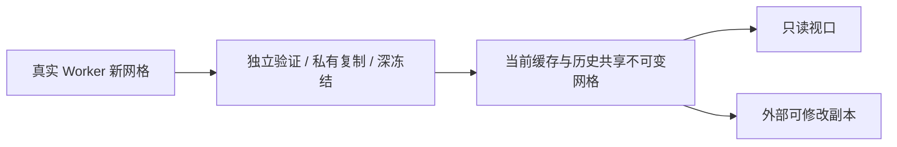

# L-012C2：Worker 回包后，主线程为什么仍会卡住？

| 项目 | 内容 |
| --- | --- |
| 日期 / 版本 | 2026-10-03 / 基线 c5ca2e3，T-403C2a 工作树 |
| 关联 | L-012C、T-403C2a、NFR-003/004/005，REQ-009/010 |
| 状态 | 已讲解；已实验；复述未记录 |
| 前置 | [网格验证成本](L-012C1-preserve-weld-semantics.md)、[精确历史](L-010F-complete-history.md) |

## 1. 本次问题

计算放进 Worker 后，接收结果、复制历史、验证网格和更新视口仍在主线程。完整十实体场景能否保持原子历史，并减少这部分连续工作？

输入是可序列化的 100 条线、100 个长度约束、外圆 R4000 和九个 R500 孔、深度 100—280 的十个拉伸。通过真实文件输入和真实内核重建，输出为实际十个网格及浏览器计时；没有向应用注入派生网格。

## 2. 原理与数据流

私有缓存接收新网格时仍验证闭合、方向、流形及有限坐标，复制成自己拥有的数据并冻结坐标数组。只有这一私有可信集合里的不可变网格可以被历史和未受影响分支共享；仅有相同 ID 或外部调用过 Object.freeze 不构成信任。



文档和诊断仍复制，避免修改相机或名称改写旧历史。新网格逐个验证后让出事件循环，取消检查继续生效；全部成功前不发布新权威。忙碌通知和相机导航不增加几何 revision，视口只更新最新元数据；新运行时强制重新应用缓存，不能因 revision 相同而恢复为空视口。

## 3. 最小实验

```powershell
. ./scripts/use-node.ps1
$env:E2E_BROWSER_KINDS='chrome'
$env:PERF_SCENE_SAMPLES='2'
$env:PERF_SCENE_PATH='docs/learning/evidence/T-403C2a-scene-before.json'
node scripts/check-scene-performance.mjs # 优化前真实记录，不能用当前代码再生成旧值

$env:E2E_BROWSER_KINDS='chrome,edge,firefox'
$env:PERF_SCENE_SAMPLES='30'
$env:PERF_ASSERT_BUDGETS='1'
npm.cmd run check:scene-performance
npm.cmd run check:immutable-mesh-history
```

优化前采一个预热、两个诊断样本；优化后每浏览器排除一个预热，真实应用长度 10/11 切换 30 次。通过原生右键旋转 100 步，用实际 WebGL TRIANGLES 绘制计数和帧间隔计算帧率，空闲 rAF 不当渲染帧。

10ms 定时器间隔记录主线程响应上界，包含采样周期，不当精确任务时间。Chrome/Edge 另外记录 Long Tasks；Firefox 未提供该类型，不填伪造的 0ms 任务结论。环境：Windows、Node24.21.0、Three0.186.1、1280×720，真实稳定三浏览器以 headless 原生输入执行；机器 i7-13700KF/31.8GiB/RTX4070Ti，完整来源见[机器与运行时](../evidence/T-403A-browser-runtimes.json)。

## 4. 实际结果与证据

实际生成十个 10576 面网格，总 105760 面；每个旋转帧至少绘制 105780 面，额外面来自草图/基准平面。

| 检查 | Chrome / Edge / Firefox | 判定 | 证据 |
| --- | --- | --- | --- |
| 优化前 Chrome | 求解 p95 154.1ms；最大定时器间隔 942.6ms，最长任务708ms | 主线程失败，仅两样本定位 | [前](../evidence/T-403C2a-scene-before.json) |
| 30 求解样本 p95 | 7.4 / 7.8 / 8ms | ≤200ms | [后](../evidence/T-403C2a-scene-after.json) |
| 计算最大采样间隔 | 115.9 / 117.8 / 85ms | 含10ms采样，≤200ms | 同上 |
| 冷打开最大间隔 | 101.9 / 108.5 / 85ms | ≤200ms | 同上 |
| 旋转中位帧率 | 158.73 / 161.29 / 76.92fps；102/102/101实际帧 | ≥30fps；自动化运行环境值 | 同上 |

Chrome/Edge 计算期间最长 Long Task 82/83ms；Firefox 以采样间隔为证。新[四所有权/取消测试](../../../tests/immutable-mesh-history.test.mjs)加原有回归共[41 Node 测试](../evidence/T-403C2a-node-replay.log)通过，几何体积容差1e-6mm³；[16领域/18纯core](../evidence/T-403C2a-domain.json)通过。

[六几何文件流程](../evidence/T-403C2a-e2e-geometry.json)与[六故障流程](../evidence/T-403C2a-e2e-failures.json)复跑通过：真实文件重建、参数传播、精确 undo/redo、实际10s超时、晚结果取消、WebGL重试继续编辑。首次新测试用浮点体积严格等于整数失败，改为项目既有1e-6容差后通过；未放宽领域判断。

## 5. 接回项目

[ProjectEngine](../../../src/core/commands/project-engine.ts)只共享自己验证冻结的网格；原 cache getter 仍返回可修改副本，新只读 getter 的深冻结数据不能被调用者修改。[featureRecompute](../../../src/app/feature-recompute.ts)保留未受影响网格身份；[ModelViewport](../../../src/components/ModelViewport.vue)按 revision/session 接回派生数据，运行时重建会清空应用标记。

T-403C2a 完成响应优化与完整十实体测量；简单 CSG 30样本、长期 GPU/Worker 资源及全 NFR 汇总仍待 C2b。没有把本篇标成 T-403/MVP 完成。主包821.63kB警告保留，固定内核和依赖未改。

## 6. 我的复述与检查题

- 我的解释：未记录。
- 小练习：尝试修改只读缓存的一个坐标，预测当前网格和 undo 的结果，再执行测试。
- 为什么：为什么一个外部冻结的非法网格仍需完整验证？

## 7. 疑问与下一步

共享网格减少复制及历史内存，但是否释放 GPU 资源需要另外测真实创建/销毁。下一 C2b 做简单 CSG 和反复打开/新建/视口重建的资源实验。

## 8. 来源

- [本地纯领域引擎](../../../src/core/commands/project-engine.ts)、[生产性能脚本](../../../scripts/check-scene-performance.mjs)：T-403C2a，核对2026-10-03；实现与原始样本，无新外部算法。
- [PRD](../../PRD.md)、[基线 C1](L-012C1-preserve-weld-semantics.md)：c5ca2e3，核对2026-10-03；规模、正确性与性能预算。
