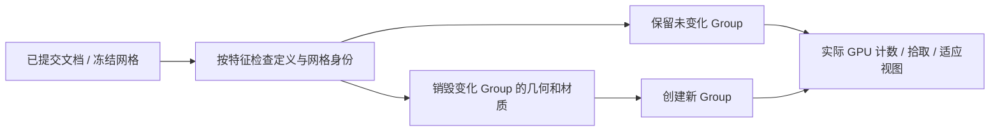

# L-012C3：怎样证明视口释放了旧几何？

| 项目 | 内容 |
| --- | --- |
| 日期 / 版本 | 2026-10-03 / 基线1358cf7，T-403C2b1 |
| 关联 | L-012C、T-403C2b1、REQ-002/AC-002-3/4、NFR-003/004/005 |
| 状态 | 已讲解；已实验；复述未记录 |
| 前置 | [不可变网格](L-012C2-immutable-mesh-history.md)、[视口生命周期](L-004C-viewport-lifecycle.md) |

## 1. 本次问题

只有一个 canvas 并不说明旧几何已经释放。需要观察真实 GPU 几何/纹理计数、会话 Worker 数和事件回调，并验证隐藏、改值、取消与上下文重建仍正确。

输入为生产文件的100线/100约束/十真实实体105760面。重复新建/打开20次，其中10次实际丢失WebGL上下文并创建新运行时，输出为每轮真实 renderer.info.memory 与会话 Worker 生命周期。

## 2. 原理与数据流

每个特征拥有一个视口 Group。草图按领域定义比较，实体还比较不可变网格身份；只有变化、隐藏或删除的特征销毁和重建。可修改调用者的缓存先复制，不能因同一对象地址而漏掉坐标变化。



缓存身份来自上篇私有验证冻结，和数值正确性没有冲突。更换会话、恢复上下文及销毁运行时会清空全部对应 Group；草图适应视图也要根据新分组定位，不能误包含其他实体。

## 3. 最小实验

```powershell
. ./scripts/use-node.ps1
$env:E2E_BROWSER_KINDS='chrome,edge,firefox'
$env:PERF_ASSERT_BUDGETS='1'
$env:PERF_FULL_ACCEPTANCE='1'
$env:PERF_SCENE_PATH='docs/learning/evidence/T-403C2b1-performance-resources.json'
npm.cmd run check:scene-performance

$env:VIEWPORT_EVIDENCE_PATH='../docs/learning/evidence/T-403C2b1-viewport.json'
$env:VIEWPORT_EVIDENCE_TASK='T-403C2b1'
npm.cmd run check:viewport
```

简单 CSG 也在完整规模场景测量：92独立线及两个四边闭环、100约束、八个更密集的真实孔洞实体和两个12面方块，实际十实体103544面。三种运算分别排除一次预热，采30次真实Worker回包；每次undo回到精确原文档且不调用内核。每个计算绘制帧还须有至少十万面，不另用只有两方块的小场景冒充完整基准。

环境是 Windows/i7-13700KF/31.8GiB/RTX4070Ti，Node24.21.0、Three0.186.1、Chrome154.0.8037.92/Edge154.0.4258.53/Firefox157.0，headless原生输入1280×720。计时保留10ms采样开销；不把计数当驱动VRAM字节或JS堆测试。

## 4. 实际结果与证据

首次三浏览器长测试的Firefox CSG主线程间隔超过200ms，[失败日志](../evidence/T-403C2b1-initial-failure.log)保留；当时没有保存精确峰值，不补填。旧实现单独[完整复跑](../evidence/T-403C2b1-firefox-baseline-repeat.json)得到97ms，说明一次成功不能解释原失败的波动。

原视口每次提交都序列化全部网格，并因两个小方块隐藏/增加结果而重建所有342个几何。改成每特征生命周期后，[三入口适配层](../evidence/T-403C2b1-viewport.json)已通过：改名/隐藏其他对象保持原Mesh和GPU几何身份；隐藏仅销毁一个几何，可修改缓存再次更新能刷新坐标；草图适应视图不含x=60的实体；20次重置无重复选择回调，实际context恢复与最终dispose计数0。

完整三浏览器[最终原始数据](../evidence/T-403C2b1-performance-resources.json)通过，每浏览器真实求解30次、各CSG30次、20次完整文件重建、10次实际WebGL重试。

| 检查 | Chrome / Edge / Firefox | 预算 | 实际判定 |
| --- | --- | --- | --- |
| 求解p95 / 最大计算间隔ms | 7.6/35.8、7.7/37.9、12/27 | 200ms | 通过 |
| union/subtract/intersect p95 ms | 4.2/4.3/4.3、4.4/4.2/4.1、8/5/5 | 每类30预热后样本，2000ms | 通过 |
| CSG最大采样间隔ms | 20 / 20.4 / 25 | 200ms，包含10ms采样 | 通过 |
| 冷打开 / 20轮最大间隔ms | 108.9/96.9、88.1/99.3、41/47 | 200ms | 通过 |
| 旋转中位fps | 158.73 / 158.73 / 76.92 | 30fps，101—102实际帧 | 通过 |

每轮完整场景GPU几何342/纹理0/canvas1/会话Worker2；空项目恢复8/0/1/0，各上下文重建回到342/0/1/2。CSG场景实际103544面，每个计算绘制帧至少十万面；实际体积union12000、subtract/intersect4000mm³，闭合/体积容差1e-6。反复undo文档精确相同、内核请求数不增加。

[六生产几何文件回归](../evidence/T-403C2b1-e2e-geometry.json)与typecheck/build/docs通过。两次旧模式测试一失败一通过，不把新模式的一次完整通过扩大为驱动堆恒定或所有机器性能保证。T-403/MVP仍待下节传输与全NFR汇总。

## 5. 接回项目

[ViewportRuntime](../../../src/adapters/viewport/viewport-runtime.ts)按特征维护私有Group/拾取对象，变化时只dispose其所有资源。ModelViewport仅发布实际renderer.info.memory数值为诊断属性，不把Three实例放进Pinia。

仍需补齐PRD6.4的网格可转移ArrayBuffer传输；现有数组的数值/性能通过不能代替该架构要求。后续C2b2/L-012C4再测实际buffer detach、精确Float64回包、保存/历史/超时与全NFR。复述未记录。

## 6. 我的复述与检查题

- 我的解释：未记录。
- 小练习：只隐藏B，预测A的Mesh身份与disposed几何数，再执行适配层实验。
- 为什么：为什么“GPU几何342→8”不能直接证明驱动显存字节或垃圾回收堆恒定？

## 7. 疑问与下一步

预算波动要保留失败和重复样本，不能删除失败或提高门槛。下一可转移网格保证不detach撤销历史持有的数据，再汇总完整NFR。

## 8. 来源

- [性能场景](../../../src/experiments/performance-fixtures.ts)、[生产脚本](../../../scripts/check-scene-performance.mjs)、[适配层实验](../../../tests/browser/viewport-harness.ts)：T-403C2b1，核对2026-10-03；实际输入、资源与操作计数。
- [PRD](../../PRD.md)与[前篇](L-012C2-immutable-mesh-history.md)：基线1358cf7，核对2026-10-03；原预算、网格只读身份与未完成的传输契约。
