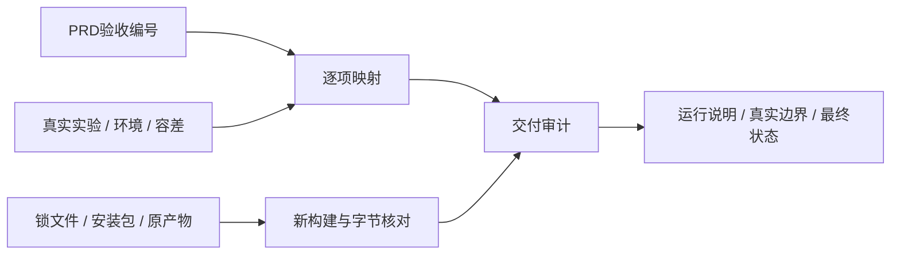

# L-012D：怎样把“完成”变成可检查的交付？

| 项目 | 内容 |
| --- | --- |
| 日期 / 版本 | 2026-10-03 / 基线7cc1879，T-404 |
| 关联 | L-012D、T-404、REQ-001—012、NFR-007、PRD13 |
| 状态 | 已讲解；已实验；复述未记录 |
| 前置 | [转移网格与最终NFR](L-012C4-transferable-mesh.md)、[来源链](L-001A-source-provenance.md) |

## 1. 本次问题

一条“测试通过”不能同时说明功能范围、可复现命令和来源。输入是PRD的52条P0、7条NFR、实际原始证据、锁文件和新构建；输出应为逐项映射、当前运行说明及可检查的证据身份。

## 2. 原理与数据流

功能实验负责真实几何和交互。交付审计检查每条编号都有证据、证据声明成功、最终三浏览器/两个路径齐全、性能样本和预算满足、锁定/安装版本一致，以及新dist与原始声明/最终实际浏览器资源匹配。SHA识别文件内容，不自动证明实验正确，必须继续保留具体断言和原环境。



历史记录继续保留当时未完成的范围；最新矩阵说明现在状态。学习复述需要真实用户反馈，不能从技术交付推断。

## 3. 最小实验

```powershell
. ./scripts/use-node.ps1
npm.cmd ci
$env:TOOLCHAIN_EVIDENCE_TASK='T-404'
npm.cmd run record:toolchain
npm.cmd run build
node scripts/check-distribution.mjs --staged --task=T-404
npm.cmd run check:delivery
npm.cmd run check:docs
```

Windows x64/PowerShell7.6/Node24.21.0/npm11.19.0。52编号须与PRD逐项一一对应；最终E2E每类恰好三浏览器×root/cad；三浏览器版本精确匹配记录。性能用原预算200ms/2s/30fps和每类30预热后样本；来源/许可/锁文件/构建资源用SHA或原始字节相等。

## 4. 实际结果与证据

| 检查 | 期望 | 实际 | 证据 |
| --- | --- | --- | --- |
| 锁文件重装 | 固定版本真实可安装 | 65包安装，90包重读来源；本次npm报告0漏洞 | [ci日志](../evidence/T-404-npm-ci.log)、[来源](../../third-party/npm-dependencies.json) |
| 类型/构建 | 真实产物可用 | vue-tsc退出0，Vite退出0；主包823.17kB提示保留 | [构建日志](../evidence/T-404-build.log) |
| 来源分发 | 原产物/许可/核心不变 | 27文件SHA与Git index匹配，dist声明/许可与public精确一致 | [来源](../evidence/T-404-distribution.json)、[审计](../evidence/T-404-delivery-audit.json) |
| 完整性 | 52P0/7NFR、三浏览器两路径、完整性能数据 | 编号无遗漏/重复，最终实际资源与新构建hash名称一致 | [逐项验收](../../ACCEPTANCE.md)、[审计](../evidence/T-404-delivery-audit.json) |

README的dev和/cad构建/预览CLI已实际启动：HTML、真实入口模块/WASM200，WASM MIME为application/wasm，见[CLI](../evidence/T-404-cli.json)。它只证明启动/HTTP，不冒充新一轮完整UI；自建服务已关闭，最终root产物重新构建。

首次审计把所有证据当成顶层passed=true，但性能记录按求解/主线程/视口、CSG和资源各类别报告，缺少单一顶层字段，因此被正确拒绝。修正审计为逐类别检查原有结果，再独立核对原始样本/预算；没有修改性能证据补造成功。

文档修正README中的“打开/保存/STL尚禁用”和混杂的历史下一任务，补齐当前命令、标准下载显式确认、恢复副本dirty、实际几何边界、三浏览器准备依赖和P1/P2范围。历史实验的当时状态没有被改成全通过。

## 5. 接回项目

[check-delivery](../../../scripts/check-delivery.mjs)只审计已执行证据与当前安装/构建，README明确它不代替重新运行几何或浏览器。第三方记录支持TOOLCHAIN_EVIDENCE_TASK标记本次来源核对；生产内核与依赖版本未改变。

全部P0/E2E/NFR满足限定条件，最终学习进度仍标复述未记录；后续候选任务不能自动作为本轮授权的新范围。

## 6. 我的复述与检查题

- 我的解释：未记录。
- 小练习：选择AC-010-1，沿表格找到真实下载/相机/继续编辑的输入与断言。
- 为什么：为什么一个证据文件的SHA相同，不能代替它内部的几何容差检查？

## 7. 疑问与下一步

固定版本是2026-10-03的实测矩阵；未来浏览器或内核更新须重新验收。生产包大小提示及任意退化几何不可靠仍是明确边界。用户可按路线重做任一独立实验，理解问题等待真实反馈。

## 8. 来源

- [PRD](../../PRD.md)、[TASKS](../../TASKS.md)：基线7cc1879/T-404，核对2026-10-03；原验收范围与依赖。
- [锁文件](../../../package-lock.json)、[自建WASM来源](../../../public/wasm/SOURCE.md)、[第三方清单](../../third-party/README.md)：T-404重读，核对2026-10-03；实际来源与可复现命令。
- [原始最终实验](../evidence/T-403C2b2-current-browsers.json)、[性能](../evidence/T-403C2b2-performance-transfer.json)：T-403C2b2/7cc1879，核对2026-10-03；实际输入与本次审计的边界。
